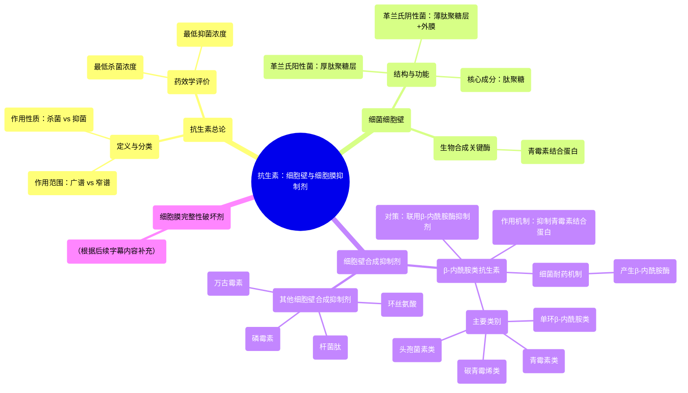

# 19 Pharmacology – ANTIBIOTICS – CELL WALL & MEMBRANE INHIBITORS (MADE EASY)

  <video controls preload="metadata" playsinline>
    <source src="https://helly.s3.bitiful.net/心血管学科/%E4%B8%93%E8%BE%91%2017%EF%BC%9A%E8%8D%AF%E7%90%86%E5%AD%A6%E5%A4%A7%E5%B8%88%E8%AF%BE%20%28Speed%20Pharmacology%29/19%20Pharmacology%20%E2%80%93%20ANTIBIOTICS%20%E2%80%93%20CELL%20WALL%20%26%20MEMBRANE%20INHIBITORS%20%28MADE%20EASY%29.mp4" type="video/mp4">
    
您的浏览器不支持播放，请升级。

  </video>

::: tip ⚡️ 核心考点 (30s速读)
*   **核心考点**：本节重点讲解抑制细菌细胞壁合成的抗生素，特别是**β-内酰胺类抗生素**（青霉素、头孢菌素等）。它们通过模仿肽聚糖前体，与**青霉素结合蛋白**共价结合，抑制转肽反应，导致细菌因细胞壁缺损而裂解死亡。
*   **临床意义**：理解抗生素的**杀菌**与**抑菌**、**广谱**与**窄谱**分类是临床选药的基础。细菌可通过产生**β-内酰胺酶**破坏药物而耐药，联合使用**β-内酰胺酶抑制剂**（如克拉维酸）是克服此类耐药的关键策略。
:::

## 🧠 深度精讲

*   **抗生素的定义与分类**：抗生素是能杀死或抑制微生物生长的化学制剂。临床选择时需综合考虑：1) **作用范围**：广谱（作用广泛） vs. 窄谱（作用局限）；2) **作用性质**：杀菌（直接杀死） vs. 抑菌（抑制生长）；3) **药敏试验结果**（如Kirby-Bauer法、MIC/MBC测定）。
*   **细菌细胞壁的结构与功能**：细胞壁对维持细菌形态和抵抗内部高渗透压至关重要。主要分为：1) **革兰氏阳性菌**：厚肽聚糖层，无外膜；2) **革兰氏阴性菌**：薄肽聚糖层，外有外膜。**肽聚糖**是赋予细胞壁刚性的核心成分。
*   **β-内酰胺类抗生素的作用机制**：此类药物（青霉素、头孢菌素、碳青霉烯、单环β-内酰胺）的核心结构是**β-内酰胺环**。该环结构与肽聚糖合成终末步骤的底物（D-Ala-D-Ala）相似，能竞争性地与**青霉素结合蛋白**（即转肽酶）的活性位点共价结合，使其永久失活，从而阻断细胞壁交联，导致细菌渗透性裂解。
*   **细菌耐药机制与对策**：细菌最常见的耐药机制是产生**β-内酰胺酶**，该酶能水解破坏β-内酰胺环。临床对策是联合使用**β-内酰胺酶抑制剂**（如克拉维酸、他唑巴坦），它们能不可逆地抑制β-内酰胺酶，从而保护抗生素活性。**碳青霉烯类**和**单环β内酰胺类**因其环结构特殊，对多数β-内酰胺酶天然耐药。
*   **其他细胞壁合成抑制剂**：除了β-内酰胺类，还有通过抑制肽聚糖合成早期步骤而发挥作用的抗生素，如**万古霉素**（抑制糖肽链延伸）、**磷霉素**（抑制MurA酶）、**环丝氨酸**（抑制D-丙氨酸合成）。它们的作用靶点不同，可用于对抗某些耐药菌。

## 📚 双语术语表 (Terminology)
| 英文术语 | 中文翻译 | 定义/解释 |
| :--- | :--- | :--- |
| Antibiotics | 抗生素 | 能杀死或抑制微生物生长的化学制剂。 |
| Broad-spectrum | 广谱 | 能对抗多种不同类型微生物的抗生素。 |
| Narrow-spectrum | 窄谱 | 仅对少数特定类型微生物有效的抗生素。 |
| Bactericidal | 杀菌剂 | 能直接杀死细菌的抗生素。 |
| Bacteriostatic | 抑菌剂 | 仅能抑制细菌生长繁殖，需依赖机体免疫系统清除细菌的抗生素。 |
| Minimum Inhibitory Concentration (MIC) | 最低抑菌浓度 | 在体外实验中，能抑制可见细菌生长的最低抗生素浓度。 |
| Minimum Bactericidal Concentration (MBC) | 最低杀菌浓度 | 在体外实验中，能杀死99.9%以上细菌的最低抗生素浓度。 |
| Peptidoglycan | 肽聚糖 | 构成细菌细胞壁骨架的多聚物，由糖链和肽链交联而成，赋予细胞刚性。 |
| Penicillin-Binding Proteins (PBPs) | 青霉素结合蛋白 | 位于细菌细胞膜上的酶（主要是转肽酶），负责催化肽聚糖合成的最终交联步骤，是β-内酰胺类抗生素的作用靶点。 |
| Beta-lactam ring | β-内酰胺环 | 青霉素、头孢菌素等抗生素分子中的四元环核心结构，是其抗菌活性的关键。 |
| Beta-lactamases | β-内酰胺酶 | 细菌产生的能水解β-内酰胺环的酶，是导致对β-内酰胺类抗生素耐药的最常见机制。 |
| Beta-lactamase inhibitors | β-内酰胺酶抑制剂 | 能不可逆地结合并抑制β-内酰胺酶的药物（如克拉维酸），常与β-内酰胺类抗生素联用以克服耐药。 |

## 🗺️ 知识图谱

