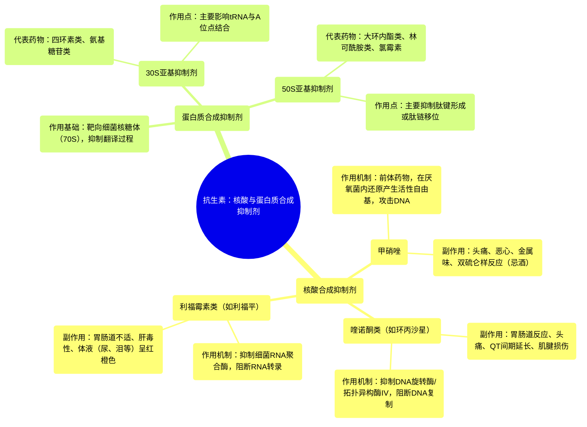

# 20 Pharmacology – ANTIBIOTICS – DNA, RNA, FOLIC ACID, PROTEIN SYNTHESIS INHIBITORS (MADE EASY)

  <video controls preload="metadata" playsinline>
    <source src="https://helly.s3.bitiful.net/心血管学科/%E4%B8%93%E8%BE%91%2017%EF%BC%9A%E8%8D%AF%E7%90%86%E5%AD%A6%E5%A4%A7%E5%B8%88%E8%AF%BE%20%28Speed%20Pharmacology%29/20%20Pharmacology%20%E2%80%93%20ANTIBIOTICS%20%E2%80%93%20DNA%2C%20RNA%2C%20FOLIC%20ACID%2C%20PROTEIN%20SYNTHESIS%20INHIBITORS%20%28MADE%20EASY%29.mp4" type="video/mp4">
    
您的浏览器不支持播放，请升级。

  </video>

::: tip ⚡️ 核心考点 (30s速读)
*   **核心考点**：抗生素通过选择性抑制细菌的关键生命过程（核酸合成、蛋白质合成、代谢途径）发挥杀菌或抑菌作用，而对人体细胞毒性较低。
*   **临床意义**：理解不同类别抗生素的作用靶点（如DNA旋转酶、RNA聚合酶、核糖体亚基）是合理选择药物、预测疗效和避免不良反应的基础。
:::

## 🧠 深度精讲

*   **核酸合成抑制剂**：这类抗生素通过干扰细菌遗传物质（DNA或RNA）的合成来发挥作用。细菌用于合成核酸的酶与人类不同，这为药物提供了选择性靶点。主要分为三类：
    *   **甲硝唑**：一种前体药物，需在厌氧菌体内被还原激活，生成高活性的自由基，攻击细菌DNA，导致链断裂和突变，最终杀死细菌。
    *   **喹诺酮类（如环丙沙星）**：主要靶向细菌的**DNA旋转酶**和**拓扑异构酶IV**。这些酶负责解旋和分离DNA，是DNA复制所必需的。药物与酶结合后，抑制其功能，阻断DNA复制，导致细菌死亡。
    *   **利福霉素类（如利福平）**：靶向细菌的**RNA聚合酶**。该酶负责以DNA为模板合成RNA（转录过程）。药物与酶结合后，抑制所有RNA的合成。没有RNA，细菌就无法合成生存必需的蛋白质。

*   **蛋白质合成抑制剂**：这类抗生素作用于细菌的蛋白质合成工厂——**核糖体**。细菌核糖体（70S）由30S和50S两个亚基组成，与人类的核糖体（80S）结构不同，因此可作为选择性靶点。
    *   **作用原理**：蛋白质合成是一个复杂过程，涉及信使RNA（mRNA）、转运RNA（tRNA）和核糖体的协同工作。mRNA携带遗传密码（密码子），tRNA携带对应的氨基酸，在核糖体上按顺序连接成多肽链。
    *   **分类**：根据作用靶点的核糖体亚基不同，可分为：
        1.  **30S亚基抑制剂**：如四环素类、氨基糖苷类。它们主要影响tRNA与核糖体A位点的结合，或导致密码子误读。
        2.  **50S亚基抑制剂**：如大环内酯类（阿奇霉素）、林可酰胺类（克林霉素）、氯霉素、噁唑烷酮类（利奈唑胺）。它们主要抑制肽键的形成或阻止肽链的移位。

## 📚 双语术语表 (Terminology)
| 英文术语 | 中文翻译 | 定义/解释 |
| :--- | :--- | :--- |
| Transcription | 转录 | 以DNA为模板合成RNA的过程。 |
| Translation | 翻译 | 以mRNA为模板，在核糖体上合成蛋白质的过程。 |
| Topoisomerase | 拓扑异构酶 | 一类能改变DNA拓扑结构的酶，如DNA旋转酶（解旋DNA）和拓扑异构酶IV（分离复制后的DNA）。 |
| RNA Polymerase | RNA聚合酶 | 以DNA为模板催化合成RNA的酶。 |
| Ribosome | 核糖体 | 细胞中负责蛋白质合成的细胞器，由大、小亚基组成。 |
| 30S Subunit | 30S亚基 | 细菌核糖体的小亚基，是某些抗生素（如四环素）的作用靶点。 |
| 50S Subunit | 50S亚基 | 细菌核糖体的大亚基，是某些抗生素（如大环内酯类）的作用靶点。 |
| mRNA | 信使RNA | 携带从DNA转录来的遗传信息，作为蛋白质合成的模板。 |
| tRNA | 转运RNA | 在翻译过程中，负责将特定氨基酸运送到核糖体上。 |
| Codon | 密码子 | mRNA上三个相邻的核苷酸序列，决定一个特定的氨基酸。 |
| A site | A位点（氨酰基位点） | 核糖体上接受携带氨基酸的tRNA进入的位置。 |
| P site | P位点（肽酰基位点） | 核糖体上携带正在延长的多肽链的tRNA所在的位置。 |

## 🗺️ 知识图谱

