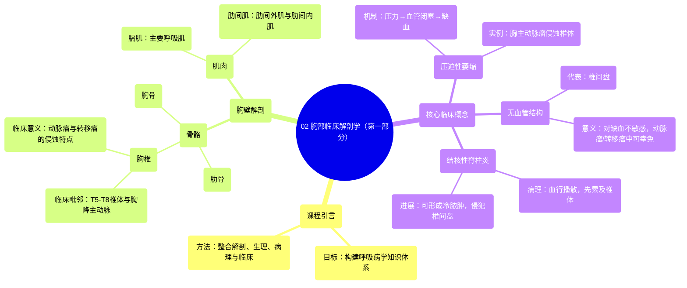

# 02 Clinically-Oriented Anatomy of the Thorax (part 1)

  <video controls preload="metadata" playsinline>
    <source src="https://helly.s3.bitiful.net/心血管学科/%E4%B8%93%E8%BE%91%2018%EF%BC%9A%E5%BF%83%E5%86%85%E7%A7%91%E7%BB%88%E6%9E%81%E7%99%BE%E7%A7%91%E8%BE%9E%E5%85%B8%20%28The%20Cardiology%20Encyclopedia%29/02%20Clinically-Oriented%20Anatomy%20of%20the%20Thorax%20%28part%201%29.mp4" type="video/mp4">
    
您的浏览器不支持播放，请升级。

  </video>

::: tip ⚡️ 核心考点 (30s速读)
*   **核心考点**：胸壁的解剖结构（骨骼、肌肉）及其临床意义，特别是胸椎、肋骨、胸骨和膈肌。
*   **临床意义**：理解胸壁结构是诊断胸主动脉瘤、脊柱转移瘤、结核性脊柱炎等疾病的基础。例如，胸主动脉瘤可侵蚀胸椎体（T5-T8），导致“压迫性萎缩”，在X光上可见，但不影响无血管的椎间盘。
:::

## 🧠 深度精讲

*   **课程目标与结构**：本课程是《呼吸病学》系列的第一部分，旨在从临床角度讲解胸部解剖。课程将遵循“基础优先”的原则，依次讲解解剖学、组织学、药理学、病理学和生理学，最后整合到临床诊断与治疗中。本节重点讲解胸壁的骨骼和肌肉。
*   **胸壁的骨骼**：
    *   **胸椎**：共12节。重点在于**T5、T6、T7、T8椎体**与**胸降主动脉**的解剖毗邻关系。
    *   **临床联系**：
        1.  **胸主动脉瘤**：若动脉瘤发生于胸降主动脉，可压迫并侵蚀T5-T8椎体，导致**压迫性萎缩**。这是因为持续压力闭塞了椎体的血管，造成缺血性损伤。在X光片上，可见椎体受损而**椎间盘完好**，其根本原因在于**椎间盘是无血管的软骨组织**，本身不依赖血液供应，因此不受缺血影响。
        2.  **转移性肿瘤**：血行转移的肿瘤（如肉瘤）同样因椎体血供丰富而易于在此定植，但同样不影响无血管的椎间盘。
        3.  **结核性脊柱炎**：继发性肺结核可经血行播散至脊柱。初期侵犯血管丰富的椎体，形成结核结节/肉芽肿；在免疫功能低下者中，病变可进一步蔓延至椎间盘，形成**冷脓肿**（“冷”指缺乏典型红、热、痛的急性炎症表现，是结核感染的特征）。
*   **胸壁的肌肉**：
    *   **膈肌**：最重要的呼吸肌。
    *   **肋间肌**：包括**肋间外肌**（吸气时提肋）和**肋间内肌**（呼气时降肋）。
*   **课程预告**：下一个视频将讲解胸部软组织，包括气管支气管树、纵隔、肺、胸膜及相关淋巴结。

## 📚 双语术语表 (Terminology)
| 英文术语 | 中文翻译 | 定义/解释 |
| :--- | :--- | :--- |
| Thoracic wall | 胸壁 | 由骨骼（胸椎、肋骨、胸骨）和肌肉（膈肌、肋间肌等）构成的胸腔外围结构。 |
| Thoracic vertebra | 胸椎 | 脊柱的胸段，共12节，与肋骨相关节。 |
| Descending thoracic aorta | 胸降主动脉 | 主动脉弓之后、穿过膈肌之前的主动脉部分，走行于脊柱左前方。 |
| Pressure atrophy | 压迫性萎缩 | 因长期受压导致组织缺血、营养障碍而发生的萎缩。 |
| Avascular | 无血管的 | 缺乏血液供应。如关节软骨和椎间盘。 |
| Metastasis | 转移 | 肿瘤细胞从原发部位经血管、淋巴管等途径播散到身体其他部位形成新病灶的过程。 |
| Tuberculous spondylitis | 结核性脊柱炎 | 结核分枝杆菌感染脊柱，常累及椎体和椎间盘。 |
| Cold abscess | 冷脓肿 | 结核感染形成的脓肿，缺乏急性炎症的典型红、热、痛表现。 |
| Diaphragm | 膈肌 | 分隔胸腔和腹腔的穹窿状肌肉，是主要的吸气肌。 |
| Intercostal muscles | 肋间肌 | 位于肋骨之间的肌肉群，包括肋间外肌和肋间内肌，参与呼吸运动。 |
| Mediastinum | 纵隔 | 左右两侧胸膜腔之间的区域，内含心脏、大血管、气管、食管等重要结构。 |
| Pleura | 胸膜 | 覆盖于肺表面（脏层胸膜）和胸壁内面（壁层胸膜）的浆膜，两者之间的潜在腔隙为胸膜腔。 |

## 🗺️ 知识图谱

