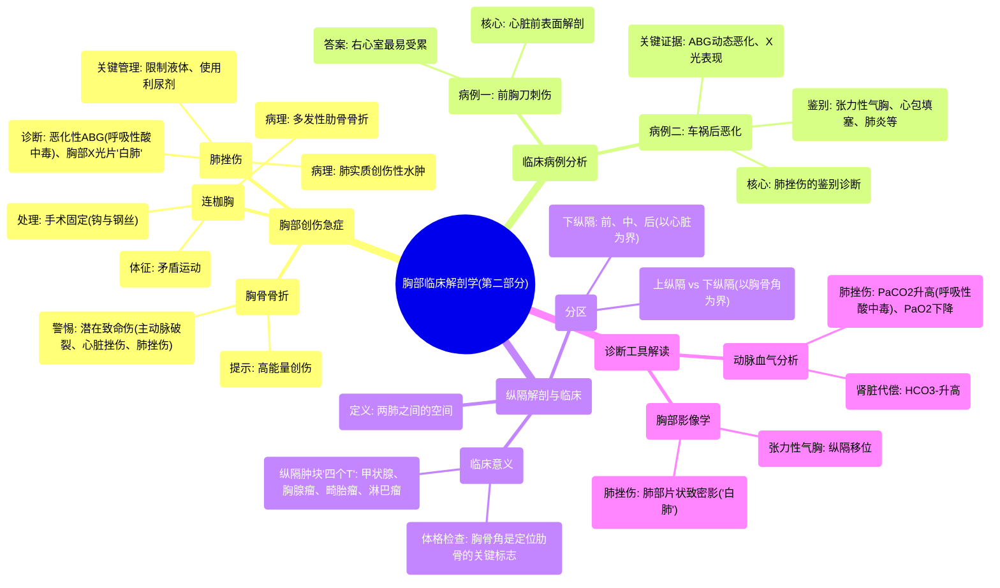

# 03 Clinically-Oriented Anatomy of the Thorax (Part 2)

  <video controls preload="metadata" playsinline>
    <source src="https://helly.s3.bitiful.net/心血管学科/%E4%B8%93%E8%BE%91%2018%EF%BC%9A%E5%BF%83%E5%86%85%E7%A7%91%E7%BB%88%E6%9E%81%E7%99%BE%E7%A7%91%E8%BE%9E%E5%85%B8%20%28The%20Cardiology%20Encyclopedia%29/03%20Clinically-Oriented%20Anatomy%20of%20the%20Thorax%20%28Part%202%29.mp4" type="video/mp4">
    
您的浏览器不支持播放，请升级。

  </video>

::: tip ⚡️ 核心考点 (30s速读)
*   **核心考点**：胸部创伤（尤其是连枷胸、胸骨骨折、肺挫伤）的病理生理、临床表现与紧急处理原则；纵隔的解剖分区及其临床意义。
*   **临床意义**：掌握胸部创伤的快速鉴别诊断（如肺挫伤 vs. 张力性气胸 vs. 心包填塞），理解动脉血气分析（ABG）和胸部X光片在评估中的关键作用，以及针对肺挫伤“限制液体、使用利尿剂”的特殊管理策略。
:::

## 🧠 深度精讲

*   **胸部创伤的紧急情况**：视频重点讨论了三种危及生命的胸部损伤。**连枷胸**由多发性肋骨骨折导致，引起胸壁“矛盾运动”，严重影响通气，需手术固定。**胸骨骨折**本身少见，一旦发生，常提示巨大的暴力，必须警惕并排查其下的**主动脉破裂、心脏挫伤或肺挫伤**等潜在致命伤。**肺挫伤**是肺实质的创伤性水肿，对液体极为敏感，管理核心是**限制液体和利尿**，以防止病情恶化。
*   **病例分析与鉴别诊断**：通过两个病例深化理解。**病例一（前胸刀刺伤）** 考查心脏前表面的解剖，**右心室**构成其大部分，因此最易受累。**病例二（车祸后病情恶化）** 是典型肺挫伤：进行性加重的**呼吸性酸中毒**（PaCO2升高）、低氧血症（PaO2下降）以及胸部X光片的“白肺”表现，是区别于张力性气胸（纵隔移位、呼吸性碱中毒）、心包填塞（无显著呼吸性酸中毒）、肺炎（感染征象）等疾病的关键。
*   **纵隔解剖与临床**：**纵隔**是两肺之间的区域。以**胸骨角（路易斯角）** 为界，分为上、下纵隔。下纵隔又以心脏为界，分为前、中、后纵隔。此分区对**纵隔肿块**的鉴别诊断至关重要，可记忆为“四个T”：甲状腺肿块（Thyroid）、胸腺瘤（Thymoma）、畸胎瘤（Teratoma）和恶性淋巴瘤（Terrible lymphoma）。此外，胸骨角是体格检查中**定位肋骨和肋间隙**（如听诊心尖搏动的第五肋间隙）的重要骨性标志。
*   **动脉血气分析解读**：视频中反复强调ABG的动态变化是评估病情的关键。肺挫伤时，由于通气/血流比例失调，表现为**PaCO2进行性升高（呼吸性酸中毒）** 和**PaO2进行性下降**。肾脏会代偿性保留HCO3-（升高），试图纠正酸中毒，这体现了机体的代偿机制。

## 📚 双语术语表 (Terminology)
| 英文术语 | 中文翻译 | 定义/解释 |
| :--- | :--- | :--- |
| Flail Chest | 连枷胸 | 多根多处肋骨骨折导致局部胸壁失去骨性支撑，在呼吸时产生与整体胸廓运动相反的“矛盾运动”。 |
| Pulmonary Contusion | 肺挫伤 | 胸部创伤引起的肺实质出血和水肿，无肺组织撕裂。对液体负荷敏感，管理需限制补液并使用利尿剂。 |
| Paradoxical Movement | 矛盾运动 | 连枷胸患者在吸气时，损伤区域胸壁向内凹陷；呼气时向外凸出，与正常胸廓运动相反。 |
| Sternal Angle (Angle of Louis) | 胸骨角（路易斯角） | 胸骨柄与胸骨体连接处向前凸起的角，是计数肋骨（其对应第二肋软骨）和划分上下纵隔的重要体表标志。 |
| Mediastinum | 纵隔 | 位于两侧纵隔胸膜之间的所有器官和结构的总称，是分隔左、右胸膜腔的间隔。 |
| Respiratory Acidosis | 呼吸性酸中毒 | 由于肺泡通气不足导致二氧化碳（CO2）潴留，动脉血PaCO2原发性升高，pH下降。 |
| ABG (Arterial Blood Gas) | 动脉血气分析 | 通过采集动脉血测量血液中氧气、二氧化碳分压、酸碱度、碳酸氢根等指标，用于评估呼吸功能和酸碱平衡状态。 |
| Tension Pneumothorax | 张力性气胸 | 胸壁或肺的裂口形成活瓣，气体只进不出，使胸腔内压力持续升高，压迫肺和纵隔，是危及生命的急症。 |
| Cardiac Tamponade | 心包填塞 | 心包腔内液体（血液等）急剧积聚，压迫心脏，限制心室舒张期充盈，导致心输出量骤降的危重状态。 |
| Mediastinal Shift | 纵隔移位 | 胸腔内压力不均衡（如大量气胸、胸腔积液）导致纵隔结构被推向健侧，是张力性气胸的典型X线征象之一。 |

## 🗺️ 知识图谱

