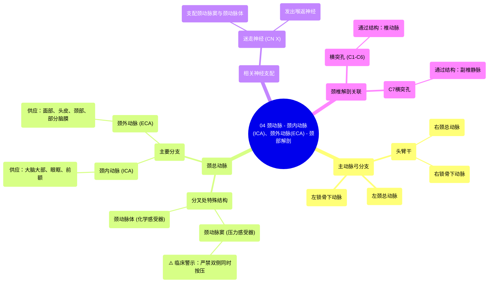

# 04 Carotid Arteries - Internal Carotid Artery (ICA), External Carotid Artery (ECA) - Anatomy of Neck

  <video controls preload="metadata" playsinline>
    <source src="https://helly.s3.bitiful.net/心血管学科/%E4%B8%93%E8%BE%91%2018%EF%BC%9A%E5%BF%83%E5%86%85%E7%A7%91%E7%BB%88%E6%9E%81%E7%99%BE%E7%A7%91%E8%BE%9E%E5%85%B8%20%28The%20Cardiology%20Encyclopedia%29/04%20Carotid%20Arteries%20-%20Internal%20Carotid%20Artery%20%28ICA%29%2C%20External%20Carotid%20Artery%20%28ECA%29%20-%20Anatomy%20of%20Neck.mp4" type="video/mp4">
    
您的浏览器不支持播放，请升级。

  </video>

::: tip ⚡️ 核心考点 (30s速读)
*   **核心考点**：颈总动脉在甲状软骨上缘水平分叉为颈内动脉和颈外动脉。分叉处存在颈动脉体和颈动脉窦，分别含有化学感受器和压力感受器，受迷走神经（第X对脑神经）调控。
*   **临床意义**：**严禁同时按压双侧颈动脉窦**，这会引发压力感受器反射，导致反射性心动过缓和血管舒张，可能引起晕厥甚至死亡。
:::

## 🧠 深度精讲

*   **颈动脉系统概述**：头颈部的动脉血供主要来源于颈总动脉和锁骨下动脉。本视频重点讲解颈总动脉及其分支。左颈总动脉直接起自主动脉弓，右颈总动脉起自头臂干。
*   **颈总动脉分叉**：颈总动脉在约平甲状软骨上缘处分为**颈内动脉**和**颈外动脉**。分叉处有两个重要结构：
    *   **颈动脉体**：化学感受器，监测血液中的氧、二氧化碳分压和pH值。
    *   **颈动脉窦**：压力感受器，监测动脉血压变化。
    *   两者均受**迷走神经（第X对脑神经）** 支配。
*   **重要临床警告**：视频中反复强调，切勿同时按摩或压迫双侧颈动脉窦。因为这会错误地向中枢传递“血压过高”的信号，引发强烈的减压反射（反射性心动过缓、血管舒张），导致脑供血不足，可能造成晕厥（颈动脉窦晕厥）甚至更严重的后果。
*   **相关解剖背景**：
    *   **颈椎特征**：第1-6颈椎的横突上有**横突孔**，**椎动脉**从中穿过。第7颈椎的横突孔仅通过副椎静脉。
    *   **主动脉弓分支**：从右至左（或根据视角）通常为：头臂干（再分为右锁骨下动脉和右颈总动脉）、左颈总动脉、左锁骨下动脉。
    *   **迷走神经与喉返神经**：右侧迷走神经在绕过右锁骨下动脉后发出**右喉返神经**；左侧迷走神经在绕过主动脉弓后发出**左喉返神经**。喉返神经支配喉部肌肉（除环甲肌外），损伤会导致声音嘶哑。

## 📚 双语术语表 (Terminology)
| 英文术语 | 中文翻译 | 定义/解释 |
| :--- | :--- | :--- |
| Common Carotid Artery | 颈总动脉 | 供应头颈部血液的主要动脉，在颈部上行至甲状软骨上缘水平分叉。 |
| Internal Carotid Artery (ICA) | 颈内动脉 | 颈总动脉分支之一，主要供应大脑的大部分、眼眶内容物及前额皮肤。 |
| External Carotid Artery (ECA) | 颈外动脉 | 颈总动脉分支之一，供应颈部、面部、头皮及部分脑膜等颅外结构。 |
| Carotid Body | 颈动脉体 | 位于颈总动脉分叉处的化学感受器，感知血液中O2、CO2和pH的变化。 |
| Carotid Sinus | 颈动脉窦 | 位于颈总动脉末端或颈内动脉起始部的膨大处，是压力感受器，感知血压变化。 |
| Vagus Nerve (Cranial Nerve X) | 迷走神经（第X对脑神经） | 混合性脑神经，支配颈动脉窦和颈动脉体，并参与内脏运动、感觉及喉部肌肉运动。 |
| Baroreceptor | 压力感受器 | 对血管壁牵张（血压变化）敏感的感受器，如颈动脉窦。 |
| Chemoreceptor | 化学感受器 | 对血液化学成分（如O2、CO2、H+）变化敏感的感受器，如颈动脉体。 |
| Reflex Bradycardia | 反射性心动过缓 | 由压力感受器激活引起的心率减慢反射。 |
| Foramen Transversarium | 横突孔 | 颈椎横突上的孔洞，第1-6颈椎的横突孔有椎动脉通过。 |
| Vertebral Artery | 椎动脉 | 起自锁骨下动脉，穿行于上6个颈椎的横突孔，参与构成脑的血液供应（椎-基底动脉系统）。 |
| Aortic Arch | 主动脉弓 | 升主动脉的延续，发出头臂干、左颈总动脉和左锁骨下动脉三大分支。 |
| Brachiocephalic Trunk | 头臂干 | 主动脉弓的第一个大分支，在右侧分为右锁骨下动脉和右颈总动脉。 |
| Recurrent Laryngeal Nerve | 喉返神经 | 迷走神经的分支，支配除环甲肌外的所有喉肌，控制声带运动。 |

## 🗺️ 知识图谱

