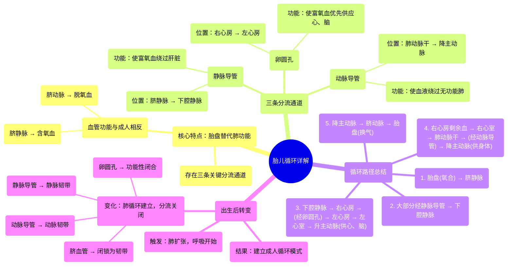

# 05 Fetal Circulation - Explained Clearly - Placenta, Umbilical Vessels, Ductus Arteriosus Venosus

  <video controls preload="metadata" playsinline>
    <source src="https://helly.s3.bitiful.net/心血管学科/%E4%B8%93%E8%BE%91%2018%EF%BC%9A%E5%BF%83%E5%86%85%E7%A7%91%E7%BB%88%E6%9E%81%E7%99%BE%E7%A7%91%E8%BE%9E%E5%85%B8%20%28The%20Cardiology%20Encyclopedia%29/05%20Fetal%20Circulation%20-%20Explained%20Clearly%20-%20Placenta%2C%20Umbilical%20Vessels%2C%20Ductus%20Arteriosus%20Venosus.mp4" type="video/mp4">
    
您的浏览器不支持播放，请升级。

  </video>

::: tip ⚡️ 核心考点 (30s速读)
*   **核心考点**：胎儿循环的核心是**绕过无功能的肺**，通过**胎盘**进行气体交换。其血管结构与成人相反：**脐静脉**输送含氧血，**脐动脉**输送脱氧血。
*   **临床意义**：理解胎儿循环是掌握**出生后循环转变**（如卵圆孔、动脉导管闭合）及**相关先天性心脏病**（如动脉导管未闭）的基础。
:::

## 🧠 深度精讲

*   **核心差异：胎盘替代肺功能**
    *   胎儿肺部充满液体，血管阻力极高，无气体交换功能。因此，**胎盘**成为胎儿与母体进行氧气和二氧化碳交换的场所。
    *   这导致了胎儿循环血管中血液性质的“颠倒”：**脐静脉**从胎盘流向胎儿，携带**含氧血**和营养物质；**脐动脉**从胎儿流向胎盘，携带**脱氧血**和代谢废物。

*   **三条关键分流通道**
    胎儿循环通过三个特殊结构，高效地将含氧血优先供应给最重要的器官（如心脏和大脑），并绕过无功能的肺和暂时不需要全量血液的肝脏：
    1.  **静脉导管**：连接**脐静脉**与**下腔静脉**。使大部分来自胎盘的富氧血**绕过胎儿肝脏**，直接进入体循环。
    2.  **卵圆孔**：位于左右心房之间的一个瓣膜样开口。使来自下腔静脉的含氧血**直接从右心房流入左心房**，进而供应大脑和心脏。
    3.  **动脉导管**：连接**肺动脉干**与**降主动脉**。使右心室泵出的血液（大部分是脱氧血）**绕过肺部**，直接流入体循环，供应下半身。

*   **循环路径详解**
    1.  **富氧血来源**：来自母体胎盘的富氧血经**脐静脉**进入胎儿体内。
    2.  **绕过肝脏**：大部分血液经**静脉导管**直接汇入**下腔静脉**，与来自胎儿下半身的脱氧血混合。
    3.  **优先供应大脑**：混合血进入**右心房**后，大部分通过**卵圆孔**直接进入**左心房** → **左心室** → **升主动脉**，优先供应**心脏和大脑**。
    4.  **绕过肺部**：右心房剩余血液进入**右心室**，泵入**肺动脉干**。由于肺阻力高，大部分血液通过**动脉导管**流入**降主动脉**，供应身体其他部分。
    5.  **返回胎盘**：降主动脉的血液（此时已为脱氧血）通过两条**脐动脉**流回胎盘，进行气体和物质交换，完成循环。

*   **出生后的转变**
    出生后，随着第一声啼哭，肺部扩张，肺血管阻力骤降。
    1.  **肺循环建立**：血液开始大量流入肺部进行气体交换。
    2.  **分流通道关闭**：
        *   **脐血管**：结扎后闭锁，形成韧带。
        *   **静脉导管**：闭锁成为静脉韧带。
        *   **卵圆孔**：因左心房压力升高而功能性闭合，最终融合。
        *   **动脉导管**：因血氧升高而收缩，在出生后数天至数周内闭锁，成为动脉韧带。
    至此，**成人循环模式**建立。

## 📚 双语术语表 (Terminology)
| 英文术语 | 中文翻译 | 定义/解释 |
| :--- | :--- | :--- |
| Fetal Circulation | 胎儿循环 | 胎儿时期特有的血液循环模式，其特点是存在胎盘和三条分流通道。 |
| Placenta | 胎盘 | 连接母体与胎儿的器官，是胎儿时期进行气体交换、营养吸收和废物排出的场所。 |
| Umbilical Vein | 脐静脉 | **一条**，将来自胎盘的**含氧血**和营养物质输送给胎儿。 |
| Umbilical Arteries | 脐动脉 | **两条**，将胎儿的**脱氧血**和代谢废物输送回胎盘。 |
| Ductus Venosus | 静脉导管 | 连接脐静脉与下腔静脉的血管通道，使富氧血绕过胎儿肝脏。 |
| Foramen Ovale | 卵圆孔 | 左右心房之间的一个开口，使血液从右心房直接流入左心房，绕过肺循环。 |
| Ductus Arteriosus | 动脉导管 | 连接肺动脉干与降主动脉的血管通道，使血液从肺动脉直接流入主动脉，绕过肺部。 |
| Fetal Hemoglobin (HbF) | 胎儿血红蛋白 | 胎儿红细胞内主要的血红蛋白类型，对氧气的亲和力高于成人血红蛋白（HbA），便于从母体血液中获取氧气。 |

## 🗺️ 知识图谱

