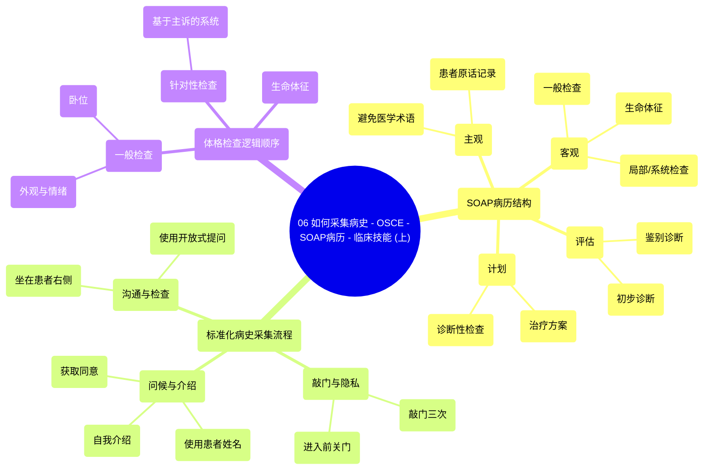

# 06 How to take a Medical History - OSCE - SOAP Notes - Clinical Skills (Part 1)

  <video controls preload="metadata" playsinline>
    <source src="https://helly.s3.bitiful.net/心血管学科/%E4%B8%93%E8%BE%91%2018%EF%BC%9A%E5%BF%83%E5%86%85%E7%A7%91%E7%BB%88%E6%9E%81%E7%99%BE%E7%A7%91%E8%BE%9E%E5%85%B8%20%28The%20Cardiology%20Encyclopedia%29/06%20How%20to%20take%20a%20Medical%20History%20-%20OSCE%20-%20SOAP%20Notes%20-%20Clinical%20Skills%20%28Part%201%29.mp4" type="video/mp4">
    
您的浏览器不支持播放，请升级。

  </video>

::: tip ⚡️ 核心考点 (30s速读)
*   **核心考点**：掌握SOAP病历结构（主观、客观、评估、计划）及标准化病史采集流程，包括敲门、自我介绍、开放式提问等关键步骤。
*   **临床意义**：这是建立正确诊断、制定治疗计划的基础，也是OSCE考试和临床实践中评估医学生/医生核心能力的关键环节。
:::

## 🧠 深度精讲

*   **SOAP病历结构**：这是现代病历记录和临床思维的核心框架。
    *   **主观 (S)**：记录患者的主诉和病史，**必须使用患者自己的语言**（如“高血压”应记为“血压高”），避免直接使用医学术语。
    *   **客观 (O)**：记录体格检查的发现，包括一般情况、生命体征和系统/局部检查。
    *   **评估 (A)**：基于主观和客观信息，形成初步诊断或鉴别诊断列表。
    *   **计划 (P)**：制定下一步的诊疗计划，包括诊断性检查（实验室、影像学）和治疗方案。

*   **标准化病史采集流程**：遵循此流程能体现对患者的尊重并建立良好医患关系。
    1.  **敲门**：尊重隐私，敲门三次后进入。
    2.  **关门**：进入后先关门，再与患者交谈，防止信息泄露。
    3.  **问候与介绍**：礼貌问候并使用患者姓名（如“穆斯塔法先生”），清晰介绍自己的身份（如“我是XX医学院的医学生”）。
    4.  **获取同意**：询问患者是否舒适，并征求其同意进行问诊和体格检查、做笔记。
    5.  **就座**：通常坐在患者右侧，便于交流和检查。需根据患者具体情况（如疼痛侧、听力障碍）灵活调整位置。
    6.  **提问技巧**：使用**开放式问题**（如“请多告诉我一些…”）开始问诊，鼓励患者详细描述。

*   **体格检查的逻辑顺序**：先进行**一般检查**（外观、情绪、体位），然后测量**生命体征**（体温、血压、脉搏、呼吸频率），再进行**局部/系统检查**，最后针对主诉进行**针对性专科检查**。**只有在完成病史采集和体格检查后，才开始形成鉴别诊断。**

## 📚 双语术语表 (Terminology)
| 英文术语 | 中文翻译 | 定义/解释 |
| :--- | :--- | :--- |
| SOAP Note | SOAP病历 | 一种结构化的病历记录格式，包含主观、客观、评估、计划四部分。 |
| History Taking | 病史采集 | 通过系统询问获取患者疾病相关信息的过程。 |
| Physical Exam | 体格检查 | 医生通过视、触、叩、听等方法对患者身体进行的检查。 |
| Differential Diagnosis | 鉴别诊断 | 基于现有信息，列出所有可能的疾病诊断，并按可能性排序。 |
| Open-ended Questions | 开放式提问 | 一种提问方式，鼓励患者自由、详细地描述，而非简单回答“是/否”。 |
| Rapport | 医患关系/融洽关系 | 医生与患者之间建立的相互信任、尊重和理解的关系。 |
| Vital Signs | 生命体征 | 反映人体基本生命活动状态的指标，通常包括体温、脉搏、呼吸、血压。 |
| Decubitus | 卧位 | 患者躺卧的姿势。 |
| Provisional Diagnosis | 初步诊断 | 在获得全部检查结果前，基于现有信息做出的暂时性诊断。 |

## 🗺️ 知识图谱

