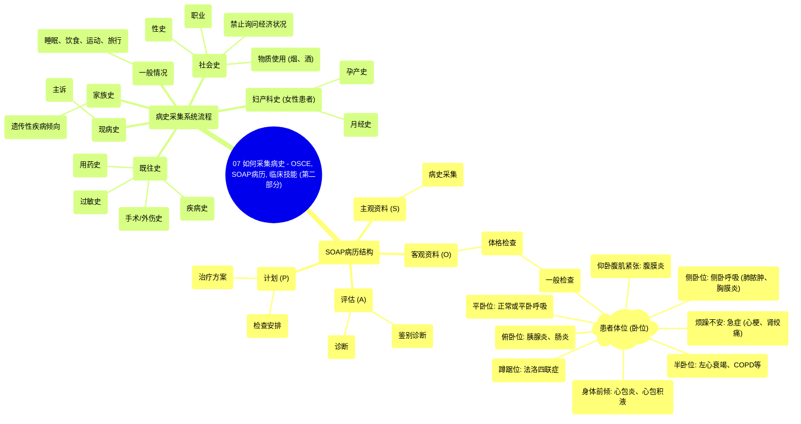

# 07 How to take a medical History - OSCE, SOAP notes, Clinical Skills (Part 2)

  <video controls preload="metadata" playsinline>
    <source src="https://helly.s3.bitiful.net/心血管学科/%E4%B8%93%E8%BE%91%2018%EF%BC%9A%E5%BF%83%E5%86%85%E7%A7%91%E7%BB%88%E6%9E%81%E7%99%BE%E7%A7%91%E8%BE%9E%E5%85%B8%20%28The%20Cardiology%20Encyclopedia%29/07%20How%20to%20take%20a%20medical%20History%20-%20OSCE%2C%20SOAP%20notes%2C%20Clinical%20Skills%20%28Part%202%29.mp4" type="video/mp4">
    
您的浏览器不支持播放，请升级。

  </video>

::: tip ⚡️ 核心考点 (30s速读)
*   **核心考点**：掌握SOAP病历结构，理解不同患者体位（卧位）的临床意义，并系统化采集病史（现病史、既往史、家族史、社会史等）。
*   **临床意义**：SOAP框架是临床思维和病历书写的核心。患者体位是重要的体格检查发现，能快速提示潜在疾病（如心衰、心包炎、肺脓肿等）。系统化问诊确保信息完整，避免遗漏关键诊断线索。
:::

## 🧠 深度精讲

本视频是优质病史采集系列的第二部分，重点讲解了体格检查的初步观察、SOAP病历中的评估与计划部分，并系统梳理了病史采集的全流程。

*   **SOAP病历与体格检查观察**：SOAP是主观资料(Subjective)、客观资料(Objective)、评估(Assessment)、计划(Plan)的缩写。视频强调，**“评估”部分应包含你的诊断和鉴别诊断**。在开始具体检查前，对患者**一般情况**的观察至关重要，尤其是患者的**体位（Decubitus）**，它能提供重要的诊断线索：
    *   **平卧位**：可能正常，也可能是**平卧呼吸（Platypnea）**（坐起时呼吸困难，躺下缓解）。
    *   **半卧位（端坐呼吸）**：提示可能为**左心衰竭**、纵隔肿块、慢性阻塞性肺病（COPD）等。
    *   **身体前倾**：可能提示**心包积液**、心包炎或严重端坐呼吸。
    *   **侧卧于一侧（侧卧呼吸，Trepopnea）**：需询问换侧后的反应。呼吸困难仅在一侧出现可能提示**肺脓肿**（换侧咳脓）、**胸膜炎**（换侧胸痛）等。
    *   **蹲踞位**：是**法洛四联症**的典型表现。
    *   **俯卧位**：可能与胰腺炎、肠炎有关。
    *   **烦躁不安**：可能是急性心肌梗死、肾绞痛等急症的表现。
    *   **仰卧但腹部紧张僵硬**：是**腹膜炎**的体征（伴反跳痛、肌卫）。

*   **病史采集的系统流程**：医患互动中，患者是最重要的，需保护其隐私。病史应分部分系统采集：
    1.  **现病史（History of Present Illness, HPI）**：围绕患者的主诉（如“剧烈头痛”）展开。
    2.  **既往史（Past Medical History, PMH）**：询问既有的疾病诊断（如高血压、糖尿病）、住院史、手术史、外伤史及**药物过敏史**。注意用患者能理解的语言（如说“血压高”而非“高血压”）。
    3.  **一般情况**：涵盖睡眠、饮食、运动、旅行四个方面。
    4.  **家族史（Family History）**：询问家族中类似疾病或健康状况，即使患者说“没有”，也应追问父母的具体健康情况，以发现遗传倾向。
    5.  **社会史（Social History）**：包括职业、物质使用（吸烟、饮酒），但**不应直接询问社会经济状况**。此外还包括性史。
    6.  **妇产科史（OBGYN History）**（针对女性患者）：询问月经周期、避孕方式、孕产史等。

## 📚 双语术语表 (Terminology)
| 英文术语 | 中文翻译 | 定义/解释 |
| :--- | :--- | :--- |
| SOAP notes | SOAP病历 | 一种结构化的病历记录格式，包括主观资料、客观资料、评估和计划。 |
| History of Present Illness (HPI) | 现病史 | 围绕患者当前主诉的详细病史。 |
| Past Medical History (PMH) | 既往史 | 患者过去的疾病、手术、过敏等医疗情况。 |
| Orthopnea | 端坐呼吸 | 平卧时出现呼吸困难，需要坐起或垫高枕头才能缓解。常见于左心衰竭。 |
| Platypnea | 平卧呼吸 | 坐起或站立时出现呼吸困难，平卧时缓解。与端坐呼吸相反。 |
| Trepopnea | 侧卧呼吸 | 仅在某一体位（如侧卧某一侧）时出现呼吸困难。 |
| Pericarditis | 心包炎 | 心包膜的炎症，常导致胸痛，身体前倾时可缓解。 |
| Peritonitis | 腹膜炎 | 腹膜的炎症，典型体征为腹部压痛、反跳痛、肌紧张和肌卫。 |
| Tetralogy of Fallot | 法洛四联症 | 一种先天性心脏病，患儿常出现蹲踞体位以缓解缺氧。 |
| Rebound tenderness | 反跳痛 | 按压腹部后突然抬手时出现的疼痛，是腹膜炎的重要体征。 |
| Guarding | 肌卫 | 患者因害怕疼痛而主动收缩腹肌，是一种保护性反应。 |
| Rigidity | 肌紧张 | 腹肌不自主的强直性收缩，是腹膜炎的客观体征。 |

## 🗺️ 知识图谱

