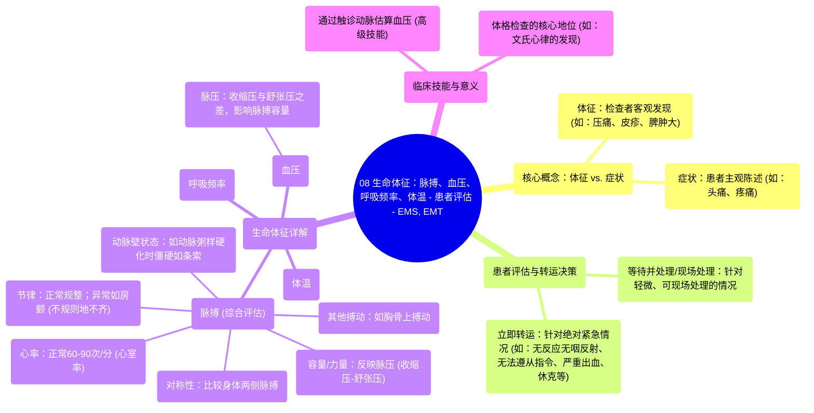

# 08 Vital Signs - Pulse, Blood Pressure, Respiratory Rate, Temperature - Patient assessment - EMS, EMT

  <video controls preload="metadata" playsinline>
    <source src="https://helly.s3.bitiful.net/心血管学科/%E4%B8%93%E8%BE%91%2018%EF%BC%9A%E5%BF%83%E5%86%85%E7%A7%91%E7%BB%88%E6%9E%81%E7%99%BE%E7%A7%91%E8%BE%9E%E5%85%B8%20%28The%20Cardiology%20Encyclopedia%29/08%20Vital%20Signs%20-%20Pulse%2C%20Blood%20Pressure%2C%20Respiratory%20Rate%2C%20Temperature%20-%20Patient%20assessment%20-%20EMS%2C%20EMT.mp4" type="video/mp4">
    
您的浏览器不支持播放，请升级。

  </video>

::: tip ⚡️ 核心考点 (30s速读)
*   **核心考点**：生命体征是评估患者生理状态的关键指标，包括脉搏、血压、呼吸频率和体温。理解体征（客观发现）与症状（主观感受）的区别至关重要。
*   **临床意义**：生命体征的评估不仅在于测量数值，更在于解读其背后的临床信息，如脉搏的特征可反映心功能、血管状态和脉压，是体格检查的核心技能。
:::

## 🧠 深度精讲
*   **体征与症状的区别**：症状是患者主观陈述的不适，如“我头痛”。体征是医护人员通过检查发现的客观证据，如压痛、皮疹或脾肿大。
*   **患者转运决策**：评估后需决定“等待并处理”还是“立即转运”。对于无反应且无咽反射、无法遵从指令、有并发症的产妇、剧烈疼痛、严重出血、呼吸困难或休克的患者，必须立即转运。
*   **脉搏的全面评估**：“脉搏”是一个综合概念，远不止“心率”。它包括：
    *   **心率**：正常成人心室率约为60-90次/分（非100次）。
    *   **节律**：正常为规整节律。心房颤动等可导致“不规则地不齐”。
    *   **容量/力量**：指血液冲击指尖的力度，反映**脉压**（收缩压与舒张压之差）。脉压高则容量大，脉压低则容量小。
    *   **对称性**：比较身体两侧（如左右桡动脉）的脉搏强度是否一致。
    *   **动脉壁状态**：动脉粥样硬化患者的动脉壁增厚、僵硬，触诊如条索。
    *   **其他搏动**：如胸骨上搏动，可能提示某些病理状态。
*   **临床技能**：通过触诊动脉准确估算血压是一项高级临床技能，体现了体格检查的重要性（例如，文氏心律就是在心电图发明前通过体格检查发现的）。

## 📚 双语术语表 (Terminology)
| 英文术语 | 中文翻译 | 定义/解释 |
| :--- | :--- | :--- |
| Vital Signs | 生命体征 | 评估患者基本生理功能状态的关键指标。 |
| Sign | 体征 | 检查者通过体格检查发现的客观异常表现。 |
| Symptom | 症状 | 患者主观感受到并陈述的异常或不适。 |
| Pulse | 脉搏 | 动脉随心脏收缩舒张而产生的搏动，是评估循环系统功能的重要指标。 |
| Heart Rate | 心率 | 心脏每分钟跳动的次数。 |
| Rhythm | 节律 | 心脏跳动或脉搏搏动的规律性。 |
| Volume (of pulse) | 脉搏容量/力量 | 触诊脉搏时感受到的血液冲击力度，与脉压相关。 |
| Pulse Pressure | 脉压 | 收缩压与舒张压之间的差值。 |
| Sphygmomanometer | 血压计 | 测量动脉血压的仪器。 |
| Load and Go / Grab and Go | 立即转运 | 紧急医疗中，指对危重患者进行必要稳定后立即送往医院，而非在现场完成全部治疗。 |
| Stay and Play / Wait and Treat | 等待并处理/现场处理 | 针对非紧急情况，在现场对患者进行评估和初步治疗。 |

## 🗺️ 知识图谱

