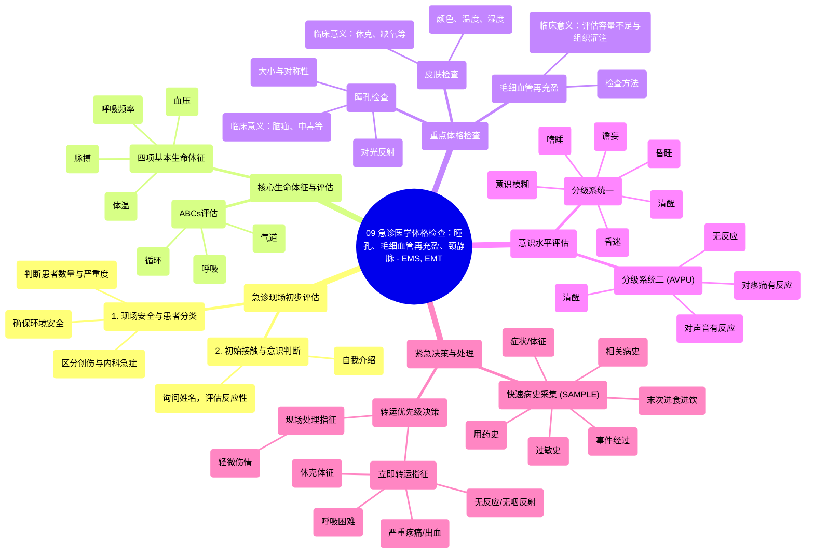

# 09 Physical Examination in Emergency Medicine - Pupils, Capillary Refill, Neck Veins - EMS, EMT

  <video controls preload="metadata" playsinline>
    <source src="https://helly.s3.bitiful.net/心血管学科/%E4%B8%93%E8%BE%91%2018%EF%BC%9A%E5%BF%83%E5%86%85%E7%A7%91%E7%BB%88%E6%9E%81%E7%99%BE%E7%A7%91%E8%BE%9E%E5%85%B8%20%28The%20Cardiology%20Encyclopedia%29/09%20Physical%20Examination%20in%20Emergency%20Medicine%20-%20Pupils%2C%20Capillary%20Refill%2C%20Neck%20Veins%20-%20EMS%2C%20EMT.mp4" type="video/mp4">
    
您的浏览器不支持播放，请升级。

  </video>

::: tip ⚡️ 核心考点 (30s速读)
*   **核心考点**：掌握急诊现场评估的标准化流程（现场安全、患者分类、ABCs评估），理解瞳孔、皮肤、毛细血管再充盈及意识水平等关键体征的检查方法与临床意义。
*   **临床意义**：快速识别危及生命的紧急情况（如休克、颅内压增高、药物中毒），并决定转运优先级（“立即转运”或“现场处理”），为后续救治赢得时间。
:::

## 🧠 深度精讲

*   **急诊现场评估流程**：视频强调了到达现场后的标准化行动顺序。首要任务是**确保现场安全**，避免救援人员成为新的受害者。其次，进行**初步评估**，确定患者数量及病情严重程度，区分是**创伤**还是**内科**急症。接着，通过自我介绍和询问姓名，快速判断患者的**意识状态和反应性**。这是启动后续针对性评估的基础。
*   **ABCs评估与生命体征**：**气道、呼吸、循环**是评估的基石。对于无反应患者，必须立即检查并处理ABCs问题（如开放气道、辅助通气、开始心肺复苏）。生命体征包括**脉搏、血压、呼吸频率和体温**。视频特别指出，**脉搏**（可触及的动脉搏动）与**心率**（心脏跳动的频率）在休克等低灌注状态下可能不一致，临床评估时应以可触及的脉搏为准。
*   **重点体格检查项目**：
    *   **瞳孔**：检查大小、对光反射及是否对称。**双侧瞳孔散大**可能提示严重脑缺氧、药物中毒或脑死亡；**双侧针尖样瞳孔**常见于阿片类药物过量或脑桥出血；**瞳孔不等大**需警惕颅内病变（如脑疝）、动眼神经损伤等。
    *   **皮肤**：评估颜色、温度、湿度。苍白、湿冷提示休克；潮红可能为CO中毒或高热；发绀提示缺氧。
    *   **毛细血管再充盈时间**：按压甲床后松开，观察颜色恢复时间。正常通常小于2秒。**时间延长（>2秒）是评估容量不足（如脱水、失血）导致组织低灌注的一个快速床边指标**。视频强调，容量不足不等于脱水，前者范围更广，包括失血等多种原因。
*   **意识水平评估**：意识水平下降是危重信号。视频介绍了两种分级系统：1) **清醒 → 意识模糊 → 谵妄 → 嗜睡 → 昏睡 → 昏迷**；2) **AVPU量表**：清醒 → 对声音有反应 → 对疼痛有反应 → 无反应。准确评估意识水平对判断病情严重性和神经功能至关重要。
*   **SAMPLE病史与转运决策**：在紧急情况下，应快速采集**SAMPLE病史**：症状/体征、过敏史、用药史、既往史/现病史、末次进食进饮情况、事件经过。基于所有评估信息，决定**转运优先级**。出现无反应、无咽反射、严重疼痛/出血、呼吸困难、休克体征等情况时，需“**立即转运**”；轻微伤情可“**现场处理**”。

## 📚 双语术语表 (Terminology)
| 英文术语 | 中文翻译 | 定义/解释 |
| :--- | :--- | :--- |
| ABCs | 气道、呼吸、循环 | 急诊医学评估与处理的优先顺序：确保气道通畅、呼吸有效、循环稳定。 |
| Capillary Refill | 毛细血管再充盈 | 评估外周组织灌注的简易方法，按压甲床或皮肤后松开，观察颜色恢复所需时间。 |
| Pupil Size | 瞳孔大小 | 瞳孔的直径，异常变化（如散大、针尖样、不等大）对诊断神经系统疾病或中毒有重要提示。 |
| Levels of Consciousness | 意识水平 | 患者对自我和环境的感知与反应程度，从清醒到昏迷的连续谱。 |
| Hypoperfusion | 低灌注 | 器官或组织的血液供应不足，是休克的核心病理生理改变。 |
| SAMPLE History | SAMPLE病史 | 急诊环境下快速采集病史的助记符：症状/体征、过敏史、用药史、相关既往史/现病史、末次进食进饮、事件经过。 |
| Load and Go / Stay and Play | 立即转运 / 现场处理 | 急诊现场决策：病情危重需立即送医 vs. 情况轻微可现场处置。 |
| Trauma vs. Medical Call | 创伤 vs. 内科急症 | 急诊呼叫分类：由外力损伤引起 vs. 由疾病或身体内部问题引起。 |

## 🗺️ 知识图谱

