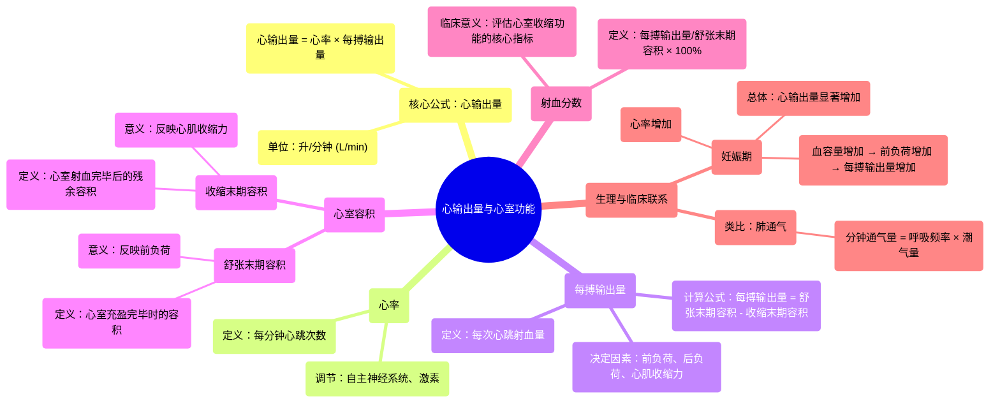

# 10 Cardiac Output, Stroke Volume, End systolic & End diastolic volumes, Ejection Fraction

  <video controls preload="metadata" playsinline>
    <source src="https://helly.s3.bitiful.net/心血管学科/%E4%B8%93%E8%BE%91%2018%EF%BC%9A%E5%BF%83%E5%86%85%E7%A7%91%E7%BB%88%E6%9E%81%E7%99%BE%E7%A7%91%E8%BE%9E%E5%85%B8%20%28The%20Cardiology%20Encyclopedia%29/10%20Cardiac%20Output%2C%20Stroke%20Volume%2C%20End%20systolic%20%26%20End%20diastolic%20volumes%2C%20Ejection%20Fraction.mp4" type="video/mp4">
    
您的浏览器不支持播放，请升级。

  </video>

::: tip ⚡️ 核心考点 (30s速读)
*   **核心考点**：心输出量是衡量心脏泵血功能的核心指标，等于心率乘以每搏输出量。理解舒张末期容积、收缩末期容积与射血分数的关系，是评估心室功能的关键。
*   **临床意义**：在妊娠、运动等生理状态下，心输出量会增加以满足代谢需求。射血分数是临床评估心力衰竭和心室收缩功能的重要指标。
:::

## 🧠 深度精讲

*   **心脏的“工厂”模型**：心脏可以被理解为一个“工厂”。**静脉**是输入管道，将血液（去氧血或含氧血）送回心脏；**动脉**是输出管道，将血液泵出心脏并输送到全身。右心接收全身回流的去氧血，泵向肺部；左心接收肺部回流的含氧血，泵向全身。
*   **心输出量**：指一侧心室每分钟泵出的血液总量，是衡量心脏泵血功能的整体指标。计算公式为：**心输出量 = 心率 × 每搏输出量**。这类似于工厂的“员工数量 × 每位员工生产率”。正常成人静息时约为 **5 升/分钟**，意味着全身血液大约每分钟循环一次。
*   **心率**：心脏每分钟搏动的次数（次/分）。
*   **每搏输出量**：一侧心室每次心搏射出的血液量（毫升/次）。
*   **心室容积与射血分数**：
    *   **舒张末期容积**：心室在舒张末期（充盈完成后）的血液容积，代表心室的前负荷。
    *   **收缩末期容积**：心室在收缩末期（射血完成后）剩余的血液容积。
    *   **每搏输出量** = 舒张末期容积 - 收缩末期容积。
    *   **射血分数**：每搏输出量占舒张末期容积的百分比，即 **（舒张末期容积 - 收缩末期容积）/ 舒张末期容积 × 100%**。它是评估**心室收缩功能**的核心指标，正常值通常 > 55%。
*   **临床联系**：视频以**妊娠期**为例，解释了心输出量增加的生理机制：血容量增加导致静脉回心血量增加（前负荷增加），进而使每搏输出量增加；同时心率也通常增快。两者共同导致心输出量显著升高，以满足母亲和胎儿的代谢需求。
*   **知识类比**：心输出量的计算逻辑（频率 × 强度）与**肺的分钟通气量**（呼吸频率 × 潮气量）完全一致，体现了生理学原理的相通性。

## 📚 双语术语表 (Terminology)
| 英文术语 | 中文翻译 | 定义/解释 |
| :--- | :--- | :--- |
| Cardiac Output | 心输出量 | 一侧心室每分钟泵出的血液总量，CO = HR × SV。 |
| Heart Rate | 心率 | 心脏每分钟搏动的次数。 |
| Stroke Volume | 每搏输出量 | 一侧心室每次心搏射出的血液量。 |
| End-Diastolic Volume | 舒张末期容积 | 心室在舒张末期（充盈完成时）的容积。 |
| End-Systolic Volume | 收缩末期容积 | 心室在收缩末期（射血完成时）的容积。 |
| Ejection Fraction | 射血分数 | 每搏输出量占舒张末期容积的百分比，反映心室收缩功能。 |
| Cardiac Index | 心指数 | 心输出量除以体表面积，用于不同体型个体间的比较。 |
| Venous Return | 静脉回心血量 | 单位时间内由静脉回流至心房的血量。 |
| Preload | 前负荷 | 心肌在收缩前所承受的负荷，通常指舒张末期容积或压力。 |
| Arterial Blood Pressure | 动脉血压 | 血液对动脉血管壁的侧压力。 |

## 🗺️ 知识图谱

