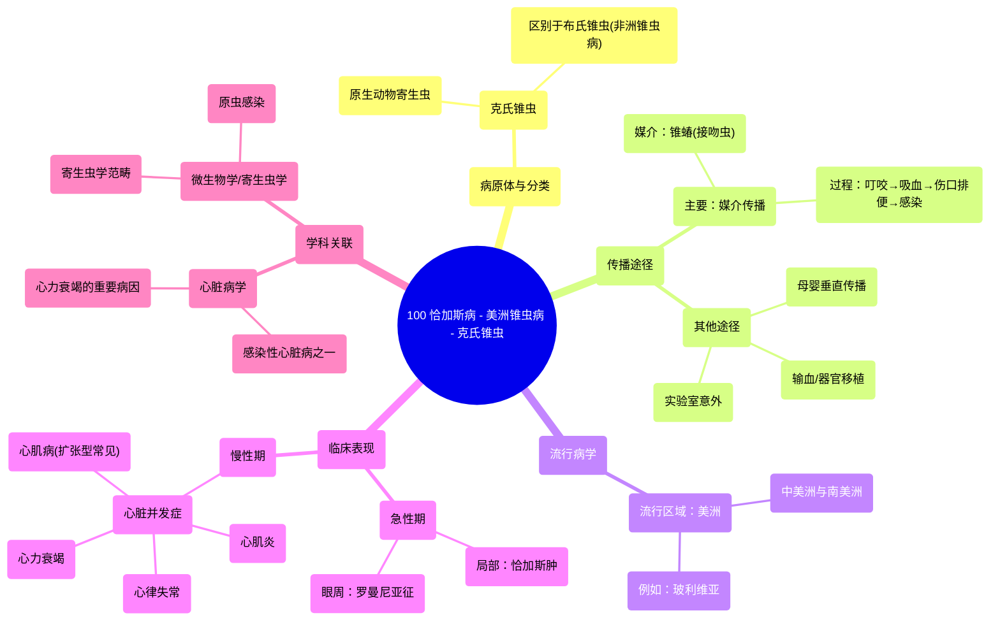

# 100 Chagas disease - American Trypanosomiasis - Trypanosoma cruzi Protozoa

  <video controls preload="metadata" playsinline>
    <source src="https://helly.s3.bitiful.net/心血管学科/%E4%B8%93%E8%BE%91%2018%EF%BC%9A%E5%BF%83%E5%86%85%E7%A7%91%E7%BB%88%E6%9E%81%E7%99%BE%E7%A7%91%E8%BE%9E%E5%85%B8%20%28The%20Cardiology%20Encyclopedia%29/100%20Chagas%20disease%20-%20American%20Trypanosomiasis%20-%20Trypanosoma%20cruzi%20Protozoa.mp4" type="video/mp4">
    
您的浏览器不支持播放，请升级。

  </video>

::: tip ⚡️ 核心考点 (30s速读)
*   **核心考点**：恰加斯病（美洲锥虫病）是由克氏锥虫引起的寄生虫病，主要通过锥蝽（接吻虫）叮咬后，其粪便污染伤口而传播。
*   **临床意义**：该病可导致严重的心脏并发症，如心肌炎、心肌病、心律失常和心力衰竭，是拉丁美洲地区心力衰竭的重要原因之一。
:::

## 🧠 深度精讲

*   **概念1：病原体与分类**
    恰加斯病由一种名为克氏锥虫的原生动物寄生虫引起。在微生物学分类中，它属于寄生虫学范畴下的原虫。需要与引起非洲锥虫病（昏睡病）的布氏锥虫相区分。

*   **概念2：传播途径**
    主要传播媒介是锥蝽（又称接吻虫或猎蝽）。其感染过程独特：1) 昆虫叮咬吸血；2) 在叮咬的皮肤伤口处排便；3) 粪便中的克氏锥虫通过皮肤破损处进入人体。其他传播方式包括：输血或器官移植、母婴垂直传播以及实验室意外感染。

*   **概念3：流行病学与临床表现**
    该病主要流行于美洲，尤其是中美洲和南美洲（如玻利维亚）。急性期感染后，皮肤局部可能出现“恰加斯肿”，若感染发生在眼部周围，可出现单侧眼睑水肿，称为“罗曼尼亚征”。疾病可进入慢性期，多年后表现为心脏扩大、心力衰竭、心律失常等严重心脏病变。

*   **概念4：在心脏病学中的位置**
    本视频是心脏病学系列的一部分，强调恰加斯病是众多可影响心脏的感染性疾病之一。它可导致心肌炎、扩张型心肌病等，最终引发心力衰竭，因此在流行区是重要的心血管疾病病因。

## 📚 双语术语表 (Terminology)
| 英文术语 | 中文翻译 | 定义/解释 |
| :--- | :--- | :--- |
| Chagas disease | 恰加斯病 | 由克氏锥虫引起的寄生虫感染，又称美洲锥虫病。 |
| Trypanosoma cruzi | 克氏锥虫 | 引起恰加斯病的原生动物寄生虫。 |
| American trypanosomiasis | 美洲锥虫病 | 恰加斯病的学名。 |
| Triatomine bug / Kissing bug | 锥蝽 / 接吻虫 | 传播克氏锥虫的主要昆虫媒介。 |
| Vector-borne transmission | 媒介传播 | 通过昆虫等生物媒介传播疾病的方式。 |
| Chagoma | 恰加斯肿 | 克氏锥虫侵入部位的皮肤局部肿胀或结节。 |
| Romana‘s sign | 罗曼尼亚征 | 恰加斯病急性期，单侧眼睑无痛性水肿的典型体征。 |
| Vertical transmission | 垂直传播 | 病原体从母亲直接传给子代，如经胎盘或分娩过程感染。 |
| Cardiomyopathy | 心肌病 | 心肌结构和功能异常的一组疾病，恰加斯病可导致其发生。 |

## 🗺️ 知识图谱

