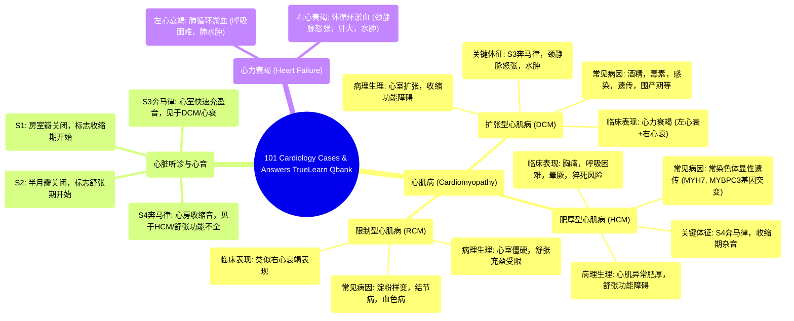

# 101 Cardiology Cases & Answers TrueLearn Qbank

  <video controls preload="metadata" playsinline>
    <source src="https://helly.s3.bitiful.net/心血管学科/%E4%B8%93%E8%BE%91%2018%EF%BC%9A%E5%BF%83%E5%86%85%E7%A7%91%E7%BB%88%E6%9E%81%E7%99%BE%E7%A7%91%E8%BE%9E%E5%85%B8%20%28The%20Cardiology%20Encyclopedia%29/101%20Cardiology%20Cases%20%26%20Answers%20TrueLearn%20Qbank.mp4" type="video/mp4">
    
您的浏览器不支持播放，请升级。

  </video>

::: tip ⚡️ 核心考点 (30s速读)
*   **核心考点**：扩张型心肌病 (DCM) 的临床特征与鉴别诊断。
*   **临床意义**：DCM以心室扩张、收缩功能障碍为特征，表现为心力衰竭症状（如呼吸困难、水肿、颈静脉怒张）。S3奔马律是其典型体征。需与肥厚型心肌病、限制型心肌病等鉴别。
:::

## 🧠 深度精讲
*   **病例一：扩张型心肌病 (Dilated Cardiomyopathy, DCM)**
    *   **核心病理生理**：心脏（尤其是左心室）显著扩张，收缩功能严重受损（“收缩期功能差”），但舒张功能相对正常。这导致心输出量下降，血液在心脏后方淤积。
    *   **临床表现**：
        *   **左心衰竭**：活动后或静息时呼吸困难、端坐呼吸、夜间阵发性呼吸困难、肺部湿啰音、咳粉红色泡沫痰。
        *   **右心衰竭**：颈静脉怒张（上腔静脉回流受阻）、肝颈静脉回流征阳性、下肢凹陷性水肿（下腔静脉回流受阻）、肝淤血。
    *   **关键体征**：**S3奔马律**（心室快速充盈期血液冲击扩张心室壁产生），是DCM的典型听诊发现。
    *   **病因记忆法 (ABCDE...)**：
        *   **A**：酒精 (Alcohol)、阿霉素/多柔比星 (Adriamycin/Doxorubicin)
        *   **B**：脚气病 (Beriberi，维生素B1缺乏) - 湿性脚气病影响心脏
        *   **C**：柯萨奇B病毒 (Coxsackie B virus)、恰加斯病 (Chagas disease)
        *   **D**：多柔比星 (Doxorubicin)
        *   **E**：离心性肥厚 (Eccentric hypertrophy) 伴 **S3** 心音
        *   **其他**：血色病 (Hemochromatosis)、围产期心肌病、特发性、家族性等。**可卡因滥用**是重要危险因素。

*   **病例二：肥厚型心肌病 (Hypertrophic Cardiomyopathy, HCM) 与 S4 奔马律**
    *   **核心病理生理**：心肌非对称性、异常肥厚（尤其是室间隔），导致左心室流出道可能梗阻，舒张功能严重受损（心室僵硬，充盈困难）。
    *   **临床表现**：可无症状，或出现胸痛、呼吸困难、晕厥（尤其在运动时）。听诊可有收缩期喷射样杂音。
    *   **关键体征**：**S4奔马律**。S4发生在舒张晚期（心房收缩期），因心房收缩将血液挤入僵硬的左心室而产生。它是**心室顺应性下降、舒张功能不全**的标志。
    *   **与高血压的关系**：长期高血压导致后负荷增加，引起**向心性左心室肥厚**（心肌向心性增厚，心腔变小），同样会导致舒张功能障碍和S4奔马律。病例二中患者的S4很可能源于高血压性心脏病。

## 📚 双语术语表 (Terminology)
| 英文术语 | 中文翻译 | 定义/解释 |
| :--- | :--- | :--- |
| Dilated Cardiomyopathy (DCM) | 扩张型心肌病 | 以心室扩张和收缩功能障碍为主要特征的心肌病。 |
| Hypertrophic Cardiomyopathy (HCM) | 肥厚型心肌病 | 以心肌非对称性肥厚、舒张功能障碍为特征的心肌病，可伴左室流出道梗阻。 |
| Restrictive Cardiomyopathy (RCM) | 限制型心肌病 | 以心室壁僵硬、舒张充盈受限为特征，收缩功能多正常。 |
| S3 Gallop (Third Heart Sound) | S3奔马律（第三心音） | 发生于心室快速充盈期，提示心室容量负荷过重或收缩功能不全（如DCM、心力衰竭）。 |
| S4 Gallop (Fourth Heart Sound) | S4奔马律（第四心音） | 发生于舒张晚期（心房收缩期），提示心室顺应性下降、舒张功能不全（如HCM、高血压性心脏病、心肌梗死）。 |
| Jugular Venous Distension (JVD) | 颈静脉怒张 | 颈静脉异常充盈，是右心衰竭、中心静脉压升高的体征。 |
| Pitting Edema | 凹陷性水肿 | 手指按压后留下凹陷的水肿，常见于心力衰竭、肾病等导致的体液潴留。 |
| Concentric Hypertrophy | 向心性肥厚 | 心肌纤维并联性增厚，心壁增厚，心腔变小。常见于压力负荷过重（如高血压）。 |
| Eccentric Hypertrophy | 离心性肥厚 | 心肌纤维串联性增长，心腔扩大，心壁可能相对变薄。常见于容量负荷过重（如DCM）。 |

## 🗺️ 知识图谱

