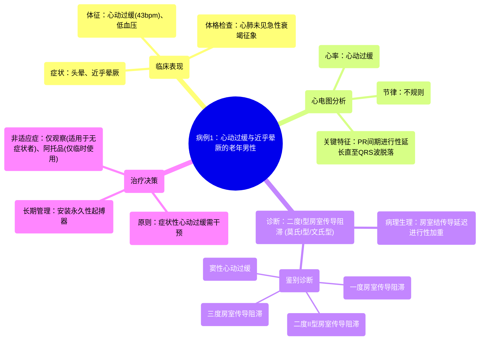

# 102 Cardiology Cases (with answers) - Physiology and Pathology - TrueLearn Qbank

  <video controls preload="metadata" playsinline>
    <source src="https://helly.s3.bitiful.net/心血管学科/%E4%B8%93%E8%BE%91%2018%EF%BC%9A%E5%BF%83%E5%86%85%E7%A7%91%E7%BB%88%E6%9E%81%E7%99%BE%E7%A7%91%E8%BE%9E%E5%85%B8%20%28The%20Cardiology%20Encyclopedia%29/102%20Cardiology%20Cases%20%28with%20answers%29%20-%20Physiology%20and%20Pathology%20-%20TrueLearn%20Qbank.mp4" type="video/mp4">
    
您的浏览器不支持播放，请升级。

  </video>

::: tip ⚡️ 核心考点 (30s速读)
*   **核心考点**：二度I型房室传导阻滞（莫氏I型）的心电图识别与临床处理。
*   **临床意义**：患者表现为心动过缓相关的头晕/晕厥前兆。心电图显示PR间期进行性延长直至一次QRS波群脱落（文氏现象），心率缓慢且不规则。莫氏I型通常为良性，若患者无症状可观察；但若出现症状（如晕厥），则需安装起搏器。
:::

## 🧠 深度精讲
*   **病例分析思路**：
    1.  **症状定位**：患者主诉为头晕/近乎晕厥，提示可能存在心输出量不足，常见原因包括心律失常。
    2.  **体征分析**：生命体征显示心动过缓（心率43次/分）和低血压。体格检查双肺呼吸音清晰、颈静脉无怒张，初步排除急性左心衰和右心压力增高。
    3.  **心电图逐步解析**：
        *   **第一步：计算心率**：使用“300法则”（300除以R-R间期大格数），计算得心率约43次/分，属于心动过缓。
        *   **第二步：评估节律**：观察发现R-R间期不恒定，为不规则的心动过缓。
        *   **第三步：分析P波与QRS波关系**：可见每个QRS波前均有P波，但PR间期逐渐延长（例如，从约1个大格延长至更长），直至一次P波后QRS波完全脱落，形成“脱漏搏动”。脱漏后PR间期恢复，并再次开始延长周期。这是典型的“文氏现象”。
    4.  **鉴别诊断**：
        *   **一度房室传导阻滞**：仅PR间期固定延长，无QRS波脱落。
        *   **二度II型房室传导阻滞**：PR间期固定（无进行性延长），突然出现QRS波脱落。
        *   **三度房室传导阻滞**：P波与QRS波完全无关，各自以固有频率跳动，心房率快于心室率。
        *   **窦性心动过缓**：心率慢但规则，P波与QRS波关系正常。
    5.  **最终诊断**：根据进行性延长的PR间期和周期性QRS波脱落，诊断为**二度I型房室传导阻滞（莫氏I型）**。
    6.  **治疗决策**：莫氏I型阻滞部位通常在房室结，进展为完全性心脏阻滞的风险相对较低。但该患者已出现症状（近乎晕厥），因此**需要安装永久性起搏器**进行长期管理。阿托品可用于紧急情况提升心率，但不是长期治疗方案。

## 📚 双语术语表 (Terminology)
| 英文术语 | 中文翻译 | 定义/解释 |
| :--- | :--- | :--- |
| Bradycardia | 心动过缓 | 心率低于60次/分。 |
| Syncope / Near-syncope | 晕厥 / 近乎晕厥 | 短暂性意识丧失 / 头晕、站立不稳等晕厥前兆。 |
| Atrioventricular (AV) Block | 房室传导阻滞 | 心脏电冲动从心房到心室的传导延迟或中断。 |
| First-Degree AV Block | 一度房室传导阻滞 | PR间期固定延长（>200ms），但每个P波后均有QRS波。 |
| Second-Degree AV Block, Mobitz Type I (Wenckebach) | 二度I型房室传导阻滞（文氏型） | PR间期进行性延长，直至一个P波后QRS波脱落，周而复始。 |
| Second-Degree AV Block, Mobitz Type II | 二度II型房室传导阻滞 | PR间期固定，突然出现一个P波后QRS波脱落。 |
| Third-Degree (Complete) AV Block | 三度（完全性）房室传导阻滞 | 心房与心室电活动完全分离，P波与QRS波无固定关系。 |
| Pacemaker | 起搏器 | 植入式医疗设备，通过发放电脉冲来调节异常缓慢的心律。 |
| EKG / ECG | 心电图 | 记录心脏电活动的检查。 |
| PR Interval | PR间期 | 心电图上从P波起点到QRS波起点的时间，代表心房除极到心室开始除极的时间。 |

## 🗺️ 知识图谱

