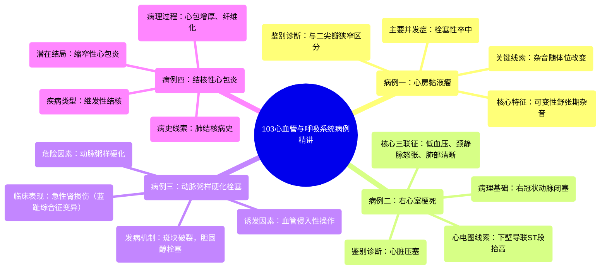

# 103 Cardiovascular & Respiratory Cases for USMLE Anatomy, Physiology, Pathology, Microbiology, Pharm

  <video controls preload="metadata" playsinline>
    <source src="https://helly.s3.bitiful.net/心血管学科/%E4%B8%93%E8%BE%91%2018%EF%BC%9A%E5%BF%83%E5%86%85%E7%A7%91%E7%BB%88%E6%9E%81%E7%99%BE%E7%A7%91%E8%BE%9E%E5%85%B8%20%28The%20Cardiology%20Encyclopedia%29/103%20Cardiovascular%20%26%20Respiratory%20Cases%20for%20USMLE%20Anatomy%2C%20Physiology%2C%20Pathology%2C%20Microbiology%2C%20Pharm.mp4" type="video/mp4">
    
您的浏览器不支持播放，请升级。

  </video>

::: tip ⚡️ 核心考点 (30s速读)
*   **核心考点**：掌握心房黏液瘤、右心室梗死、动脉粥样硬化栓塞及结核性心包炎的临床特征与鉴别诊断。
*   **临床意义**：通过病例学习，理解“症状相似但病因不同”的鉴别思路，以及如何从病史、体征和检查结果中寻找关键线索。
:::

## 🧠 深度精讲

*   **病例一：心房黏液瘤**
    *   **核心特征**：患者表现为典型的二尖瓣狭窄体征（舒张期隆隆样杂音，心尖部最响），但杂音会随体位改变而变化，且为新发杂音。
    *   **鉴别诊断**：这是与真性二尖瓣狭窄鉴别的关键点。心房黏液瘤是左心房内的良性肿瘤，可随体位移动，导致二尖瓣口间歇性阻塞，从而产生可变的杂音。
    *   **并发症**：肿瘤可导致高凝状态（魏尔啸三联征之一），增加血栓形成风险。左心房血栓脱落可引起体循环栓塞，最常见且危险的并发症是**栓塞性卒中**。

*   **病例二：右心室梗死**
    *   **核心特征**：患者表现为下壁心肌梗死（心电图II、III、aVF导联ST段抬高），同时伴有**低血压、颈静脉怒张和肺部听诊清晰**。
    *   **鉴别诊断**：需与心脏压塞（贝克三联征：颈静脉怒张、低血压、心音遥远）鉴别。右心室梗死三联征的特点是“肺部清晰”，因为右心衰竭不会直接导致肺淤血。
    *   **病理生理**：右冠状动脉同时供应心脏下壁和右心室。下壁心梗提示右冠状动脉受累，因此常合并右心室梗死。右心室功能受损导致其舒张期充盈受限（前负荷降低），进而引起心输出量下降和低血压。

*   **病例三：动脉粥样硬化栓塞性肾病**
    *   **核心特征**：具有多种动脉粥样硬化危险因素的老年患者，在接受冠状动脉造影（动脉穿刺操作）后，出现急性肾功能损害（血尿素氮和肌酐升高）。
    *   **发病机制**：操作可能使主动脉等大血管壁上的动脉粥样硬化斑块破裂，其内的胆固醇结晶脱落形成栓子，随血流阻塞肾动脉等小血管，导致组织缺血梗死。这属于**胆固醇栓塞**。
    *   **临床联系**：若栓塞发生在下肢末梢动脉，可表现为“蓝趾综合征”。本例栓塞发生在肾脏，故表现为急性肾损伤。

*   **病例四：结核性心包炎**
    *   **核心特征**：慢性病程，患者有肺结核病史，出现进行性肌无力、呼吸困难，影像学发现心包增厚。
    *   **疾病归属**：结核性心包炎属于**继发性结核病**。原发性结核通常局限于肺部，而继发性结核可经血行播散至全身任何器官，包括心包。
    *   **病理发展**：结核杆菌感染心包，引起慢性炎症、渗出和纤维化，导致心包增厚、钙化，最终可能发展为**缩窄性心包炎**，限制心脏舒张，引起心输出量降低和上述症状。

## 📚 双语术语表 (Terminology)

| 英文术语 | 中文翻译 | 定义/解释 |
| :--- | :--- | :--- |
| Atrial Myxoma | 心房黏液瘤 | 一种最常见的心脏原发性良性肿瘤，通常位于左心房，可产生类似瓣膜病的杂音和栓塞症状。 |
| Right Ventricular Infarction | 右心室梗死 | 心肌梗死累及右心室，常与下壁心梗并存，典型表现为颈静脉怒张、低血压和肺部清晰。 |
| Atheroembolic Disease | 动脉粥样硬化栓塞性疾病 | 动脉粥样硬化斑块破裂，内容物（如胆固醇结晶）脱落形成栓子，阻塞远端动脉引起的疾病。 |
| Cholesterol Embolization | 胆固醇栓塞 | 动脉粥样硬化栓塞的一种具体类型，栓子成分为胆固醇结晶。 |
| Tuberculous Pericarditis | 结核性心包炎 | 由结核分枝杆菌感染引起的心包炎症，是缩窄性心包炎的常见原因之一。 |
| Beck's Triad | 贝克三联征 | 心脏压塞的典型体征：颈静脉怒张、低血压、心音遥远。 |
| Virchow's Triad | 魏尔啸三联征 | 血栓形成的三个主要因素：血管内皮损伤、血流淤滞、血液高凝状态。 |

## 🗺️ 知识图谱

