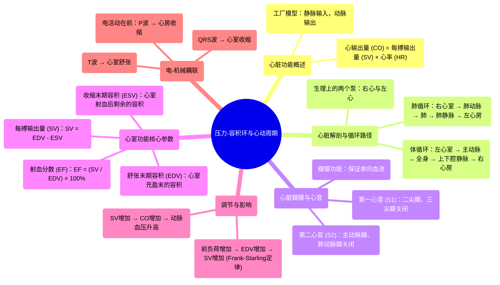

# 11 Pressure-Volume Loops & the Cardiac Cycle — Cardiophysiology — Physiology Playlist

  <video controls preload="metadata" playsinline>
    <source src="https://helly.s3.bitiful.net/心血管学科/%E4%B8%93%E8%BE%91%2018%EF%BC%9A%E5%BF%83%E5%86%85%E7%A7%91%E7%BB%88%E6%9E%81%E7%99%BE%E7%A7%91%E8%BE%9E%E5%85%B8%20%28The%20Cardiology%20Encyclopedia%29/11%20Pressure-Volume%20Loops%20%26%20the%20Cardiac%20Cycle%20%E2%80%94%20Cardiophysiology%20%E2%80%94%20Physiology%20Playlist.mp4" type="video/mp4">
    
您的浏览器不支持播放，请升级。

  </video>

::: tip ⚡️ 核心考点 (30s速读)
*   **核心考点**：理解心脏的“工厂”模型、心输出量（CO）的构成（CO = SV × HR）、以及通过舒张末期容积（EDV）、收缩末期容积（ESV）和每搏输出量（SV）计算射血分数（EF）。
*   **临床意义**：射血分数是评估左心室泵血功能的关键指标，前负荷（静脉回心血量）直接影响每搏输出量和心输出量，进而影响血压。压力-容积环是分析心室做功和心脏状态的强大工具。
:::

## 🧠 深度精讲

*   **心脏的“工厂”模型**：心脏被比喻为一个工厂。**静脉**是输入管道，将血液（原料）送回心脏；**动脉**是输出管道，将泵出的血液（产品）输送到全身。这个模型有助于理解心脏的基本功能：接收和泵出血液。
*   **心输出量的计算**：心输出量（Cardiac Output, CO）是衡量心脏每分钟泵血总量的指标。其计算公式为：**心输出量 (CO) = 每搏输出量 (SV) × 心率 (HR)**。这类似于工厂的“员工数量 × 每位员工的生产率”。
*   **心脏的“两个泵”**：从解剖学上看，我们只有一个心脏。但从生理功能上，它可以被视为两个串联的泵：**右心**（泵血至肺部进行气体交换）和**左心**（泵血至全身供应氧气和营养）。
*   **心动周期与瓣膜**：血液流动路径遵循体循环和肺循环。瓣膜控制血流方向，其关闭产生心音：
    *   **第一心音 (S1)**：二尖瓣和三尖瓣关闭（心室收缩开始）。
    *   **第二心音 (S2)**：主动脉瓣和肺动脉瓣关闭（心室舒张开始）。
*   **容积与射血分数的核心概念**：这是理解心室功能的核心。
    1.  **舒张末期容积 (EDV)**：心室在舒张末期完全充盈后的血容量（“我给你的10个苹果”）。
    2.  **收缩末期容积 (ESV)**：心室在收缩末期射血后剩余的血容量（“你留下的4个苹果”）。
    3.  **每搏输出量 (SV)**：心室一次收缩射出的血量，**SV = EDV - ESV**（“你射出的6个苹果”）。
    4.  **射血分数 (EF)**：每搏输出量占舒张末期容积的百分比，**EF = (SV / EDV) × 100% = [(EDV - ESV) / EDV] × 100%**（“你射出了60%”）。EF是评估心室收缩功能的关键指标。
*   **前负荷与心输出量的关系**：**前负荷**主要指静脉回心血量，它决定了心室的初始拉伸程度（EDV）。根据Frank-Starling定律，在一定范围内，EDV增加（如前负荷增加）会导致SV增加（“给你20个苹果，你能射出更多”），从而提升心输出量和动脉血压。
*   **电活动与机械活动**：心脏的收缩（机械活动）由电活动触发。**P波**引发心房收缩，**QRS波**引发心室收缩，**T波**对应心室复极（舒张开始）。

## 📚 双语术语表 (Terminology)
| 英文术语 | 中文翻译 | 定义/解释 |
| :--- | :--- | :--- |
| Cardiac Output (CO) | 心输出量 | 心脏每分钟泵出的血液总量，CO = SV × HR。 |
| Stroke Volume (SV) | 每搏输出量 | 心室一次收缩射出的血液量。 |
| Heart Rate (HR) | 心率 | 心脏每分钟搏动的次数。 |
| End-Diastolic Volume (EDV) | 舒张末期容积 | 心室在舒张末期（充盈完成后）的血液容积。 |
| End-Systolic Volume (ESV) | 收缩末期容积 | 心室在收缩末期（射血完成后）剩余的血液容积。 |
| Ejection Fraction (EF) | 射血分数 | 每搏输出量占舒张末期容积的百分比，反映心室泵血效率。 |
| Preload | 前负荷 | 心室在舒张末期所承受的负荷，通常指静脉回心血量或心室壁的初始张力。 |
| Systemic Circulation | 体循环 | 左心室泵血至全身（除肺外），再返回右心房的循环路径。 |
| Pulmonary Circulation | 肺循环 | 右心室泵血至肺部，进行气体交换后返回左心房的循环路径。 |
| Mitral Valve | 二尖瓣 | 位于左心房和左心室之间的瓣膜，有两个瓣叶。 |
| Tricuspid Valve | 三尖瓣 | 位于右心房和右心室之间的瓣膜，有三个瓣叶。 |
| Aortic Valve | 主动脉瓣 | 位于左心室和主动脉之间的瓣膜。 |
| Pulmonic Valve | 肺动脉瓣 | 位于右心室和肺动脉之间的瓣膜。 |
| S1 Heart Sound | 第一心音 | 主要由二尖瓣和三尖瓣关闭产生，标志心室收缩开始。 |
| S2 Heart Sound | 第二心音 | 主要由主动脉瓣和肺动脉瓣关闭产生，标志心室舒张开始。 |

## 🗺️ 知识图谱

