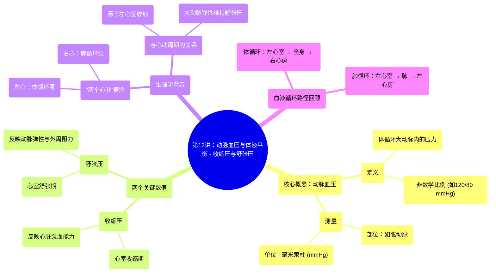

# 12 Arterial Blood Pressure (ABP) and Fluid Balance - Systolic and Diastolic Pressure

  <video controls preload="metadata" playsinline>
    <source src="https://helly.s3.bitiful.net/心血管学科/%E4%B8%93%E8%BE%91%2018%EF%BC%9A%E5%BF%83%E5%86%85%E7%A7%91%E7%BB%88%E6%9E%81%E7%99%BE%E7%A7%91%E8%BE%9E%E5%85%B8%20%28The%20Cardiology%20Encyclopedia%29/12%20Arterial%20Blood%20Pressure%20%28ABP%29%20and%20Fluid%20Balance%20-%20Systolic%20and%20Diastolic%20Pressure.mp4" type="video/mp4">
    
您的浏览器不支持播放，请升级。

  </video>

::: tip ⚡️ 核心考点 (30s速读)
*   **核心考点**：动脉血压（ABP）是体循环大动脉内的压力，由收缩压（心室收缩时）和舒张压（心室舒张时）两个数值表示，单位为毫米汞柱（mmHg）。它不是数学比例。
*   **临床意义**：血压是评估心血管健康的关键指标。理解收缩压与舒张压的生理意义，是诊断高血压、低血压及评估心功能的基础。
:::

## 🧠 深度精讲

*   **动脉血压的定义与测量**：动脉血压特指**体循环动脉**（如肱动脉）内的压力，而非肺动脉或心脏腔室内的压力。临床上通过袖带在上臂测量，得到两个数值：**收缩压**（SBP，心室收缩期动脉内压力峰值）和**舒张压**（DBP，心室舒张期动脉内压力最低值）。记录格式为“收缩压/舒张压 mmHg”，例如120/80 mmHg，**这不是一个可约分的数学比例**。

*   **血压数值的生理来源**：收缩压（如120 mmHg）主要来源于**左心室收缩**时射血对主动脉壁产生的压力。舒张压（如80 mmHg）则反映了在心室舒张期，**大动脉弹性回缩**维持的持续血流压力。视频中强调，虽然左心室舒张压为0，但大动脉因弹性储器作用，其舒张压仍维持在较高水平。

*   **体循环与肺循环的“两个心脏”概念**：从生理功能角度，心脏可视为“两个泵”：**左心**（左心房、左心室）负责将氧合血泵入**体循环**，供应全身；**右心**（右心房、右心室）负责将脱氧血泵入**肺循环**，进行气体交换。本次讲座主要关注负责体循环的**左心室**及其产生的动脉血压。

*   **心动周期与血压的关联**：血压测量与心动周期紧密相关。回顾血液循环路径：左心室 → 主动脉 → 体循环动脉 → 毛细血管（物质交换）→ 静脉 → 上/下腔静脉 → 右心房 → 右心室 → 肺动脉 → 肺（气体交换）→ 肺静脉 → 左心房 → 左心室。血压测量点位于此路径的起始阶段——体循环大动脉。

## 📚 双语术语表 (Terminology)
| 英文术语 | 中文翻译 | 定义/解释 |
| :--- | :--- | :--- |
| Arterial Blood Pressure (ABP) | 动脉血压 | 体循环大动脉内的血液对血管壁产生的侧压力。 |
| Systolic Blood Pressure | 收缩压 | 心室收缩（射血）时，动脉血压达到的最高值。 |
| Diastolic Blood Pressure | 舒张压 | 心室舒张（充盈）时，动脉血压下降到的最低值。 |
| Millimeters of Mercury (mmHg) | 毫米汞柱 | 血压的测量单位。 |
| Systemic Circulation | 体循环 / 大循环 | 血液从左心室流向全身组织再返回右心房的循环路径。 |
| Pulmonary Circulation | 肺循环 / 小循环 | 血液从右心室流向肺部进行气体交换再返回左心房的循环路径。 |
| Cardiac Cycle | 心动周期 | 心脏一次收缩和舒张所经历的机械活动周期。 |
| Left Ventricle | 左心室 | 心脏腔室之一，负责将氧合血泵入体循环，是产生体循环动脉收缩压的主要动力源。 |
| Brachial Artery | 肱动脉 | 位于上臂的动脉，是临床测量血压的常用部位。 |

## 🗺️ 知识图谱

