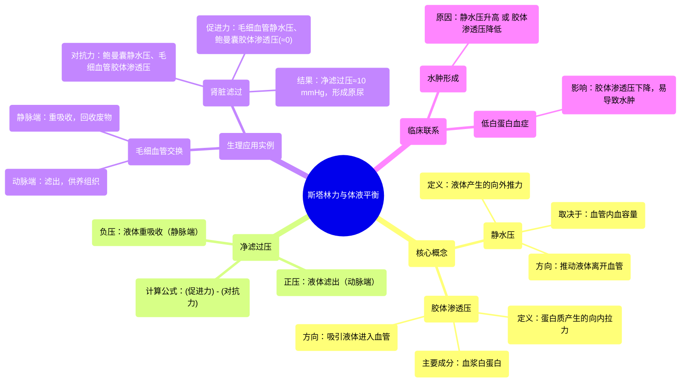

# 13 Starling Forces - made easy - Hydrostatic Pressure and Colloidal Osmotic (Oncotic) Pressure - Physio

  <video controls preload="metadata" playsinline>
    <source src="https://helly.s3.bitiful.net/心血管学科/%E4%B8%93%E8%BE%91%2018%EF%BC%9A%E5%BF%83%E5%86%85%E7%A7%91%E7%BB%88%E6%9E%81%E7%99%BE%E7%A7%91%E8%BE%9E%E5%85%B8%20%28The%20Cardiology%20Encyclopedia%29/13%20Starling%20Forces%20-%20made%20easy%20-%20Hydrostatic%20Pressure%20and%20Colloidal%20Osmotic%20%28Oncotic%29%20Pressure%20-%20Physio.mp4" type="video/mp4">
    
您的浏览器不支持播放，请升级。

  </video>

::: tip ⚡️ 核心考点 (30s速读)
*   **核心考点**：**Starling力**决定了液体在毛细血管和组织间液之间的净流动方向。其核心是**静水压**（将液体“推”出血管）与**胶体渗透压**（将液体“拉”回血管）之间的平衡。
*   **临床意义**：理解Starling力是解释**水肿**（如心衰、肝病、肾病综合征引起的水肿）和**肾脏滤过**机制的基础。血浆白蛋白水平是影响胶体渗透压的关键临床指标。
:::

## 🧠 深度精讲

*   **Starling力**：指决定液体在毛细血管和组织间液之间交换的四种压力。其净效应决定了液体是滤出血管（形成组织液）还是被重吸收回血管。
*   **静水压**：由血管内血液容积产生的压力，方向是**向外推**液体。压力大小取决于血容量。例如，动脉端毛细血管静水压较高。
*   **胶体渗透压**：主要由血浆蛋白（尤其是**白蛋白**）产生的渗透压，方向是**向内拉**液体。它取决于具有渗透活性的颗粒数量，而非颗粒大小或重量。
*   **净滤过压**：促进滤过的力减去对抗滤过的力。在**毛细血管动脉端**，净滤过压为**正**，液体滤出供养细胞；在**静脉端**，净滤过压为**负**，大部分液体被重吸收回血管。
*   **肾脏滤过的应用**：肾小球滤过是Starling力的典型应用。
    *   **促进滤过的力**：肾小球毛细血管静水压（约60 mmHg）、鲍曼囊胶体渗透压（约为0，因正常无蛋白）。
    *   **对抗滤过的力**：鲍曼囊静水压（约18 mmHg）、肾小球毛细血管胶体渗透压（约32 mmHg）。
    *   **净滤过压** = (60 + 0) - (18 + 32) = **10 mmHg**。这个正压力驱动血浆滤过形成原尿。

## 📚 双语术语表 (Terminology)
| 英文术语 | 中文翻译 | 定义/解释 |
| :--- | :--- | :--- |
| Starling Forces | 斯塔林力 / 星氏力 | 决定毛细血管内外液体交换的四种压力（毛细血管静水压、组织液静水压、血浆胶体渗透压、组织液胶体渗透压）的合称。 |
| Hydrostatic Pressure | 静水压 | 由液体本身重量或容积产生的压力，在血管内它将液体向外推。 |
| Colloidal Osmotic Pressure / Oncotic Pressure | 胶体渗透压 | 主要由血浆中的大分子蛋白质（如白蛋白）产生的渗透压，它将液体拉向血管内。 |
| Albumin | 白蛋白 | 血浆中含量最丰富的蛋白质，是维持血浆胶体渗透压的最主要成分。 |
| Net Filtration Pressure | 净滤过压 | 促进滤过的压力之和减去对抗滤过的压力之和，决定了液体净流动的方向和速率。 |
| Glomerular Filtration | 肾小球滤过 | 血液流经肾小球时，在Starling力作用下，部分血浆成分滤入鲍曼囊形成原尿的过程。 |
| Bowman‘s Capsule | 鲍曼囊 / 肾小囊 | 肾小管的起始端，包裹肾小球，是原尿收集的部位。 |

## 🗺️ 知识图谱

