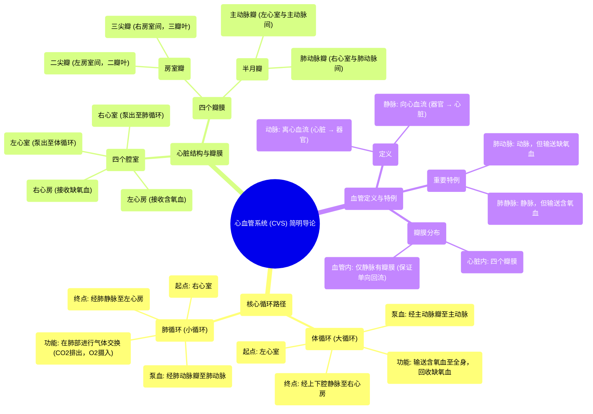

# 14 The Cardiovascular System (CVS)  A Simple Introduction - Biology, Anatomy, Physiology

  <video controls preload="metadata" playsinline>
    <source src="https://helly.s3.bitiful.net/心血管学科/%E4%B8%93%E8%BE%91%2018%EF%BC%9A%E5%BF%83%E5%86%85%E7%A7%91%E7%BB%88%E6%9E%81%E7%99%BE%E7%A7%91%E8%BE%9E%E5%85%B8%20%28The%20Cardiology%20Encyclopedia%29/14%20The%20Cardiovascular%20System%20%28CVS%29%20%20A%20Simple%20Introduction%20-%20Biology%2C%20Anatomy%2C%20Physiology.mp4" type="video/mp4">
    
您的浏览器不支持播放，请升级。

  </video>

::: tip ⚡️ 核心考点 (30s速读)
*   **核心考点**：掌握体循环与肺循环的完整路径，理解心脏四个腔室（左心房、左心室、右心房、右心室）和四个瓣膜（二尖瓣、三尖瓣、主动脉瓣、肺动脉瓣）的功能与位置。
*   **临床意义**：明确动脉与静脉的定义（基于血流方向而非含氧量），识别肺动脉（输送缺氧血）和肺静脉（输送含氧血）这两个特例。
:::

## 🧠 深度精讲

*   **概念1：体循环与肺循环路径**
    1.  **体循环（大循环）**：从左心室开始。含氧血经**主动脉瓣**泵入**主动脉**，流向全身组织毛细血管。在毛细血管处，血液释放氧气并带走细胞代谢产生的二氧化碳，变为缺氧血。缺氧血经各级静脉汇集，最终通过**上腔静脉**和**下腔静脉**返回**右心房**。
    2.  **肺循环（小循环）**：从右心室开始。右心房的缺氧血经**三尖瓣**进入**右心室**，再经**肺动脉瓣**泵入**肺动脉干**及其分支，到达肺部。在肺部毛细血管，血液释放二氧化碳，吸收氧气，重新变为含氧血。含氧血经**肺静脉**（左右各两条）返回**左心房**，再经**二尖瓣**进入**左心室**，完成一次循环。

*   **概念2：心脏的四个瓣膜**
    *   **房室瓣**：位于心房与心室之间，防止血液从心室倒流回心房。
        *   **二尖瓣（僧帽瓣）**：位于左心房与左心室之间，是**唯一一个有两个瓣叶**的瓣膜，因其形状类似主教冠（法冠，拉丁语“Mitra”）而得名。
        *   **三尖瓣**：位于右心房与右心室之间，有三个瓣叶。
    *   **半月瓣**：位于心室与大动脉之间，防止血液从大动脉倒流回心室。
        *   **主动脉瓣**：位于左心室与主动脉之间，有三个瓣叶。
        *   **肺动脉瓣**：位于右心室与肺动脉干之间，有三个瓣叶。

*   **概念3：血管定义与特例**
    *   **定义**：
        *   **动脉**：将血液**从心脏**输送到身体其他部位的血管（离心方向）。
        *   **静脉**：将血液**输送回心脏**的血管（向心方向）。
    *   **特例**：
        *   **肺动脉**：是**动脉**，但输送的是**缺氧血**（从右心室到肺）。
        *   **肺静脉**：是**静脉**，但输送的是**含氧血**（从肺到左心房）。
    *   **瓣膜**：**只有静脉（除腔静脉等大静脉外）和心脏内有瓣膜**，动脉和毛细血管内没有瓣膜。

## 📚 双语术语表 (Terminology)
| 英文术语 | 中文翻译 | 定义/解释 |
| :--- | :--- | :--- |
| Cardiovascular System (CVS) | 心血管系统 | 由心脏和血管组成的循环系统。 |
| Left Ventricle | 左心室 | 心脏腔室，将含氧血泵入体循环。 |
| Aorta | 主动脉 | 体循环的起始大动脉。 |
| Systemic Circulation | 体循环 / 大循环 | 血液从左心室流向全身再返回右心房的循环。 |
| Inferior/Superior Vena Cava | 下腔静脉 / 上腔静脉 | 将身体下半部和上半部缺氧血输送回右心房的大静脉。 |
| Right Atrium | 右心房 | 接收体循环回流的缺氧血。 |
| Tricuspid Valve | 三尖瓣 | 位于右心房和右心室之间的房室瓣（三瓣叶）。 |
| Right Ventricle | 右心室 | 心脏腔室，将缺氧血泵入肺循环。 |
| Pulmonary Trunk/Artery | 肺动脉干 / 肺动脉 | 将右心室的缺氧血输送至肺部的动脉。 |
| Pulmonary Circulation | 肺循环 / 小循环 | 血液从右心室流向肺部再返回左心房的循环。 |
| Pulmonary Veins | 肺静脉 | 将肺部含氧血输送回左心房的静脉（共四条）。 |
| Left Atrium | 左心房 | 接收肺循环回流的含氧血。 |
| Mitral Valve | 二尖瓣 / 僧帽瓣 | 位于左心房和左心室之间的房室瓣（二瓣叶）。 |
| Aortic Valve | 主动脉瓣 | 位于左心室和主动脉之间的半月瓣。 |
| Pulmonic Valve | 肺动脉瓣 | 位于右心室和肺动脉干之间的半月瓣。 |
| Semilunar Valves | 半月瓣 | 主动脉瓣和肺动脉瓣的统称。 |
| Atrioventricular (AV) Valves | 房室瓣 | 二尖瓣和三尖瓣的统称。 |
| Artery | 动脉 | 将血液从心脏运出的血管。 |
| Vein | 静脉 | 将血液运回心脏的血管。 |
| Fetal Circulation | 胎儿循环 | 胎儿时期特有的、依赖胎盘的血液循环路径。 |

## 🗺️ 知识图谱

