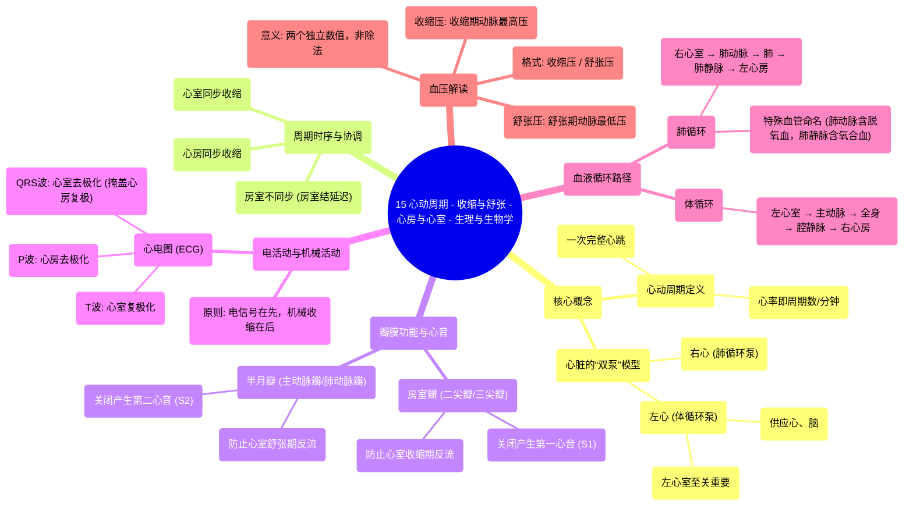

# 15 The Cardiac Cycle - Systole and Diastole - Atria and Ventricles - Physiology and Biology

  <video controls preload="metadata" playsinline>
    <source src="https://helly.s3.bitiful.net/心血管学科/%E4%B8%93%E8%BE%91%2018%EF%BC%9A%E5%BF%83%E5%86%85%E7%A7%91%E7%BB%88%E6%9E%81%E7%99%BE%E7%A7%91%E8%BE%9E%E5%85%B8%20%28The%20Cardiology%20Encyclopedia%29/15%20The%20Cardiac%20Cycle%20-%20Systole%20and%20Diastole%20-%20Atria%20and%20Ventricles%20-%20Physiology%20and%20Biology.mp4" type="video/mp4">
    
您的浏览器不支持播放，请升级。

  </video>

::: tip ⚡️ 核心考点 (30s速读)
*   **核心考点**：心动周期是心脏一次收缩和舒张的全过程，包括电活动（去极化/复极化）和机械活动（收缩/舒张）。理解“电在前，收缩在后”以及心脏瓣膜的开闭顺序是掌握其生理机制的关键。
*   **临床意义**：心音（S1、S2）的产生与瓣膜关闭直接相关，是听诊的基础。血压（如120/80 mmHg）的书写代表收缩压/舒张压，而非除法运算。左心室功能在临床中更为重要（如左束支传导阻滞比右束支传导阻滞更受关注）。
:::

## 🧠 深度精讲

*   **心动周期与心率**：心率（如100次/分钟）直接对应每分钟心动周期的次数（100次）。每个周期都包含完整的心房和心室活动序列。
*   **心脏的“两个泵”**：从生理功能上，可将心脏视为**左心**（体循环泵）和**右心**（肺循环泵）。左心室泵血至主动脉供应全身（包括心、脑），因此其功能和病理状态（如高血压、传导阻滞）临床意义更大。
*   **血液循环路径回顾**：
    *   **体循环**：左心室（氧合血）→ 主动脉 → 全身组织（交换O₂/CO₂）→ 上下腔静脉 → 右心房。
    *   **肺循环**：右心室（脱氧血）→ 肺动脉 → 肺（气体交换）→ 肺静脉（氧合血）→ 左心房。
    *   **关键点**：肺动脉输送脱氧血（动脉送血离心），肺静脉输送氧合血（静脉送血回心）。
*   **收缩与舒张的协调**：
    *   **同步性**：两个心房同时收缩；两个心室同时收缩。但心房与心室**不同时**收缩，其间存在房室结延迟，确保心房收缩后心室再充盈并收缩。
    *   **瓣膜功能**：瓣膜确保血液单向流动，防止反流。
        *   **房室瓣**（二尖瓣、三尖瓣）：防止心室收缩时血液反流回心房。
        *   **半月瓣**（主动脉瓣、肺动脉瓣）：防止心室舒张时血液从大动脉反流回心室。
*   **心音**：
    *   **第一心音 (S1, “咚”)**：由**房室瓣（二尖瓣、三尖瓣）关闭**产生，标志心室收缩期开始。
    *   **第二心音 (S2, “嗒”)**：由**半月瓣（主动脉瓣、肺动脉瓣）关闭**产生，标志心室舒张期开始。
    *   **周期划分**：S1与S2之间为**心室收缩期**；S2与下一个S1之间为**心室舒张期**。
*   **电活动与机械活动**：心脏活动遵循“**电信号在先，机械收缩在后**”的原则。
    *   **心电图 (ECG/EKG)** 反映电活动：
        *   **P波**：心房去极化（电激活）。
        *   **QRS波群**：心室去极化（电激活）。其信号强大，掩盖了同时发生的心房复极。
        *   **T波**：心室复极（电恢复）。
    *   **机械活动**：电活动（去极化）触发心肌细胞收缩。
*   **血压的正确理解**：书写格式“收缩压/舒张压”（如120/80 mmHg）表示两个独立的压力数值，**绝非数学上的除法运算**。收缩压是心室收缩期主动脉内的最高压，舒张压是心室舒张期主动脉内的最低压。

## 📚 双语术语表 (Terminology)
| 英文术语 | 中文翻译 | 定义/解释 |
| :--- | :--- | :--- |
| Cardiac Cycle | 心动周期 | 心脏一次完整的收缩和舒张过程。 |
| Systole | 收缩期 | 心脏（特指心室）收缩，泵出血液的时期。 |
| Diastole | 舒张期 | 心脏（特指心室）舒张，充盈血液的时期。 |
| Atrium (pl. Atria) | 心房 | 心脏上部的腔室，接收回心血液。 |
| Ventricle | 心室 | 心脏下部的腔室，负责将血液泵出心脏。 |
| SA Node (Sinoatrial Node) | 窦房结 | 心脏的正常起搏点，位于右心房。 |
| AV Node (Atrioventricular Node) | 房室结 | 位于心房与心室之间，传导电信号并产生生理性延迟。 |
| Depolarization | 去极化 | 心肌细胞的电激活过程，触发收缩。 |
| Repolarization | 复极化 | 心肌细胞在收缩后恢复静息电位的过程。 |
| ECG/EKG (Electrocardiogram) | 心电图 | 记录心脏电活动的图形。 |
| Systemic Circulation | 体循环 | 左心泵血至全身器官的循环路径。 |
| Pulmonary Circulation | 肺循环 | 右心泵血至肺进行气体交换的循环路径。 |
| Heart Sounds (S1, S2) | 心音 (S1, S2) | 心脏瓣膜关闭产生的声音。S1为房室瓣关闭，S2为半月瓣关闭。 |
| Systolic Blood Pressure | 收缩压 | 心室收缩时，动脉内的最高压力。 |
| Diastolic Blood Pressure | 舒张压 | 心室舒张时，动脉内的最低压力。 |
| Bundle Branch Block | 束支传导阻滞 | 心室内传导系统（左或右束支）的传导障碍。 |

## 🗺️ 知识图谱

