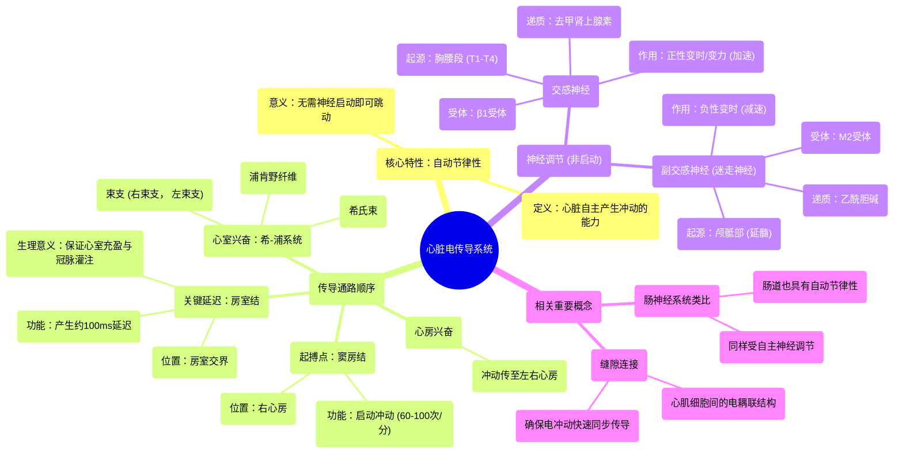

# 16 Cardiac Electrical Conduction System - SA node, AV node, Hiss Bundle, Purkinje fibers - Physiology

  <video controls preload="metadata" playsinline>
    <source src="https://helly.s3.bitiful.net/心血管学科/%E4%B8%93%E8%BE%91%2018%EF%BC%9A%E5%BF%83%E5%86%85%E7%A7%91%E7%BB%88%E6%9E%81%E7%99%BE%E7%A7%91%E8%BE%9E%E5%85%B8%20%28The%20Cardiology%20Encyclopedia%29/16%20Cardiac%20Electrical%20Conduction%20System%20-%20SA%20node%2C%20AV%20node%2C%20Hiss%20Bundle%2C%20Purkinje%20fibers%20-%20Physiology.mp4" type="video/mp4">
    
您的浏览器不支持播放，请升级。

  </video>

::: tip ⚡️ 核心考点 (30s速读)
*   **核心考点**：心脏电传导系统是心脏自主产生并传导电冲动的通路，其核心结构包括“窦房结”、“房室结”、“希氏束”、“束支”和“浦肯野纤维”。心脏的“自动节律性”使其无需神经支配即可自主跳动。
*   **临床意义**：理解此系统是分析心电图、诊断心律失常（如房室传导阻滞、束支传导阻滞）的基础。交感神经（β1受体）和副交感神经（M2受体）对此系统起调节作用，而非启动作用。
:::

## 🧠 深度精讲

*   **心脏的自动节律性**：心脏具有“自动节律性”，这意味着它能够不依赖外部神经输入，自主地产生和启动电冲动。这一特性由心脏内特化的传导系统实现。即使心脏被移出体外（在短暂时间内），它仍能继续跳动，这证明了其内在的自主性。
*   **电传导通路顺序**：正常心脏电冲动的产生和传导遵循严格顺序：
    1.  **起搏点**：“窦房结”是心脏的天然起搏点，位于右心房，以约60-100次/分钟的频率自发产生冲动。
    2.  **心房兴奋**：冲动从“窦房结”迅速传遍左、右心房，引起心房收缩。
    3.  **关键延迟**：冲动随后抵达“房室结”。此处存在约100毫秒的“房室结延迟”，其生理意义至关重要：它确保心房有足够时间完成收缩并将血液泵入心室，同时让心室在收缩前有充分的充盈时间，并保证冠状动脉在舒张期得到血液灌注。
    4.  **心室兴奋**：冲动通过“房室结”后，进入“希氏束”，随后分为“右束支”和“左束支”，分别支配右心室和左心室。最终，冲动通过遍布心室的“浦肯野纤维”网迅速传遍整个心室肌，引发协调、有力的心室收缩。希氏束、束支和浦肯野纤维合称为“希-浦系统”。
*   **神经调节**：虽然心脏能自主跳动，但其节律受自主神经系统精细调节。
    *   **交感神经**（胸腰段，T1-T4）：释放去甲肾上腺素，作用于心脏的β1受体，**加快**心率和增强心肌收缩力（正性变时、变力作用）。
    *   **副交感神经**（颅骶部，迷走神经）：释放乙酰胆碱，作用于心脏的M2受体，**减慢**心率（负性变时作用）。
    *   **核心区别**：神经是“调节者”，而“窦房结”是“启动者”。
*   **相关概念**：
    *   **缝隙连接**：心肌细胞之间通过“缝隙连接”（又称连接体）相连，这些低电阻通道允许电冲动在细胞间快速传导，确保心脏作为一个功能合胞体同步收缩。
    *   **肠神经系统**：与心脏类似，肠道也拥有“自动节律性”，其内在的“肠神经系统”（包括肌间神经丛和粘膜下神经丛）可独立控制肠道运动与分泌，同样受交感和副交感神经调节。

## 📚 双语术语表 (Terminology)
| 英文术语 | 中文翻译 | 定义/解释 |
| :--- | :--- | :--- |
| SA node | 窦房结 | 心脏的天然起搏点，位于右心房，自主产生电冲动。 |
| AV node | 房室结 | 位于心房与心室之间，传导冲动并产生生理性延迟，确保心房心室顺序收缩。 |
| Bundle of His | 希氏束 | 连接房室结与心室束支的传导纤维。 |
| Bundle Branches | 束支 | 希氏束的延续，分为右束支和左束支，分别将冲动传向左右心室。 |
| Purkinje fibers | 浦肯野纤维 | 分布于心室心内膜下的特化传导纤维，能快速将冲动传遍心室肌。 |
| Automaticity | 自动节律性 | 心脏（或肠道等组织）不依赖外部神经输入而自主产生节律性电活动的能力。 |
| Pacemaker | 起搏点 | 指能够设定心脏节律的结构，正常情况下指窦房结。 |
| AV nodal delay | 房室结延迟 | 冲动在房室结内传导速度减慢所产生的约100毫秒的延迟，对心脏泵血功能至关重要。 |
| Sympathetic nerve | 交感神经 | 自主神经系统的一部分，兴奋时释放去甲肾上腺素，通过β1受体加快心率、增强心缩力。 |
| Parasympathetic nerve | 副交感神经 | 自主神经系统的一部分，此处主要指迷走神经，兴奋时释放乙酰胆碱，通过M2受体减慢心率。 |
| Gap junction (Nexus) | 缝隙连接（连接体） | 心肌细胞膜上的特殊连接结构，允许离子和小分子直接通过，实现电冲动的快速细胞间传导。 |

## 🗺️ 知识图谱

