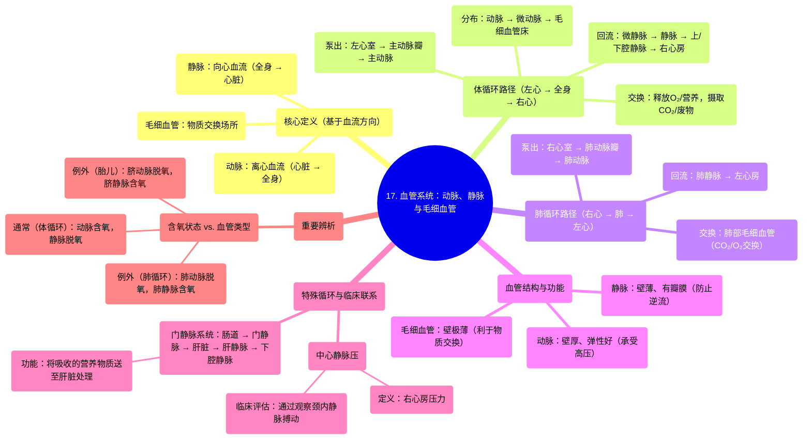

# 17 Blood  Vessels  (Vasculature) - Arteries, Arterioles, Capillaries, Venules & Veins

  <video controls preload="metadata" playsinline>
    <source src="https://helly.s3.bitiful.net/心血管学科/%E4%B8%93%E8%BE%91%2018%EF%BC%9A%E5%BF%83%E5%86%85%E7%A7%91%E7%BB%88%E6%9E%81%E7%99%BE%E7%A7%91%E8%BE%9E%E5%85%B8%20%28The%20Cardiology%20Encyclopedia%29/17%20Blood%20%20Vessels%20%20%28Vasculature%29%20-%20Arteries%2C%20Arterioles%2C%20Capillaries%2C%20Venules%20%26%20Veins.mp4" type="video/mp4">
    
您的浏览器不支持播放，请升级。

  </video>

::: tip ⚡️ 核心考点 (30s速读)
*   **核心考点**：血管系统的核心功能是运输血液。**动脉**将血液从心脏泵出，**静脉**将血液送回心脏。**毛细血管**是物质交换的场所。定义血管的关键是**血流方向**，而非血液含氧量。
*   **临床意义**：理解血管结构与功能的关系（如动脉壁厚以承受高压），以及特殊循环路径（如门静脉系统），是解读心血管疾病（如高血压、静脉曲张、肝硬化）病理生理的基础。
:::

## 🧠 深度精讲

*   **体循环与肺循环路径回顾**：视频从**左心室**（含氧血）开始，血液经**主动脉瓣**泵入**主动脉**，进入**体循环**。血液流经**动脉** -> **微动脉** -> **毛细血管**，在此与组织细胞进行气体和物质交换（释放O₂和营养物质，带走CO₂和废物）。交换后的脱氧血进入**微静脉** -> **静脉** -> **上/下腔静脉** -> **右心房** -> **右心室**，再经**肺动脉**进入**肺循环**。在肺部完成气体交换（释放CO₂，摄取O₂）后，含氧血经**肺静脉**返回**左心房** -> **左心室**，完成一个循环。心率即为此循环每分钟重复的次数。

*   **血管结构与功能的关系**：
    *   **动脉**：靠近心脏，承受压力最高。因此其管壁**最厚、最坚韧**（形态遵循功能），以承受心脏收缩时产生的高压并将血液推向全身。
    *   **静脉**：压力较低，管壁较薄，但管腔通常较大。许多静脉内有**静脉瓣**以防止血液逆流。
    *   **毛细血管**：管壁极薄（仅一层内皮细胞），是血液与组织液进行**物质交换**的唯一场所。

*   **中心静脉压与临床检查**：**右心房**的压力称为**中心静脉压**，它反映了全身静脉血液回流至心脏的状态。临床上，医生通过观察患者颈部的**颈内静脉**搏动来间接评估中心静脉压，这是判断心脏功能和血容量状态的重要窗口。

*   **门静脉系统**：这是一个特殊的静脉系统。来自胃肠道的静脉血（富含从食物中吸收的营养物质）并不直接汇入下腔静脉，而是先汇集到**门静脉**，流入**肝脏**。肝脏作为“身体的化工厂”，对这些物质进行代谢、解毒、储存。处理后的血液再经**肝静脉**流出肝脏，汇入**下腔静脉**。因此，**门静脉是入肝血管，肝静脉是出肝血管**，两者功能截然不同。

*   **动脉与静脉的精确定义**：
    *   **动脉**：**将血液从心脏输送到身体各部位的血管**。
    *   **静脉**：**将血液从身体各部位输送回心脏的血管**。
    *   **关键点**：此定义基于**血流方向**，而非血液的含氧状态。在成人**体循环**中，动脉通常含氧，静脉通常脱氧；但在**肺循环**中恰恰相反（肺动脉含脱氧血，肺静脉含氧血）。胎儿循环（如脐动脉、脐静脉）也与此不同。牢记定义可避免混淆。

## 📚 双语术语表 (Terminology)
| 英文术语 | 中文翻译 | 定义/解释 |
| :--- | :--- | :--- |
| Artery | 动脉 | 将血液从心脏输送到身体各部位的血管。 |
| Vein | 静脉 | 将血液从身体各部位输送回心脏的血管。 |
| Capillary | 毛细血管 | 连接微动脉和微静脉的极细微血管，是血液与组织进行物质交换的主要场所。 |
| Arteriole | 微动脉 | 小动脉，位于动脉和毛细血管之间，是调节外周阻力和局部血流量的主要血管。 |
| Venule | 微静脉 | 小静脉，收集来自毛细血管的血液，汇入更大的静脉。 |
| Aorta | 主动脉 | 体循环的起始主干动脉，从左心室发出，将含氧血输送至全身。 |
| Vena Cava | 腔静脉 | 将全身脱氧血输送回右心房的大静脉，分为上腔静脉和下腔静脉。 |
| Pulmonary Artery | 肺动脉 | 将右心室的脱氧血输送至肺部进行气体交换的血管。 |
| Pulmonary Vein | 肺静脉 | 将肺部氧合后的血液输送回左心房的血管。 |
| Portal Vein | 门静脉 | 将来自胃肠道、脾脏、胰腺的静脉血（富含营养物质）输送至肝脏的静脉。 |
| Hepatic Vein | 肝静脉 | 将经过肝脏处理后的血液从肝脏输送至下腔静脉的静脉。 |
| Systemic Circulation | 体循环 / 大循环 | 血液从左心室泵出，经动脉至全身毛细血管，再经静脉返回右心房的循环路径。 |
| Pulmonary Circulation | 肺循环 / 小循环 | 血液从右心室泵出，经肺动脉至肺部毛细血管进行气体交换，再经肺静脉返回左心房的循环路径。 |
| Central Venous Pressure (CVP) | 中心静脉压 | 右心房或胸腔内大静脉的血压，反映回心血量和心脏泵血功能。 |

## 🗺️ 知识图谱

