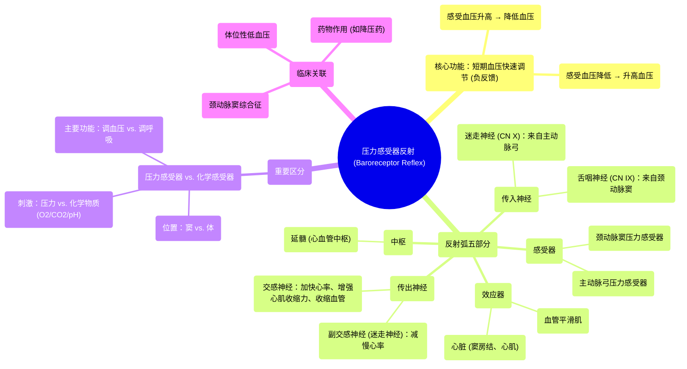

# 18 Baroreceptor Reflex - Carotid Sinus, Aortic Arch - Reflex Arc - Pressure- Cardiovascular Physiology

  <video controls preload="metadata" playsinline>
    <source src="https://helly.s3.bitiful.net/心血管学科/%E4%B8%93%E8%BE%91%2018%EF%BC%9A%E5%BF%83%E5%86%85%E7%A7%91%E7%BB%88%E6%9E%81%E7%99%BE%E7%A7%91%E8%BE%9E%E5%85%B8%20%28The%20Cardiology%20Encyclopedia%29/18%20Baroreceptor%20Reflex%20-%20Carotid%20Sinus%2C%20Aortic%20Arch%20-%20Reflex%20Arc%20-%20Pressure-%20Cardiovascular%20Physiology.mp4" type="video/mp4">
    
您的浏览器不支持播放，请升级。

  </video>

::: tip ⚡️ 核心考点 (30s速读)
*   **核心考点**：压力感受器反射是心血管系统最重要的**短期血压调节机制**。它通过感受主动脉弓和颈动脉窦的血压变化，经舌咽神经和迷走神经将信号传至延髓，从而快速调节心率、心肌收缩力和外周血管阻力，以维持血压稳定。
*   **临床意义**：理解此反射是分析**体位性低血压**、**颈动脉窦综合征**以及某些药物（如降压药）作用机制的基础。在临床操作（如颈动脉按摩）和麻醉管理中至关重要。
:::

## 🧠 深度精讲

*   **概念1：压力感受器反射的解剖基础**
    *   **感受器位置**：压力感受器主要位于**颈动脉窦**（颈内动脉起始处的膨大部分）和**主动脉弓**的血管壁中。它们是机械感受器，对血管壁的牵张（即血压）敏感。
    *   **传入神经**：
        *   来自**颈动脉窦**的压力信号由**舌咽神经（第9对脑神经）** 传入。
        *   来自**主动脉弓**的压力信号由**迷走神经（第10对脑神经）** 传入。
    *   **中枢**：传入信号到达**延髓**的心血管中枢（主要是孤束核）。
    *   **传出神经与效应**：中枢整合信息后，通过**自主神经系统**（交感和副交感神经）传出指令。
        *   **副交感神经（迷走神经）**：支配心脏窦房结，释放乙酰胆碱，**降低心率**。
        *   **交感神经**：支配心脏（增加心率、增强心肌收缩力）和全身血管（引起血管收缩，增加外周阻力）。

*   **概念2：反射弧的工作机制（负反馈调节）**
    *   **血压升高时**：
        1.  **刺激**：颈动脉窦和主动脉弓压力感受器受到的牵张增强。
        2.  **传入**：舌咽神经和迷走神经传入冲动**增加**。
        3.  **中枢整合**：延髓心血管中枢收到“血压过高”信号。
        4.  **传出反应**：
            *   **增强副交感活动**：迷走神经张力增加，**心率减慢**。
            *   **抑制交感活动**：交感神经传出减少，导致**心肌收缩力减弱**，**全身血管舒张**（外周阻力下降）。
        5.  **效应**：心输出量和外周阻力下降，从而使**血压回降至正常水平**。
    *   **血压降低时**：过程相反。压力感受器传入冲动减少，导致中枢抑制副交感、兴奋交感，最终使心率加快、心肌收缩力增强、血管收缩，从而使**血压回升**。

*   **概念3：与化学感受器反射的区分**
    *   **压力感受器**：位于**颈动脉窦**和**主动脉弓**，主要感受**血压（机械牵张）** 变化，是**短期、快速**血压调节的主力。
    *   **化学感受器**：位于**颈动脉体**和**主动脉体**，主要感受血液中**氧分压（PO2）下降、二氧化碳分压（PCO2）升高和氢离子浓度（H+）升高**等化学变化。其主要功能是在缺氧、窒息等情况下**调节呼吸**，对心血管的调节是次要的（通常引起血管收缩）。
    *   **记忆口诀**：“**窦压体化**”——**窦**（颈动脉窦）感受**压**力，**体**（颈动脉体）感受**化**学物质。

## 📚 双语术语表 (Terminology)
| 英文术语 | 中文翻译 | 定义/解释 |
| :--- | :--- | :--- |
| Baroreceptor Reflex | 压力感受器反射 | 通过感知动脉血压变化，快速调节心率和血管阻力以维持血压稳定的神经反射。 |
| Baroreceptor | 压力感受器 | 位于颈动脉窦和主动脉弓血管壁，对血压（血管壁牵张）敏感的机械感受器。 |
| Carotid Sinus | 颈动脉窦 | 颈内动脉起始处的膨大部位，富含压力感受器。 |
| Aortic Arch | 主动脉弓 | 升主动脉与降主动脉之间的弓形部分，含有压力感受器和化学感受器（主动脉体）。 |
| Glossopharyngeal Nerve (CN IX) | 舌咽神经（第9对脑神经） | 将颈动脉窦压力感受器的信号传入延髓的脑神经。 |
| Vagus Nerve (CN X) | 迷走神经（第10对脑神经） | 将主动脉弓压力感受器的信号传入延髓，并传出副交感指令至心脏的脑神经。 |
| Medulla Oblongata | 延髓 | 脑干的一部分，内含心血管中枢（如孤束核），是压力感受器反射的整合中枢。 |
| Chemoreceptor | 化学感受器 | 位于颈动脉体和主动脉体，感知血液中O2、CO2和pH变化的感受器。 |
| Carotid Body | 颈动脉体 | 位于颈总动脉分叉处附近的化学感受器组织。 |

## 🗺️ 知识图谱

