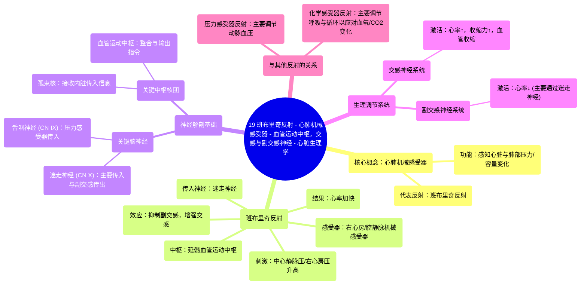

# 19 Bainbridge Reflex - Cardiopulmonary Mechanoreceptors - Vasomotor center, SNS, PNS - Cardiophysiology

  <video controls preload="metadata" playsinline>
    <source src="https://helly.s3.bitiful.net/心血管学科/%E4%B8%93%E8%BE%91%2018%EF%BC%9A%E5%BF%83%E5%86%85%E7%A7%91%E7%BB%88%E6%9E%81%E7%99%BE%E7%A7%91%E8%BE%9E%E5%85%B8%20%28The%20Cardiology%20Encyclopedia%29/19%20Bainbridge%20Reflex%20-%20Cardiopulmonary%20Mechanoreceptors%20-%20Vasomotor%20center%2C%20SNS%2C%20PNS%20-%20Cardiophysiology.mp4" type="video/mp4">
    
您的浏览器不支持播放，请升级。

  </video>

::: tip ⚡️ 核心考点 (30s速读)
*   **核心考点**：心肺机械感受器（如班布里奇反射）是心血管系统重要的压力调节机制，通过感知心房压力变化，反射性地调节心率和血管张力，以维持循环稳定。
*   **临床意义**：理解此反射有助于解释某些临床情况下的心率变化，如快速输液或心力衰竭时的心动过速，是评估心血管自主神经功能的重要环节。
:::

## 🧠 深度精讲

*   **心肺机械感受器**：位于心脏和肺部的机械感受器，是心血管系统重要的感觉末梢。它们能感知心脏腔室、大血管和肺血管内的压力变化，并将信息传入中枢神经系统，参与血压和血容量的调节。班布里奇反射是其主要代表之一。
*   **班布里奇反射**：一种经典的心血管反射。当中心静脉压升高（如快速输液、血容量增加）时，右心房和腔静脉的机械感受器（主要是迷走神经传入纤维）受到牵张，向延髓的血管运动中枢发送信号。该反射的最终效应是**抑制迷走神经（副交感）活性，并增强交感神经活性**，从而导致**心率加快**。其生理意义在于，当回心血量增加时，通过加快心率来增加心输出量，以适应增加的静脉回流，防止血液在静脉系统淤积。
*   **压力感受器反射 vs. 心肺机械感受器反射**：
    *   **压力感受器反射**：主要感知**动脉系统**（颈动脉窦、主动脉弓）的压力变化，快速调节血压。高血压引起反射性心动过缓（通过增强迷走神经），低血压引起反射性心动过速（通过增强交感神经）。
    *   **心肺机械感受器反射（如班布里奇反射）**：主要感知**低压力容量系统**（心房、大静脉、肺血管）的压力/容量变化，主要调节血容量和静脉回流。中心静脉压升高引起反射性心动过速。
*   **神经通路**：
    *   **传入神经**：迷走神经（第10对脑神经）是心肺机械感受器的主要传入通路，将信息传至延髓的**孤束核**。
    *   **中枢整合**：血管运动中枢（位于延髓）处理传入信息。
    *   **传出神经**：通过调节**交感神经系统**和**副交感神经系统（迷走神经）** 的活性来改变心率和心肌收缩力。
*   **血管运动中枢**：位于延髓，是调节心血管活动的关键中枢。它接收来自压力感受器、化学感受器、心肺感受器及更高级脑中枢的信号，并整合这些信息，通过改变交感神经和副交感神经的传出冲动来精细调节心率、心肌收缩力和血管张力，从而维持血压稳定。

## 📚 双语术语表 (Terminology)
| 英文术语 | 中文翻译 | 定义/解释 |
| :--- | :--- | :--- |
| Bainbridge Reflex | 班布里奇反射 | 因中心静脉压/右心房压升高而引起心率反射性加快的生理反射。 |
| Cardiopulmonary Mechanoreceptors | 心肺机械感受器 | 分布于心脏和肺循环血管中的感受器，能感知压力和牵张刺激。 |
| Baroreceptor Reflex | 压力感受器反射 | 通过感知动脉血压变化来反射性调节心率和血管阻力，维持血压稳定的反射。 |
| Vasomotor Center | 血管运动中枢 | 位于延髓，负责整合心血管反射信息并调节交感与副交感神经输出的中枢。 |
| Sympathetic Nervous System (SNS) | 交感神经系统 | 自主神经系统的组成部分，激活时引起“战斗或逃跑”反应，如心率加快、血管收缩。 |
| Parasympathetic Nervous System (PNS) | 副交感神经系统 | 自主神经系统的组成部分，激活时促进“休息和消化”，如心率减慢。 |
| Vagus Nerve (Cranial Nerve X) | 迷走神经（第10对脑神经） | 最重要的副交感神经，也是心肺机械感受器的主要传入神经。 |
| Glossopharyngeal Nerve (Cranial Nerve IX) | 舌咽神经（第9对脑神经） | 参与压力感受器反射（如颈动脉窦反射）的传入神经。 |
| Solitary Nucleus (Nucleus Solitarius) | 孤束核 | 位于延髓，接收来自内脏（包括心肺）的传入信号（如味觉、压力、化学感受）并进行初级整合。 |
| Medulla Oblongata | 延髓 | 脑干的最下部分，包含心血管和呼吸中枢等生命中枢。 |

## 🗺️ 知识图谱

