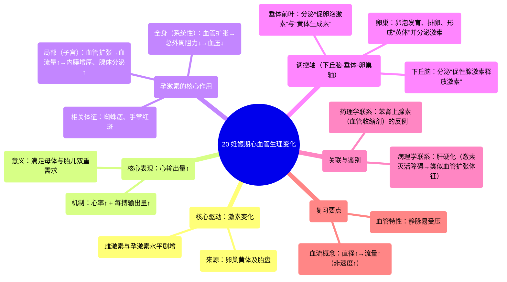

# 20 Cardiovascular Physiological Changes During Pregnancy

  <video controls preload="metadata" playsinline>
    <source src="https://helly.s3.bitiful.net/心血管学科/%E4%B8%93%E8%BE%91%2018%EF%BC%9A%E5%BF%83%E5%86%85%E7%A7%91%E7%BB%88%E6%9E%81%E7%99%BE%E7%A7%91%E8%BE%9E%E5%85%B8%20%28The%20Cardiology%20Encyclopedia%29/20%20Cardiovascular%20Physiological%20Changes%20During%20Pregnancy.mp4" type="video/mp4">
    
您的浏览器不支持播放，请升级。

  </video>

::: tip ⚡️ 核心考点 (30s速读)
*   **核心考点**：妊娠期心血管系统的核心变化是**心输出量显著增加**，以满足母体和胎儿的双重需求。其机制主要源于高水平的雌激素和孕激素导致**心率加快**和**每搏输出量增加**。
*   **临床意义**：理解这些变化是解释妊娠期**生理性贫血**、**低血压**、**蜘蛛痣**等表现的基础，并能与肝硬化等病理状态（因激素灭活障碍）的类似表现进行鉴别。
:::

## 🧠 深度精讲

*   **概念1：心输出量增加**
    妊娠期间，母体心输出量从正常的约5升/分钟显著增加。这是通过两个关键因素实现的：**心率加快**和**每搏输出量增加**。其根本驱动力是卵巢分泌的**雌激素**和**孕激素**水平急剧升高，它们直接作用于心血管系统。

*   **概念2：激素的级联调控与作用**
    1.  **调控轴**：下丘脑分泌**促性腺激素释放激素**，刺激垂体前叶释放**促卵泡激素**和**黄体生成素**，后者作用于卵巢，促使卵泡成熟、排卵并形成**黄体**。黄体及后续的胎盘是妊娠期**雌激素**和**孕激素**的主要来源。
    2.  **孕激素的核心作用**：孕激素的主要生理功能是**维持和增厚子宫内膜**，为胚胎着床和发育提供支持。为实现这一目标，它会使子宫血管**扩张**、**血流量增加**，从而为子宫内膜腺体提供更多营养，促进其分泌。
    3.  **全身性血管效应**：孕激素和雌激素的血管扩张作用并不局限于子宫。它们会引起全身性的血管扩张，导致**总外周阻力下降**，这是妊娠期常出现**血压轻度下降**（生理性低血压）的原因。同时，皮肤小血管扩张也解释了妊娠期常见的**蜘蛛痣**、**手掌红斑**等表现。

*   **概念3：与病理状态的关联（鉴别诊断）**
    全身血管扩张的表现（如蜘蛛痣、肝掌）并非妊娠特有。在**肝硬化**等肝脏疾病中，由于肝脏对雌激素和孕激素的**灭活能力下降**，体内激素水平升高，同样会引起血管扩张，出现类似症状。这是一个重要的临床联系点。

*   **概念4：重要的解剖与生理复习**
    1.  **血管特性**：与厚壁、高压的动脉相比，静脉管壁薄、压力低，因此**更容易受到外部压迫**。这一特性在理解妊娠后期可能出现的**仰卧位低血压综合征**（增大的子宫压迫下腔静脉）时很重要。
    2.  **血流动力学**：需区分**血流速度**和**血流量**。血管直径增加会降低血流速度，但根据泊肃叶定律，会显著**增加血流量（容积流率）**。妊娠期子宫血流的增加是流量增加的结果。
    3.  **药理学联系**：以减充血剂**苯肾上腺素**（α受体激动剂）为例，其通过收缩鼻黏膜血管，减少血流量，从而减少腺体分泌（鼻涕）。这从反面印证了**血流量增加会促进腺体分泌**的原理，与孕激素增加子宫腺体分泌的机制相通。

## 📚 双语术语表 (Terminology)
| 英文术语 | 中文翻译 | 定义/解释 |
| :--- | :--- | :--- |
| Cardiac Output | 心输出量 | 每分钟由一侧心室射出的血液总量，是心率与每搏输出量的乘积。妊娠期显著增加。 |
| Stroke Volume | 每搏输出量 | 一次心搏中一侧心室射出的血液量。妊娠期在激素作用下增加。 |
| Estrogen | 雌激素 | 主要的女性性激素之一，妊娠期水平很高，参与心血管调节。 |
| Progesterone | 孕激素 | 维持妊娠的关键激素，具有强大的舒张血管、维持子宫内膜的作用。 |
| Gonadotropin-releasing Hormone (GnRH) | 促性腺激素释放激素 | 下丘脑分泌，刺激垂体释放FSH和LH。 |
| Follicle-stimulating Hormone (FSH) | 促卵泡激素 | 促进卵巢卵泡生长和成熟。 |
| Luteinizing Hormone (LH) | 黄体生成素 | 触发排卵并促进黄体形成。 |
| Corpus Luteum | 黄体 | 排卵后卵泡转变而成的内分泌结构，分泌孕激素和雌激素。 |
| Total Peripheral Resistance | 总外周阻力 | 体循环中所有小血管对血流产生的总阻力。孕激素使其下降。 |
| Spider Angiomata / Telangiectasia | 蜘蛛痣 / 毛细血管扩张 | 皮肤小动脉末端分支扩张形成的血管痣，与雌激素水平升高有关。 |
| Palmar Erythema | 手掌红斑 | 手掌大小鱼际处出现的片状红斑，与血管扩张有关，见于妊娠或肝病。 |
| Cirrhosis | 肝硬化 | 一种慢性肝病，因肝功能减退导致激素灭活障碍，可出现类似妊娠的血管扩张表现。 |

## 🗺️ 知识图谱

