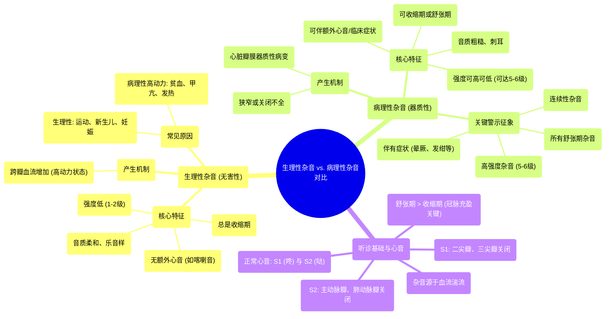

# 21 Physiological Murmurs vs. Pathological Murmurs - Comparisons

  <video controls preload="metadata" playsinline>
    <source src="https://helly.s3.bitiful.net/心血管学科/%E4%B8%93%E8%BE%91%2018%EF%BC%9A%E5%BF%83%E5%86%85%E7%A7%91%E7%BB%88%E6%9E%81%E7%99%BE%E7%A7%91%E8%BE%9E%E5%85%B8%20%28The%20Cardiology%20Encyclopedia%29/21%20Physiological%20Murmurs%20vs.%20Pathological%20Murmurs%20-%20Comparisons.mp4" type="video/mp4">
    
您的浏览器不支持播放，请升级。

  </video>

::: tip ⚡️ 核心考点 (30s速读)
*   **核心考点**：生理性杂音与病理性杂音的根本区别在于是否存在心脏瓣膜的器质性病变。生理性杂音是良性的，仅由血流增加引起；病理性杂音则提示心脏瓣膜病。
*   **临床意义**：**所有舒张期杂音、连续性杂音、高强度杂音（5-6级）或伴有临床症状（如发绀、晕厥）的杂音，均为病理性，需要进一步检查。**
:::

## 🧠 深度精讲

*   **心音基础**：正常心音为“咚-哒”（S1-S2）。S1由二尖瓣和三尖瓣关闭产生，标志收缩期开始；S2由主动脉瓣和肺动脉瓣关闭产生，标志舒张期开始。**舒张期长于收缩期**，这对冠状动脉在舒张期充盈至关重要。
*   **杂音产生机制**：杂音源于血液的**湍流**。当血流从层流变为湍流时，就会产生可闻及的声音。
*   **生理性杂音 (无害性/血流性杂音)**：
    *   **本质**：完全正常，良性。
    *   **特征**：**总是收缩期**杂音；强度低（1-2级）；音质柔和、乐音样；**不伴有额外心音（如喀喇音）**。
    *   **原因**：跨瓣血流增加，常见于剧烈运动后、新生儿、妊娠、贫血、甲亢、发热等高动力循环状态。通常发生在主动脉瓣或肺动脉瓣区。
*   **病理性杂音 (器质性杂音)**：
    *   **本质**：由心脏瓣膜的**器质性病变**（狭窄或关闭不全）引起，即心脏瓣膜病。
    *   **特征**：可出现在收缩期或舒张期；强度可从低到高（可达5-6级）；音质粗糙、刺耳；**可伴有额外心音（如喀喇音）、震颤或临床症状**。
    *   **关键警示**：**所有舒张期杂音、连续性杂音、全收缩期杂音以及任何伴有症状（如胸痛、呼吸困难、晕厥、发绀）的杂音，都是病理性的。**
*   **听诊要点与临床思维**：
    1.  **定位**：首先识别S1和S2，判断杂音出现在收缩期（S1-S2之间）还是舒张期（S2-下一个S1之间）。
    2.  **定性**：评估杂音的音质（柔和 vs. 粗糙）、强度（分级）、形状（如递增-递减型）。
    3.  **关联**：结合患者临床表现（症状、体征）进行综合判断。一个高级别（5-6级）的杂音几乎总是病理性的。

## 📚 双语术语表 (Terminology)
| 英文术语 | 中文翻译 | 定义/解释 |
| :--- | :--- | :--- |
| Physiological Murmur | 生理性杂音 | 由血流增加引起的良性、无害的心脏杂音，无心脏结构异常。 |
| Pathological Murmur | 病理性杂音 | 由心脏瓣膜或其他结构器质性病变（如狭窄、反流）引起的杂音。 |
| Innocent / Flow Murmur | 无害性 / 血流性杂音 | 生理性杂音的同义词。 |
| Organic Murmur | 器质性杂音 | 病理性杂音的同义词，强调存在解剖结构病变。 |
| Systole | 收缩期 | 心脏心室收缩射血的时期，介于S1和S2之间。 |
| Diastole | 舒张期 | 心脏心室放松充盈的时期，介于S2和下一个S1之间，通常长于收缩期。 |
| S1 (First Heart Sound) | 第一心音 | 主要由二尖瓣和三尖瓣关闭产生，标志收缩期开始。 |
| S2 (Second Heart Sound) | 第二心音 | 主要由主动脉瓣和肺动脉瓣关闭产生，标志舒张期开始。 |
| Crescendo-decrescendo Murmur | 递增-递减型杂音 | 杂音强度先增强后减弱，形如菱形，是主动脉瓣狭窄的典型特征。 |
| Holosystolic Murmur | 全收缩期杂音 | 杂音贯穿整个收缩期，从S1开始，持续到S2，见于二尖瓣反流、室间隔缺损等。 |
| Mid-systolic Click | 收缩中期喀喇音 | 收缩期出现的一个尖锐额外心音，常提示二尖瓣脱垂。 |
| Valvular Heart Disease | 心脏瓣膜病 | 心脏瓣膜（如二尖瓣、主动脉瓣）发生狭窄或关闭不全等结构或功能异常的疾病。 |
| Hyperdynamic Circulation | 高动力循环状态 | 心输出量增加的状态，如贫血、甲亢、妊娠时，易产生生理性血流杂音。 |

## 🗺️ 知识图谱

