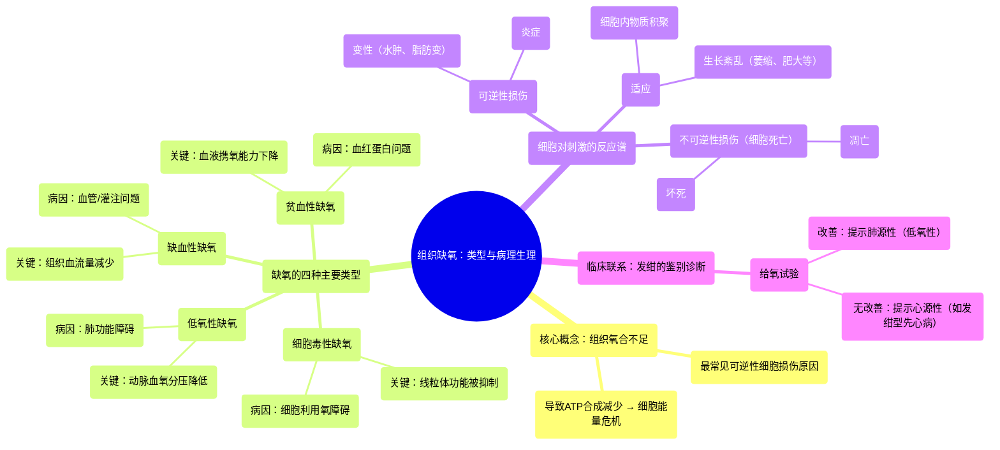

# 23 Tissue Hypoxia - Types of hypoxia (Hypoxic, Ischemic, Anemic, Cytotoxic) - Pathophysiology

  <video controls preload="metadata" playsinline>
    <source src="https://helly.s3.bitiful.net/心血管学科/%E4%B8%93%E8%BE%91%2018%EF%BC%9A%E5%BF%83%E5%86%85%E7%A7%91%E7%BB%88%E6%9E%81%E7%99%BE%E7%A7%91%E8%BE%9E%E5%85%B8%20%28The%20Cardiology%20Encyclopedia%29/23%20Tissue%20Hypoxia%20-%20Types%20of%20hypoxia%20%28Hypoxic%2C%20Ischemic%2C%20Anemic%2C%20Cytotoxic%29%20-%20Pathophysiology.mp4" type="video/mp4">
    
您的浏览器不支持播放，请升级。

  </video>

::: tip ⚡️ 核心考点 (30s速读)
*   **核心考点**：组织缺氧是导致可逆性细胞损伤最常见的原因。缺氧的根本在于细胞线粒体无法获得足够氧气进行氧化磷酸化，导致ATP合成减少，能量供应中断。
*   **临床意义**：区分缺氧类型（低氧性、缺血性、贫血性、细胞毒性）是诊断和治疗的关键。例如，通过“给氧试验”可初步鉴别新生儿发绀是源于肺部疾病（可纠正）还是发绀型先天性心脏病（不可纠正）。
:::

## 🧠 深度精讲

*   **组织缺氧与细胞损伤**：组织缺氧是指组织氧气供应不足。这是最常见的可逆性细胞损伤原因。细胞损伤是否可逆，取决于刺激（如缺氧）的强度和持续时间。短暂缺氧导致可逆损伤（如细胞水肿、脂肪变），持续严重缺氧则导致不可逆的细胞死亡（坏死或凋亡）。
*   **缺氧的病理生理核心**：氧气是线粒体电子传递链（复合物IV）的最终电子受体。缺氧时，电子传递链受阻，氧化磷酸化过程停止，ATP生成锐减。细胞缺乏能量（ATP），无法维持正常功能与结构，从而导致损伤。
*   **缺氧的分类与病因**：
    1.  **低氧性缺氧**：动脉血氧分压降低。病因在肺，如呼吸衰竭、肺疾病。核心问题是血液“载氧”不足。
    2.  **缺血性缺氧**：组织血液灌注量减少。病因在血管，如动脉狭窄、血栓、心脏泵血功能衰竭。核心问题是“运送”氧气的血液不足。
    3.  **贫血性缺氧**：血红蛋白数量减少或功能异常。病因在血液，如贫血、一氧化碳中毒、高铁血红蛋白血症。核心问题是运氧“工具”失效。
    4.  **细胞毒性缺氧**：细胞利用氧的能力受损。病因在细胞本身，如氰化物中毒（抑制细胞色素氧化酶）。核心问题是细胞“工厂”无法利用氧气。
*   **临床联系：发绀的鉴别**：新生儿发绀（皮肤黏膜青紫）提示严重缺氧。通过“给氧试验”可初步鉴别：给氧后发绀改善，提示为低氧性缺氧（肺源性）；给氧后发绀无改善，提示为右向左分流的发绀型先天性心脏病（如法洛四联症）导致的缺血/混合性缺氧。

## 📚 双语术语表 (Terminology)
| 英文术语 | 中文翻译 | 定义/解释 |
| :--- | :--- | :--- |
| Tissue Hypoxia | 组织缺氧 | 组织水平的氧气供应不足。 |
| Hypoxic Hypoxia | 低氧性缺氧 | 由于动脉血氧分压降低导致的缺氧。 |
| Ischemic Hypoxia | 缺血性缺氧 | 由于组织血液灌注减少导致的缺氧。 |
| Anemic Hypoxia | 贫血性缺氧 | 由于血红蛋白数量减少或携氧能力下降导致的缺氧。 |
| Cytotoxic Hypoxia | 细胞毒性缺氧 | 由于细胞利用氧气的能力受损（如酶被抑制）导致的缺氧。 |
| Reversible Cell Injury | 可逆性细胞损伤 | 去除病因后，细胞结构和功能可以恢复的损伤。 |
| Irreversible Cell Injury (Cell Death) | 不可逆性细胞损伤（细胞死亡） | 导致细胞死亡的严重损伤，包括坏死和凋亡。 |
| Electron Transport Chain (ETC) | 电子传递链 | 位于线粒体内膜上，通过氧化磷酸化产生ATP的一系列蛋白质复合物。 |
| Oxidative Phosphorylation | 氧化磷酸化 | 电子传递链中，将ADP磷酸化为ATP的过程，需要氧气作为最终电子受体。 |
| Cyanosis | 发绀 | 皮肤和黏膜呈蓝紫色，通常由毛细血管血液中还原血红蛋白增多引起。 |
| Cyanotic Congenital Heart Disease | 发绀型先天性心脏病 | 存在右向左分流，导致静脉血直接进入体循环的先天性心脏畸形。 |

## 🗺️ 知识图谱

