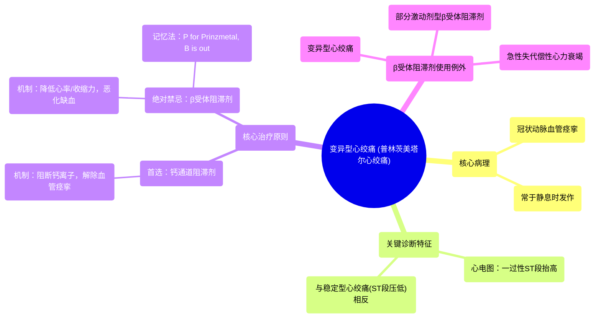

# 24 Prinzmetal (Vasospastic) Angina Mnemonic

  <video controls preload="metadata" playsinline>
    <source src="https://helly.s3.bitiful.net/心血管学科/%E4%B8%93%E8%BE%91%2018%EF%BC%9A%E5%BF%83%E5%86%85%E7%A7%91%E7%BB%88%E6%9E%81%E7%99%BE%E7%A7%91%E8%BE%9E%E5%85%B8%20%28The%20Cardiology%20Encyclopedia%29/24%20Prinzmetal%20%28Vasospastic%29%20Angina%20Mnemonic.mp4" type="video/mp4">
    
您的浏览器不支持播放，请升级。

  </video>

::: tip ⚡️ 核心考点 (30s速读)
*   **核心考点**：变异型心绞痛（普林茨美塔尔心绞痛）是一种由冠状动脉**血管痉挛**引起的缺血性胸痛，其心电图特征为**ST段抬高**，治疗上**禁用β受体阻滞剂**，而应使用**钙通道阻滞剂**。
*   **临床意义**：与稳定型心绞痛（ST段压低，可用β受体阻滞剂）的治疗原则相反。误用β受体阻滞剂会加重病情，因其会降低心率和心肌收缩力，在血管痉挛导致供血不足时进一步减少心肌氧供。
:::

## 🧠 深度精讲

*   **概念1：什么是变异型心绞痛？**
    变异型心绞痛，又称普林茨美塔尔心绞痛或血管痉挛性心绞痛，其核心病理生理是**冠状动脉发生一过性、自发的严重痉挛**，导致血管管腔急剧狭窄甚至闭塞，从而引发心肌缺血。这种痉挛通常发生在**无明显冠状动脉固定狭窄**的血管段，但也可与动脉粥样硬化并存。其发作与劳力、情绪激动等心肌耗氧量增加的关系不大，常于**静息时**，尤其是**夜间或凌晨**发作。

*   **概念2：关键诊断线索——心电图特征**
    发作时心电图的特征性表现是**一过性ST段抬高**，对应血管痉挛导致的心肌透壁性缺血。这与稳定型心绞痛（ST段压低，对应心内膜下缺血）形成鲜明对比。痉挛缓解后，ST段可迅速恢复正常。

*   **概念3：核心治疗原则与记忆法**
    治疗目标是**解除冠状动脉痉挛**。
    1.  **禁用药物（记忆法：P for Prinzmetal, B is out）**：**绝对禁忌使用β受体阻滞剂**。因为β受体阻滞剂通过降低心率、减弱心肌收缩力来减少心肌耗氧，这在冠状动脉因痉挛而供血不足时，会进一步恶化供需平衡，可能诱发或加重心绞痛，甚至导致心肌梗死。
    2.  **首选药物（记忆法：Z sounds like C for Calcium）**：**首选钙通道阻滞剂**（如地尔硫䓬、硝苯地平）。血管平滑肌的收缩依赖于钙离子内流，钙通道阻滞剂能有效抑制钙离子进入细胞，从而**松弛血管平滑肌，解除痉挛**，是治疗的基石。长效硝酸酯类药物也可作为辅助治疗。

*   **概念4：β受体阻滞剂使用的一般原则与例外**
    虽然β受体阻滞剂是治疗稳定型心绞痛、降低心肌梗死患者死亡率的基石药物，但存在重要例外：
    *   **变异型心绞痛**：禁忌，原因如上。
    *   **部分激动剂型β受体阻滞剂**（如吲哚洛尔）：应避免使用。在存在内源性儿茶酚胺的情况下，它们可能表现出拮抗剂效应，带来不确定性风险。
    *   **急性失代偿性心力衰竭**：在急性发作期，患者依赖于交感神经兴奋维持心输出量，此时使用β受体阻滞剂可能加重病情。但慢性稳定性心力衰竭是β受体阻滞剂的强适应症（需从小剂量开始）。

## 📚 双语术语表 (Terminology)
| 英文术语 | 中文翻译 | 定义/解释 |
| :--- | :--- | :--- |
| Prinzmetal (Vasospastic) Angina | 变异型心绞痛（普林茨美塔尔心绞痛/血管痉挛性心绞痛） | 由冠状动脉自发性、一过性痉挛引起的心肌缺血，常于静息时发作，心电图表现为ST段抬高。 |
| Vasospasm | 血管痉挛 | 血管壁平滑肌发生强烈、不自主的收缩，导致管腔狭窄。 |
| ST Elevation | ST段抬高 | 心电图上ST段相对于基线的异常上移，常提示心肌透壁性缺血或损伤（如变异型心绞痛、急性心肌梗死）。 |
| ST Depression | ST段压低 | 心电图上ST段相对于基线的异常下移，常提示心内膜下缺血（如稳定型心绞痛）。 |
| Beta Blockers | β受体阻滞剂 | 一类通过阻断β肾上腺素能受体，降低心率、心肌收缩力和血压的药物。禁用于变异型心绞痛。 |
| Calcium Channel Blockers (CCBs) | 钙通道阻滞剂 | 一类通过阻断钙离子通道，舒张血管平滑肌（尤其是动脉），降低血压和解除血管痉挛的药物。是变异型心绞痛的首选治疗。 |
| Partial Agonist | 部分激动剂 | 一种与受体结合后，只能产生低于完全激动剂最大效应的物质。在特定情况下可能表现出拮抗剂特性。 |
| Acute Coronary Syndrome (ACS) | 急性冠脉综合征 | 一组由冠状动脉血流急剧减少引起的临床综合征，包括不稳定型心绞痛和心肌梗死。 |

## 🗺️ 知识图谱

