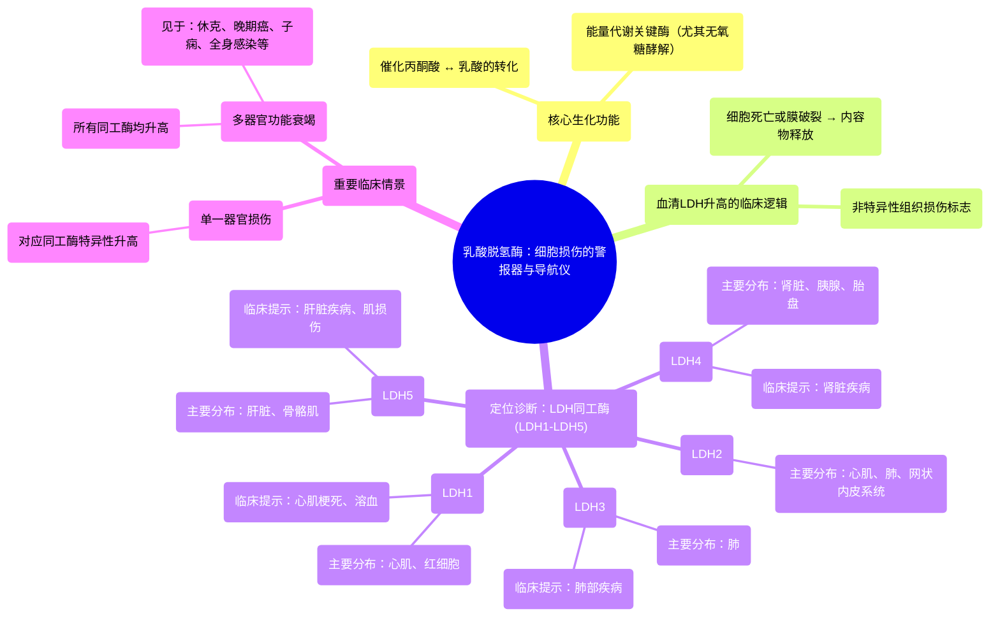

# 25 Lactate Dehydrogenase (LDH) - Organ Damage - Biochemistry, Labs, Clinical significance

  <video controls preload="metadata" playsinline>
    <source src="https://helly.s3.bitiful.net/心血管学科/%E4%B8%93%E8%BE%91%2018%EF%BC%9A%E5%BF%83%E5%86%85%E7%A7%91%E7%BB%88%E6%9E%81%E7%99%BE%E7%A7%91%E8%BE%9E%E5%85%B8%20%28The%20Cardiology%20Encyclopedia%29/25%20Lactate%20Dehydrogenase%20%28LDH%29%20-%20Organ%20Damage%20-%20Biochemistry%2C%20Labs%2C%20Clinical%20significance.mp4" type="video/mp4">
    
您的浏览器不支持播放，请升级。

  </video>

::: tip ⚡️ 核心考点 (30s速读)
*   **核心考点**：乳酸脱氢酶是细胞损伤的“警报器”。血清LDH升高提示细胞死亡或破裂，是组织损伤的非特异性标志物。
*   **临床意义**：通过检测LDH同工酶（LDH1-LDH5），可以定位损伤器官，如LDH1>LDH2提示心肌梗死，LDH5升高提示肝脏或骨骼肌损伤。
:::

## 🧠 深度精讲

*   **概念1：乳酸脱氢酶是什么？**
    乳酸脱氢酶是一种广泛存在于人体几乎所有细胞内的酶。它的核心功能是催化丙酮酸和乳酸之间的相互转化，这是细胞能量代谢（特别是无氧糖酵解）中的关键步骤。

*   **概念2：为什么血清LDH升高有临床意义？**
    正常情况下，LDH主要存在于细胞内，血清中水平很低。当细胞因缺血、炎症、坏死等原因死亡或膜破裂时，LDH会释放入血，导致血清LDH水平升高。因此，**血清LDH升高是细胞损伤的非特异性标志**。

*   **概念3：LDH同工酶——定位损伤的“导航仪”**
    由于LDH升高无法指明具体是哪个器官受损，因此需要检测其同工酶。LDH有5种同工酶（LDH1-5），它们在身体不同组织中的分布有差异：
    *   **LDH1**：主要存在于**心肌**和**红细胞**。
    *   **LDH2**：存在于心肌、肺、网状内皮系统（如脾、淋巴结）。
    *   **LDH3**：主要存在于**肺**。
    *   **LDH4**：存在于**肾脏**、胰腺、胎盘。
    *   **LDH5**：主要存在于**肝脏**和**骨骼肌**。
    通过分析哪种同工酶升高占主导，可以帮助判断损伤来源。例如，急性心肌梗死时，通常**LDH1 > LDH2**；溶血时LDH1升高；肝病时LDH5升高。

*   **概念4：临床解读与实例**
    *   **单一器官损伤**：对应同工酶升高（如心梗→LDH1↑，肝损→LDH5↑）。
    *   **多器官衰竭**：所有同工酶均升高，见于严重疾病如休克、晚期癌症、子痫、全身性感染等。
    *   **重要提示**：LDH检测敏感性高但特异性不强，必须结合患者症状、体征及其他检查（如肌钙蛋白、转氨酶、影像学）进行综合诊断。

## 📚 双语术语表 (Terminology)
| 英文术语 | 中文翻译 | 定义/解释 |
| :--- | :--- | :--- |
| Lactate Dehydrogenase (LDH) | 乳酸脱氢酶 | 催化丙酮酸与乳酸相互转化的酶，是细胞损伤的标志物。 |
| Isoenzyme / Isoform | 同工酶 | 催化相同化学反应但分子结构、理化性质及组织分布不同的酶的不同形式。 |
| Glycolysis | 糖酵解 | 葡萄糖分解为丙酮酸并产生少量ATP的代谢途径。 |
| Anaerobic Glycolysis | 无氧糖酵解 | 在缺氧条件下，丙酮酸被还原为乳酸的过程。 |
| Myocardial Infarction (MI) | 心肌梗死 | 因冠状动脉阻塞导致心肌缺血性坏死。 |
| Hemolysis | 溶血 | 红细胞破裂，内容物（包括LDH1）释放入血。 |
| Multi-organ Failure | 多器官功能衰竭 | 两个或以上器官系统功能同时或序贯发生障碍。 |

## 🗺️ 知识图谱

