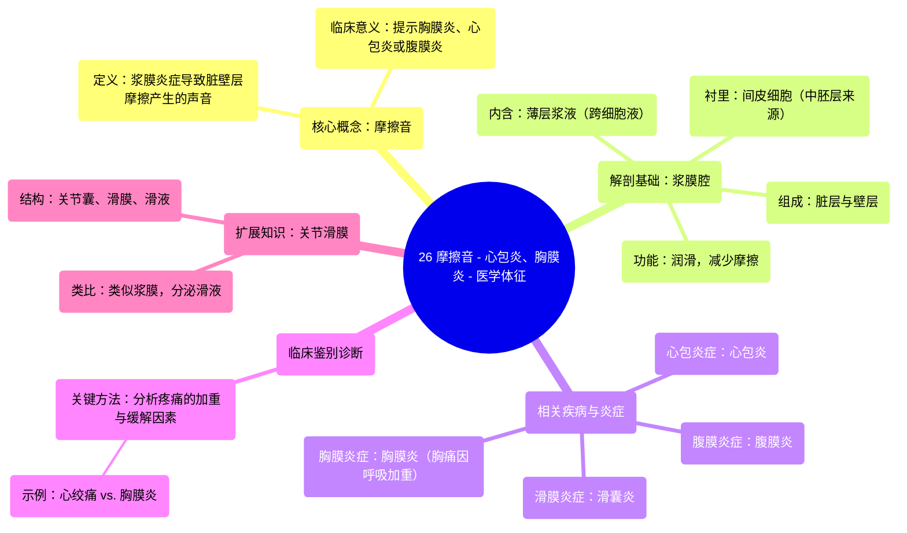

# 26 Friction Rub - Pericarditis, Pleurisy (Pleuritis) - Signs in Medicine

  <video controls preload="metadata" playsinline>
    <source src="https://helly.s3.bitiful.net/心血管学科/%E4%B8%93%E8%BE%91%2018%EF%BC%9A%E5%BF%83%E5%86%85%E7%A7%91%E7%BB%88%E6%9E%81%E7%99%BE%E7%A7%91%E8%BE%9E%E5%85%B8%20%28The%20Cardiology%20Encyclopedia%29/26%20Friction%20Rub%20-%20Pericarditis%2C%20Pleurisy%20%28Pleuritis%29%20-%20Signs%20in%20Medicine.mp4" type="video/mp4">
    
您的浏览器不支持播放，请升级。

  </video>

::: tip ⚡️ 核心考点 (30s速读)
*   **核心考点**：摩擦音是浆膜（胸膜、心包、腹膜）发炎时，其脏层与壁层相互摩擦产生的一种听诊体征。其出现提示存在胸膜炎、心包炎或腹膜炎。
*   **临床意义**：通过分析疼痛的加重/缓解因素（如胸膜炎疼痛因呼吸、咳嗽加重，心绞痛因运动诱发、休息缓解），结合听诊发现的摩擦音，可进行鉴别诊断，是临床体格检查的关键环节。
:::

## 🧠 深度精讲

*   **摩擦音的概念与产生机制**：摩擦音是当胸膜、心包或腹膜等浆膜因炎症（胸膜炎、心包炎、腹膜炎）而变得粗糙时，其脏层与壁层在相对运动（如呼吸、心跳、肠蠕动）中相互摩擦所产生的声音。这是急性炎症（红、肿、热、痛、功能障碍）的体征之一，常伴有剧烈疼痛。
*   **浆膜腔的解剖与生理回顾**：
    *   **定义**：浆膜腔是由间皮细胞（来源于中胚层）衬里的密闭腔隙，内含一层极薄的浆液性（非黏液性）液体，属于跨细胞液/细胞外液的一部分。
    *   **功能**：润滑，减少器官运动时的摩擦。
    *   **结构**：以胸膜为例，紧贴肺表面的为“脏层胸膜”，贴附于胸壁内面的为“壁层胸膜”，两者之间的潜在腔隙即胸膜腔，内含少量浆液。
    *   **胚胎学类比**：如同拳头（器官）推入气球（浆膜囊），紧贴拳头的一层为脏层，外层为壁层。
*   **浆膜炎症的临床联系**：
    *   **共同点**：所有浆膜（胸膜、心包、腹膜、滑膜）的炎症均遵循“-itis”的命名规则（如胸膜炎、心包炎、腹膜炎、滑囊炎），并可能产生摩擦音。
    *   **鉴别诊断**：视频通过两个左侧胸痛患者的例子，强调了“加重与缓解因素”在鉴别诊断中的核心作用：
        1.  **心绞痛**：疼痛由运动、情绪激动诱发，休息或舌下含服硝酸甘油可缓解。
        2.  **胸膜炎**：疼痛因呼吸、咳嗽、打喷嚏而加重，可通过浅呼吸或固定患侧胸壁来缓解。
    *   **扩展**：关节的滑膜结构与浆膜类似，分泌滑液润滑关节。滑膜囊（滑囊）是滑膜腔的延伸，其炎症称为滑囊炎。

## 📚 双语术语表 (Terminology)
| 英文术语 | 中文翻译 | 定义/解释 |
| :--- | :--- | :--- |
| Friction Rub | 摩擦音 | 浆膜（如胸膜、心包）发炎时，其脏层与壁层相互摩擦产生的听诊音。 |
| Pleurisy / Pleuritis | 胸膜炎 | 胸膜的炎症。 |
| Pericarditis | 心包炎 | 心包膜的炎症。 |
| Peritonitis | 腹膜炎 | 腹膜的炎症。 |
| Serous Membrane / Cavity | 浆膜 / 浆膜腔 | 由间皮细胞衬里、内含薄层浆液的密闭腔隙，如胸膜腔、心包腔、腹膜腔。 |
| Visceral Layer | 脏层 | 浆膜紧贴器官（如肺、心脏）表面的那一层。 |
| Parietal Layer | 壁层 | 浆膜贴附于体腔壁（如胸壁、心包壁）的那一层。 |
| Transcellular Fluid | 跨细胞液 | 存在于浆膜腔等特定腔隙中的细胞外液组成部分。 |
| Mesothelial Cells | 间皮细胞 | 衬于浆膜腔表面、来源于中胚层的上皮细胞。 |
| Aggravating/Alleviating Factors | 加重/缓解因素 | 使症状加剧或减轻的条件或活动，是疾病鉴别诊断的重要依据。 |
| Synovial Membrane / Fluid | 滑膜 / 滑液 | 位于关节囊内层，分泌滑液以润滑关节的结构与液体。 |
| Bursitis | 滑囊炎 | 滑膜囊（位于肌腱与骨之间以减少摩擦的囊）的炎症。 |

## 🗺️ 知识图谱

