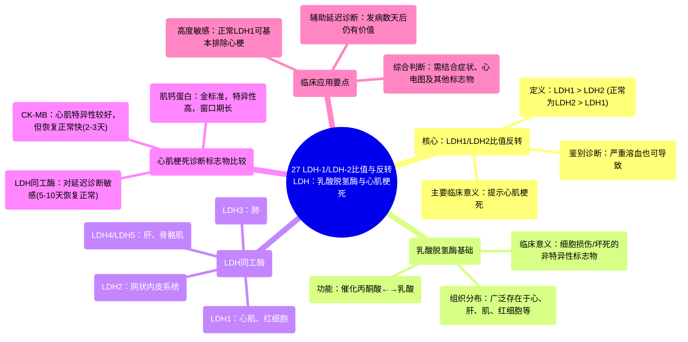

# 27 LDH-1 to LDH-2 Ratio (and the flipped LDH) Lactate Dehydrogenase and Heart Attacks 

  <video controls preload="metadata" playsinline>
    <source src="https://helly.s3.bitiful.net/心血管学科/%E4%B8%93%E8%BE%91%2018%EF%BC%9A%E5%BF%83%E5%86%85%E7%A7%91%E7%BB%88%E6%9E%81%E7%99%BE%E7%A7%91%E8%BE%9E%E5%85%B8%20%28The%20Cardiology%20Encyclopedia%29/27%20LDH-1%20to%20LDH-2%20Ratio%20%28and%20the%20flipped%20LDH%29%20Lactate%20Dehydrogenase%20and%20Heart%20Attacks%20.mp4" type="video/mp4">
    
您的浏览器不支持播放，请升级。

  </video>

::: tip ⚡️ 核心考点 (30s速读)
*   **核心考点**：正常情况下，血清中LDH2含量高于LDH1。当发生心肌梗死时，心肌细胞坏死释放大量LDH1，导致血清中LDH1水平超过LDH2，即“LDH1/LDH2比值反转（Flipped LDH）”。这是诊断心肌梗死（尤其是延迟就诊病例）的重要线索。
*   **临床意义**：LDH1/LDH2比值反转对心肌梗死具有高度敏感性（>95%），正常的LDH1几乎可排除心梗。但需注意，溶血（红细胞破坏）也会导致LDH1升高，需结合其他指标（如肌钙蛋白、CK-MB）和临床表现综合判断。
:::

## 🧠 深度精讲

*   **概念1：乳酸脱氢酶（LDH）的临床意义**
    LDH是一种广泛存在于人体细胞（如心、肝、骨骼肌、红细胞等）中的酶。当细胞死亡或破裂（如梗死、炎症、创伤）时，LDH会释放入血，导致血清LDH水平升高。因此，**血清LDH升高是细胞损伤的非特异性标志**，提示可能存在心肌梗死、溶血、肝病、肺梗死、肾病、肿瘤等多种疾病。

*   **概念2：LDH同工酶与组织特异性**
    为了明确LDH升高的来源，需要检测其**同工酶**。LDH有5种同工酶（LDH1-5），它们在组织中的分布不同：
    *   **LDH1**：主要存在于**心肌**和**红细胞**中。
    *   **LDH2**：主要存在于**网状内皮系统**（如脾、淋巴结）。
    *   **LDH3**：主要存在于**肺**。
    *   **LDH4/LDH5**：主要存在于**肝脏**和**骨骼肌**。
    正常情况下，血清中含量最丰富的同工酶是**LDH2**。

*   **概念3：LDH1/LDH2比值反转（Flipped LDH）**
    这是本视频的核心。在**心肌梗死**时，坏死的心肌细胞释放出大量LDH1，使得血清中LDH1的水平**超过**了LDH2，即 **LDH1/LDH2 > 1**，这种现象被称为“比值反转”。
    *   **高度敏感**：正常的LDH1水平对排除心肌梗死有很高的价值（敏感性>95%）。
    *   **诊断窗口期**：LDH在心肌梗死后约6-12小时开始升高，48-72小时达峰，**5-10天后恢复正常**。因此，对于发病数天后才就诊的疑似心梗患者，当肌酸激酶同工酶（CK-MB）已恢复正常时，检测LDH及其同工酶仍有诊断意义。
    *   **特异性局限**：由于LDH1也存在于红细胞中，因此**严重溶血**时也会出现LDH1升高和比值反转，需注意鉴别。

*   **概念4：LDH与其他心梗标志物的比较**
    *   **肌钙蛋白（Troponin）**：当今诊断心肌梗死的**金标准**，特异性高，但升高也可见于心力衰竭、心肌炎、肺栓塞、肾功能衰竭等情况。其恢复正常时间较长（约10-14天）。
    *   **肌酸激酶同工酶（CK-MB）**：对心肌损伤有较好特异性，但**恢复正常较快（约2-3天）**，对延迟就诊的诊断价值有限。
    *   **综合应用**：临床中应结合**肌钙蛋白（特异性高）、CK-MB（判断再梗死）、LDH同工酶（延迟诊断的敏感线索）** 以及心电图、临床症状进行综合判断。

## 📚 双语术语表 (Terminology)
| 英文术语 | 中文翻译 | 定义/解释 |
| :--- | :--- | :--- |
| Lactate Dehydrogenase (LDH) | 乳酸脱氢酶 | 一种参与糖酵解的关键酶，催化丙酮酸与乳酸之间的相互转化。细胞损伤时释放入血。 |
| Isoenzyme / Isoform | 同工酶 | 催化相同化学反应，但分子结构、理化性质和免疫学特性不同的一组酶。用于定位损伤组织。 |
| LDH1/LDH2 Ratio | LDH1/LDH2比值 | 血清中LDH1与LDH2活性的比值。正常时<1，心肌梗死时可>1（反转）。 |
| Flipped LDH | LDH比值反转 | 指LDH1/LDH2比值>1的状态，是心肌梗死（或溶血）的特征性表现。 |
| Myocardial Infarction (MI) | 心肌梗死 | 由于冠状动脉阻塞导致心肌缺血性坏死。 |
| Hemolysis | 溶血 | 红细胞破裂，内容物（包括LDH1）释放入血的过程。 |
| CK-MB | 肌酸激酶同工酶 | 主要存在于心肌中的一种酶，是心肌损伤的传统标志物之一。 |
| Troponin | 肌钙蛋白 | 调节心肌收缩的蛋白，心肌坏死时释放，是诊断心肌梗死的敏感且特异的标志物。 |
| Anaerobic Glycolysis | 无氧糖酵解 | 在缺氧条件下，葡萄糖分解为乳酸并产生少量ATP的过程。 |

## 🗺️ 知识图谱

