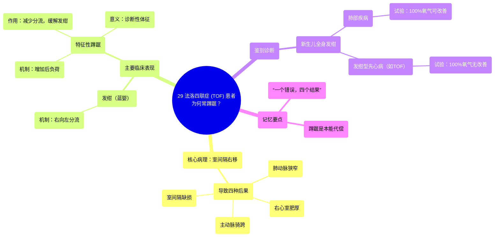

# 29 Tetralogy of Fallot (TOF)  Patients Squat a lot…Ever Wonder Why

  <video controls preload="metadata" playsinline>
    <source src="https://helly.s3.bitiful.net/心血管学科/%E4%B8%93%E8%BE%91%2018%EF%BC%9A%E5%BF%83%E5%86%85%E7%A7%91%E7%BB%88%E6%9E%81%E7%99%BE%E7%A7%91%E8%BE%9E%E5%85%B8%20%28The%20Cardiology%20Encyclopedia%29/29%20Tetralogy%20of%20Fallot%20%28TOF%29%20%20Patients%20Squat%20a%20lot%E2%80%A6Ever%20Wonder%20Why.mp4" type="video/mp4">
    
您的浏览器不支持播放，请升级。

  </video>

::: tip ⚡️ 核心考点 (30s速读)
*   **核心考点**：法洛四联症（TOF）是一种先天性心脏病，其根本原因是**室间隔向右移位**，导致四种特征性后果：肺动脉狭窄、右心室肥厚、主动脉骑跨和室间隔缺损。患者出现发绀（蓝婴）和特征性的**蹲踞**姿势。
*   **临床意义**：蹲踞能**增加体循环后负荷**，减少右向左分流，从而暂时缓解发绀。这是TOF的**诊断性体征**。与肺部疾病鉴别时，可给予100%氧气，若发绀无改善，则提示为发绀型心脏病。
:::

## 🧠 深度精讲

*   **核心病理生理**：法洛四联症并非四种独立的畸形，而是**一个根本缺陷（室间隔右移）引发的四种连锁后果**。这“一个错误”导致：1) 肺动脉流出道变窄（**肺动脉狭窄**）；2) 右心室为克服狭窄产生的阻力而代偿性增厚（**右心室肥厚**）；3) 室间隔对位不良形成孔洞（**室间隔缺损**）；4) 主动脉根部位置异常，同时接收来自左右心室的血液（**主动脉骑跨**）。
*   **发绀的机制**：由于肺动脉狭窄，右心室压力增高。当右心室压力超过左心室时，含氧量低的静脉血（右心）会通过室间隔缺损直接分流到主动脉（左心系统），与动脉血混合，导致全身动脉血氧饱和度下降，表现为**发绀**。
*   **蹲踞的机制**：蹲踞时，屈曲的下肢压迫动脉，同时腹部受压，共同导致**体循环血管阻力（后负荷）瞬时增加**。这使得血液从左心室射入主动脉的阻力变大。对于TOF患者而言，这相当于提高了主动脉的“门槛”，使得右心室的静脉血更难通过室间隔缺损分流到主动脉。因此，更多的血液被迫流向肺动脉（尽管狭窄）进行氧合，**减少了右向左分流，暂时提高了血氧，缓解了发绀**。这是一种通过体位改变血流动力学的本能代偿行为。
*   **鉴别诊断**：新生儿全身发绀时，需鉴别是**肺部疾病**（氧合障碍）还是**发绀型心脏病**（循环分流）。简单的床旁试验是**给予100%氧气**。若为肺部疾病，提高吸入氧浓度可改善氧合，发绀减轻；若为心脏右向左分流，提高氧浓度无法改变分流血量，发绀**无改善**。

## 📚 双语术语表 (Terminology)
| 英文术语 | 中文翻译 | 定义/解释 |
| :--- | :--- | :--- |
| Tetralogy of Fallot (TOF) | 法洛四联症 | 一种发绀型先天性心脏病，特征为肺动脉狭窄、室间隔缺损、主动脉骑跨和右心室肥厚。 |
| Squatting | 蹲踞 | TOF患者的特征性姿势，通过增加体循环后负荷来减少右向左分流，缓解发绀。 |
| Cyanosis | 发绀/紫绀 | 皮肤、黏膜呈青紫色，因血液中还原血红蛋白增多所致。在TOF中因右向左分流引起。 |
| Blue baby | 蓝婴 | 指因先天性心脏病（如TOF）导致全身发绀的新生儿。 |
| Ventricular Septal Defect (VSD) | 室间隔缺损 | 左右心室之间的间隔存在异常开口。在TOF中，是四个特征之一。 |
| Pulmonic Stenosis | 肺动脉狭窄 | 肺动脉瓣或肺动脉流出道狭窄，增加右心室射血阻力。TOF的核心病变之一。 |
| Right Ventricular Hypertrophy | 右心室肥厚 | 右心室心肌代偿性增厚，通常是对肺动脉狭窄导致后负荷增加的响应。 |
| Overriding Aorta | 主动脉骑跨 | 主动脉根部位置异常，骑跨于室间隔之上，同时接收来自左右心室的血液。 |
| Afterload | 后负荷 | 心室收缩射血时需要克服的阻力，主要指体循环动脉压力。 |
| Shunt (Right-to-Left) | 分流（右向左） | 血液从右心系统（静脉侧）直接流入左心系统（动脉侧），导致动脉血氧下降。TOF发绀的原因。 |
| Holosystolic Murmur | 全收缩期杂音 | 在整个心脏收缩期都能听到的杂音。TOF因室间隔缺损可在胸骨左下缘闻及。 |

## 🗺️ 知识图谱

