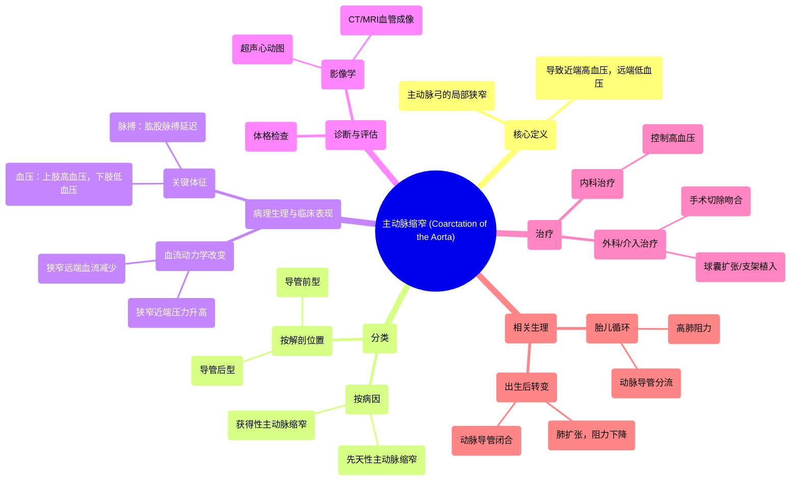

# 30 Coarctation of the Aorta - Cardiology Series - Types, Symptoms, Signs, Diagnosis & Treatment

  <video controls preload="metadata" playsinline>
    <source src="https://helly.s3.bitiful.net/心血管学科/%E4%B8%93%E8%BE%91%2018%EF%BC%9A%E5%BF%83%E5%86%85%E7%A7%91%E7%BB%88%E6%9E%81%E7%99%BE%E7%A7%91%E8%BE%9E%E5%85%B8%20%28The%20Cardiology%20Encyclopedia%29/30%20Coarctation%20of%20the%20Aorta%20-%20Cardiology%20Series%20-%20Types%2C%20Symptoms%2C%20Signs%2C%20Diagnosis%20%26%20Treatment.mp4" type="video/mp4">
    
您的浏览器不支持播放，请升级。

  </video>

::: tip ⚡️ 核心考点 (30s速读)
*   **核心考点**：主动脉缩窄是主动脉弓的先天性或获得性狭窄，导致上半身高血压、下半身低血压及肱股脉搏延迟。
*   **临床意义**：典型表现为上肢血压高于下肢，股动脉搏动减弱或延迟。治疗包括内科药物控制血压和外科手术/介入修复狭窄。
:::

## 🧠 深度精讲

*   **概念1：主动脉缩窄的定义与解剖位置**
    主动脉缩窄是指主动脉弓发生局部狭窄的病理状态。主动脉是人体最大的动脉，起自左心室，分为升主动脉、主动脉弓、胸降主动脉和腹主动脉。缩窄最常发生在主动脉弓，特别是左锁骨下动脉开口远端、动脉导管韧带附近的位置。这种狭窄导致血流受阻，从而引发一系列血流动力学改变。

*   **概念2：分类**
    主要从两个维度进行分类：
    1.  **按病因**：分为“先天性主动脉缩窄”和“获得性主动脉缩窄”。先天性最常见，常与其他心脏畸形（如二叶式主动脉瓣）并存。
    2.  **按与动脉导管的位置关系**：分为“导管前型”（狭窄位于动脉导管近端）和“导管后型”（狭窄位于动脉导管远端或远侧）。导管后型在成人中更常见。

*   **概念3：病理生理与临床表现**
    狭窄导致近端（上半身）血压升高，远端（下半身）血压降低和血流减少。这解释了核心的体格检查发现：
    *   **血压异常**：“上肢高血压”与“下肢低血压”。
    *   **脉搏异常**：“肱股脉搏延迟”：检查者同时触摸患者肱动脉和股动脉脉搏时，可感到股动脉搏动明显迟于肱动脉。此外，肱动脉脉搏的幅度和力量也强于股动脉脉搏。
    *   **其他**：可能因侧支循环形成（如肋间动脉扩张）导致肋骨下缘被侵蚀（X光可见“肋骨切迹”）。

*   **概念4：胎儿循环与动脉导管的作用**
    理解胎儿循环有助于明白缩窄的病理。胎儿期肺阻力极高，肺动脉血大部分经“动脉导管”分流至主动脉。出生后肺扩张，阻力下降，动脉导管功能性闭合，形成“动脉韧带”。在导管后型缩窄中，动脉导管的闭合可能使狭窄远端的血流进一步减少，加重病情。

*   **概念5：治疗原则**
    治疗取决于狭窄的严重程度（轻度 vs 重度）和症状。
    *   **内科治疗**：主要使用药物（如β受体阻滞剂）控制高血压。
    *   **外科/介入治疗**：对于严重或有症状的缩窄，标准治疗是手术切除狭窄段并吻合，或采用球囊扩张和支架植入的介入治疗。

## 📚 双语术语表 (Terminology)
| 英文术语 | 中文翻译 | 定义/解释 |
| :--- | :--- | :--- |
| Coarctation of the aorta | 主动脉缩窄 | 主动脉，特别是主动脉弓的先天性或获得性狭窄。 |
| Ascending aorta | 升主动脉 | 主动脉起始于左心室的部分。 |
| Aortic arch | 主动脉弓 | 主动脉呈弓形弯曲的部分，发出头臂干、左颈总动脉和左锁骨下动脉。 |
| Descending thoracic aorta | 胸降主动脉 | 主动脉弓之后、穿过膈肌之前的部分。 |
| Abdominal aorta | 腹主动脉 | 主动脉穿过膈肌进入腹腔后的部分。 |
| Congenital / Acquired | 先天性 / 获得性 | 指出生时即存在或后天因疾病（如大动脉炎）所致。 |
| Pre-ductal / Post-ductal | 导管前型 / 导管后型 | 根据狭窄部位相对于已闭合的动脉导管（动脉韧带）的位置分类。 |
| Ductus arteriosus | 动脉导管 | 胎儿期连接肺动脉与主动脉的血管通道，出生后闭合。 |
| Ligamentum arteriosum | 动脉韧带 | 动脉导管闭合后形成的纤维韧带。 |
| Brachiofemoral delay | 肱股脉搏延迟 | 股动脉搏动较肱动脉搏动明显延迟的体征，是主动脉缩窄的特征性表现。 |
| Upper extremity hypertension | 上肢高血压 | 由于主动脉狭窄近端阻力增加导致的双臂血压升高。 |
| Lower extremity hypotension | 下肢低血压 | 由于主动脉狭窄远端血流减少导致的双腿血压降低。 |
| Cardiac output | 心输出量 | 每分钟一侧心室泵出的血液总量。 |
| Vascular resistance | 血管阻力 | 血液在血管内流动所遇到的阻力。 |

## 🗺️ 知识图谱

