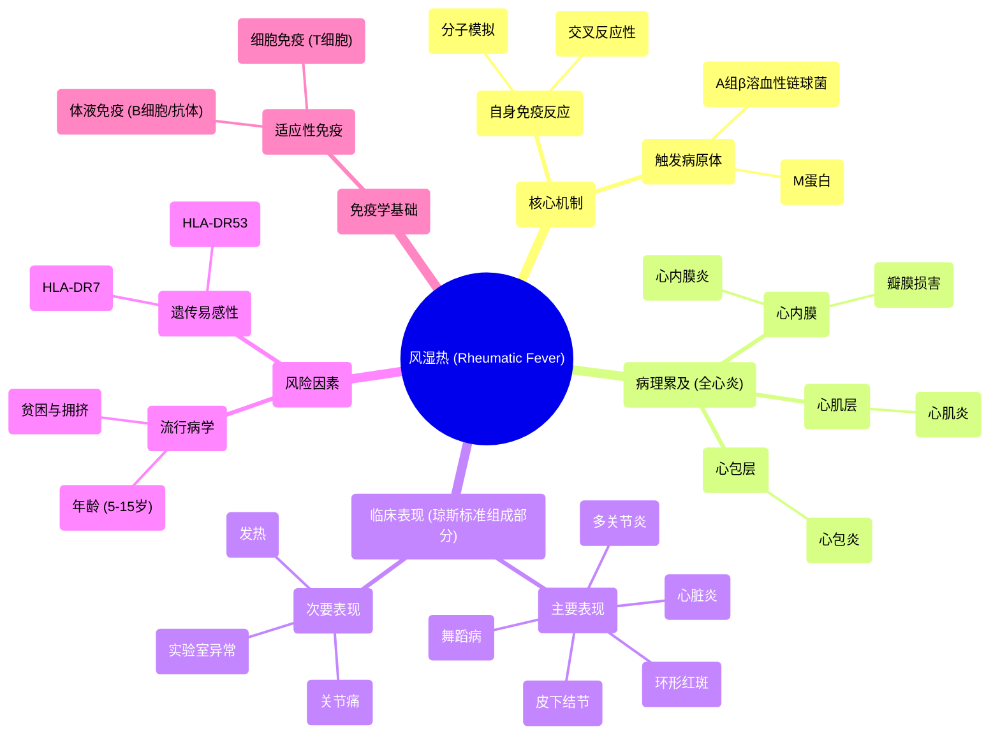

# 31 Rheumatic Fever - Jones Criteria - Causes, Signs, Symptoms, Diagnosis & Treatment - Cardiology

  <video controls preload="metadata" playsinline>
    <source src="https://helly.s3.bitiful.net/心血管学科/%E4%B8%93%E8%BE%91%2018%EF%BC%9A%E5%BF%83%E5%86%85%E7%A7%91%E7%BB%88%E6%9E%81%E7%99%BE%E7%A7%91%E8%BE%9E%E5%85%B8%20%28The%20Cardiology%20Encyclopedia%29/31%20Rheumatic%20Fever%20-%20Jones%20Criteria%20-%20Causes%2C%20Signs%2C%20Symptoms%2C%20Diagnosis%20%26%20Treatment%20-%20Cardiology.mp4" type="video/mp4">
    
您的浏览器不支持播放，请升级。

  </video>

::: tip ⚡️ 核心考点 (30s速读)
*   **核心考点**：风湿热是A组β溶血性链球菌感染后引发的**自身免疫性疾病**，主要累及心脏、关节、皮肤和神经系统，其诊断依赖**琼斯标准**。
*   **临床意义**：急性期可导致**全心炎**，慢性期可遗留**风湿性心脏病**（如二尖瓣狭窄），是儿童和青少年获得性心脏病的重要原因。
:::

## 🧠 深度精讲

*   **概念1：风湿热的本质与发病机制**
    风湿热**不是**细菌的直接感染，而是链球菌感染后引发的**异常免疫反应**。其核心机制是**分子模拟**：病原体（A组β溶血性链球菌）的M蛋白与人体心脏、关节、神经等组织的抗原结构相似。免疫系统在攻击细菌后产生的抗体和T细胞，会错误地攻击自身组织，导致炎症和损伤，属于**自身免疫性疾病**。这涉及**体液免疫**（B细胞产生抗体）和**细胞免疫**（T细胞直接杀伤）的共同作用。

*   **概念2：心脏受累——“全心炎”**
    风湿热可同时侵犯心脏的三层结构，称为**全心炎**：
    *   **心内膜炎**：最内层受累，常导致瓣膜（尤其是二尖瓣）的炎症、增厚，是慢性风湿性心脏病的病理基础。
    *   **心肌炎**：中间肌肉层受累，影响心脏收缩功能。
    *   **心包炎**：最外层受累，可产生心包积液。

*   **概念3：风险因素与流行病学**
    急性风湿热好发于**5-15岁**的儿童和青少年，与社会经济因素（**贫困、居住拥挤**）密切相关，这些条件增加了链球菌感染和传播的机会。此外，携带**HLA-DR7**或**HLA-DR53**等基因型的人群有**遗传易感性**。慢性风湿热则源于急性期未得到充分或有效治疗。

## 📚 双语术语表 (Terminology)
| 英文术语 | 中文翻译 | 定义/解释 |
| :--- | :--- | :--- |
| Rheumatic Fever | 风湿热 | A组β溶血性链球菌感染后引发的自身免疫性疾病，可累及心脏、关节、皮肤、神经系统。 |
| Pancarditis | 全心炎 | 同时累及心内膜、心肌层和心包层的心脏炎症，是风湿热心脏受累的典型表现。 |
| Molecular Mimicry | 分子模拟 | 病原体抗原与宿主自身抗原结构相似，导致免疫系统交叉反应，攻击自身组织的机制。 |
| Autoimmune Disease | 自身免疫性疾病 | 免疫系统错误地攻击并破坏自身正常组织的疾病。 |
| Group A Beta-hemolytic Streptococcus (GAS) | A组β溶血性链球菌 | 引起链球菌性咽炎等感染的细菌，其M蛋白是诱发风湿热免疫反应的关键抗原。 |
| Jones Criteria | 琼斯标准 | 用于诊断急性风湿热的一套临床标准，包括主要表现和次要表现。 |
| Endocardium / Myocardium / Pericardium | 心内膜 / 心肌层 / 心包层 | 构成心脏壁的三层结构，从内到外依次为心内膜、心肌层和心包层。 |
| Humoral Immunity / Cellular Immunity | 体液免疫 / 细胞免疫 | 适应性免疫的两种类型。体液免疫由B细胞和抗体介导；细胞免疫由T细胞直接杀伤靶细胞。 |

## 🗺️ 知识图谱

