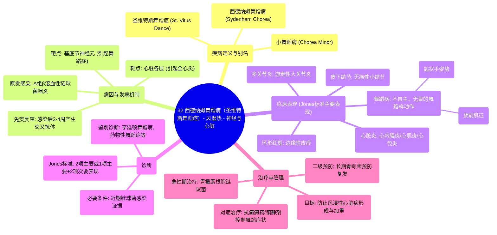

# 32 Sydenham Chorea (St. Vitus Dance) - Rheumatic Fever - Neurology & Cardiology

  <video controls preload="metadata" playsinline>
    <source src="https://helly.s3.bitiful.net/心血管学科/%E4%B8%93%E8%BE%91%2018%EF%BC%9A%E5%BF%83%E5%86%85%E7%A7%91%E7%BB%88%E6%9E%81%E7%99%BE%E7%A7%91%E8%BE%9E%E5%85%B8%20%28The%20Cardiology%20Encyclopedia%29/32%20Sydenham%20Chorea%20%28St.%20Vitus%20Dance%29%20-%20Rheumatic%20Fever%20-%20Neurology%20%26%20Cardiology.mp4" type="video/mp4">
    
您的浏览器不支持播放，请升级。

  </video>

::: tip ⚡️ 核心考点 (30s速读)
*   **核心考点**：西德纳姆舞蹈病（小舞蹈病）是风湿热的主要诊断标准之一，表现为无目的、不自主的舞蹈样动作，常继发于A组β溶血性链球菌感染后2-4周。
*   **临床意义**：该病是风湿热累及中枢神经系统的表现，诊断需结合咽喉炎病史、心脏炎、关节炎等其他Jones标准。治疗核心是控制链球菌感染和风湿热。
:::

## 🧠 深度精讲

*   **概念1：西德纳姆舞蹈病概述**
    *   西德纳姆舞蹈病，也称为**小舞蹈病**或**圣维特斯舞蹈症**，是风湿热累及中枢神经系统（主要是基底节）后出现的神经精神症状。
    *   它是风湿热**Jones诊断标准**中的主要表现之一（“S”代表Sydenham Chorea）。
    *   需与**亨廷顿舞蹈病（大舞蹈病）** 等其它原因导致的舞蹈症相鉴别。

*   **概念2：与风湿热的关联**
    *   发病始于**A组β溶血性链球菌（化脓性链球菌）** 引起的咽喉炎。
    *   感染后**2至4周**，机体产生针对细菌M蛋白的异常免疫反应，攻击心脏、关节、皮肤和神经系统，导致风湿热。
    *   风湿热是一种**全心炎**，可同时累及心内膜、心肌和心包。

*   **概念3：临床表现与诊断**
    *   **核心症状**：突发、无目的、不自主、半目的性的舞蹈样动作（如视频中“打翻水杯”的案例所示），常伴有肌张力减低和情绪不稳。
    *   **特征性体征**：
        *   **旋前肌征**：嘱患者前臂旋后（手心向上），患者会不自主地将手掌旋前（手心向下）。
        *   **匙状手姿势**：患者无法长时间保持手臂伸展和手腕背屈，手腕会不自主地屈曲，手指过伸。
    *   **诊断**：依据修订的Jones标准，需有**链球菌感染证据**（如咽拭子培养阳性、抗链球菌溶血素O滴度升高），并满足**至少两项主要表现**或**一项主要表现加两项次要表现**。
        *   **主要表现**：心脏炎、多关节炎、舞蹈病、环形红斑、皮下结节。
        *   **次要表现**：发热、关节痛、血沉增快/C反应蛋白升高、心电图PR间期延长。

*   **概念4：治疗与管理**
    *   **首要治疗**：使用**青霉素**进行足疗程的抗生素治疗，以彻底清除链球菌，防止风湿热复发和心脏瓣膜进一步损害（风湿性心脏病）。
    *   **对症治疗**：舞蹈症状严重时，可使用**丙戊酸、卡马西平**等药物或**氟哌啶醇**等镇静剂控制症状。
    *   **二级预防**：确诊风湿热后，需长期（通常至成年）进行青霉素预防性用药，防止复发。

## 📚 双语术语表 (Terminology)
| 英文术语 | 中文翻译 | 定义/解释 |
| :--- | :--- | :--- |
| Sydenham Chorea | 西德纳姆舞蹈病 | 风湿热引起的中枢神经系统并发症，以舞蹈样动作为特征。 |
| St. Vitus Dance | 圣维特斯舞蹈症 | 西德纳姆舞蹈病的别称。 |
| Rheumatic Fever | 风湿热 | 继发于A组链球菌感染后的自身免疫性疾病，主要累及心脏、关节、皮肤和神经系统。 |
| Jones Criteria | Jones诊断标准 | 用于诊断风湿热的一套临床标准，包括主要和次要表现。 |
| Group A Beta-hemolytic Streptococcus (GAS) | A组β溶血性链球菌 | 引起链球菌性咽炎，并可触发风湿热的细菌。 |
| Pan-carditis | 全心炎 | 指心脏的所有三层（心内膜、心肌、心包）均发生炎症。 |
| Chorea | 舞蹈症 | 一种不自主、无目的、快速、不规则的运动障碍。 |
| Pronator Sign | 旋前肌征 | 西德纳姆舞蹈病的特征性神经体征，表现为前臂不自主旋前。 |
| Erythema Marginatum | 环形红斑 | 风湿热的皮肤表现，为边缘清晰、中心消退的粉红色皮疹。 |
| Subcutaneous Nodules | 皮下结节 | 风湿热的表现之一，为无痛性、可移动的皮下小硬结。 |

## 🗺️ 知识图谱

