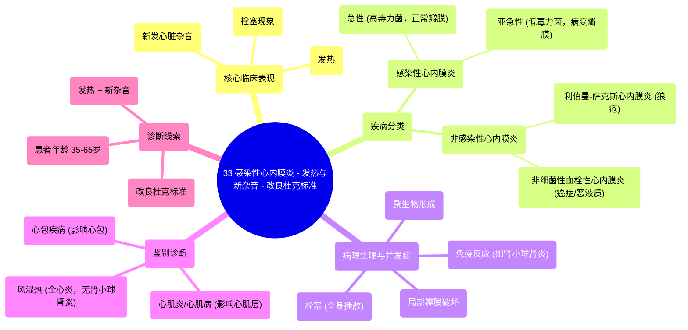

# 33 Infective Endocarditis - Fever & New Murmur - Modified Duke’s Criteria - Cardiology Playlist

  <video controls preload="metadata" playsinline>
    <source src="https://helly.s3.bitiful.net/心血管学科/%E4%B8%93%E8%BE%91%2018%EF%BC%9A%E5%BF%83%E5%86%85%E7%A7%91%E7%BB%88%E6%9E%81%E7%99%BE%E7%A7%91%E8%BE%9E%E5%85%B8%20%28The%20Cardiology%20Encyclopedia%29/33%20Infective%20Endocarditis%20-%20Fever%20%26%20New%20Murmur%20-%20Modified%20Duke%E2%80%99s%20Criteria%20-%20Cardiology%20Playlist.mp4" type="video/mp4">
    
您的浏览器不支持播放，请升级。

  </video>

::: tip ⚡️ 核心考点 (30s速读)
*   **核心考点**：感染性心内膜炎的核心临床表现为“发热 + 新发心脏杂音”。对于35-65岁出现此组合症状的患者，应首先考虑此病。
*   **临床意义**：瓣膜上的赘生物可脱落形成栓塞，导致全身多器官（如脑、脾、肾）缺血症状，并可能引发免疫反应（如肾小球肾炎），这是与风湿热鉴别的重要点。
:::

## 🧠 深度精讲

*   **概念1：心内膜炎的定义与分类**
    心内膜炎是心内膜（包括心脏瓣膜）的炎症。主要分为两大类：
    1.  **感染性心内膜炎**：由微生物（主要是细菌，其次是真菌）感染引起。
    2.  **非感染性心内膜炎**：瓣膜赘生物无菌，主要包括：
        *   **利伯曼-萨克斯心内膜炎**：见于系统性红斑狼疮（SLE），常累及二尖瓣，导致反流。
        *   **非细菌性血栓性心内膜炎**：一种副肿瘤综合征，见于某些癌症（如结肠癌、胰腺癌）患者，与粘蛋白分泌等有关，又称“恶液质性心内膜炎”。

*   **概念2：感染性心内膜炎的病理生理与临床**
    1.  **病原体与瓣膜状态**：
        *   **急性**：由高毒力细菌（如金黄色葡萄球菌）引起，可侵袭并破坏**正常**瓣膜，病程急骤。
        *   **亚急性**：由低毒力细菌（如草绿色链球菌）引起，通常发生在**已有病变**的瓣膜（如风湿性心脏病、二尖瓣脱垂）上，病程较缓。
    2.  **主要后果**：
        *   **局部影响**：瓣膜破坏导致**新发杂音**（多为反流性杂音）。
        *   **全身栓塞**：赘生物脱落形成栓子，随血流播散，可引起脑梗死、脾梗死、皮肤黏膜瘀点等。
        *   **免疫反应**：针对病原体和赘生物碎片的免疫复合物可沉积于肾脏，导致**免疫复合物介导的肾小球肾炎**。这是与风湿热（主要引起关节炎、心脏炎、舞蹈病等，不直接引起肾小球肾炎）的重要鉴别点之一。

*   **概念3：心脏各层结构与对应疾病**
    理解心脏壁的三层结构有助于疾病定位：
    *   **心内膜**（内层）：感染性/非感染性心内膜炎。
    *   **心肌层**（中层）：心肌炎、心肌病、心肌梗死。
    *   **心包**（外层）：心包炎、心包积液、心脏压塞。
    *   **全层**：风湿热（全心炎）。

## 📚 双语术语表 (Terminology)
| 英文术语 | 中文翻译 | 定义/解释 |
| :--- | :--- | :--- |
| Infective Endocarditis | 感染性心内膜炎 | 由微生物感染引起的心内膜（尤其是瓣膜）炎症。 |
| Modified Duke‘s Criteria | 改良杜克标准 | 用于诊断感染性心内膜炎的临床标准，结合了临床、微生物学和超声心动图发现。 |
| Vegetation | 赘生物 | 附着于受损心内膜或瓣膜上的由血小板、纤维蛋白、微生物和炎性细胞组成的团块。 |
| Embolization | 栓塞 | 赘生物或其他物质脱落，随血流阻塞远端血管的过程。 |
| Libman-Sachs Endocarditis | 利伯曼-萨克斯心内膜炎 | 系统性红斑狼疮相关的非感染性心内膜炎，赘生物无菌。 |
| Non-bacterial Thrombotic Endocarditis (NBTE) | 非细菌性血栓性心内膜炎 | 一种与恶性肿瘤（尤其是腺癌）相关的非感染性心内膜炎，赘生物为无菌性血栓。 |
| Pancarditis | 全心炎 | 心脏所有三层（心内膜、心肌层、心包）均发生炎症，见于风湿热。 |
| Murmur | 心脏杂音 | 血液流经心脏或大血管时产生的异常声音，提示可能存在瓣膜病变或其他结构异常。 |
| Glomerulonephritis | 肾小球肾炎 | 肾小球的炎症，在感染性心内膜炎中常由免疫复合物沉积引起。 |

## 🗺️ 知识图谱

