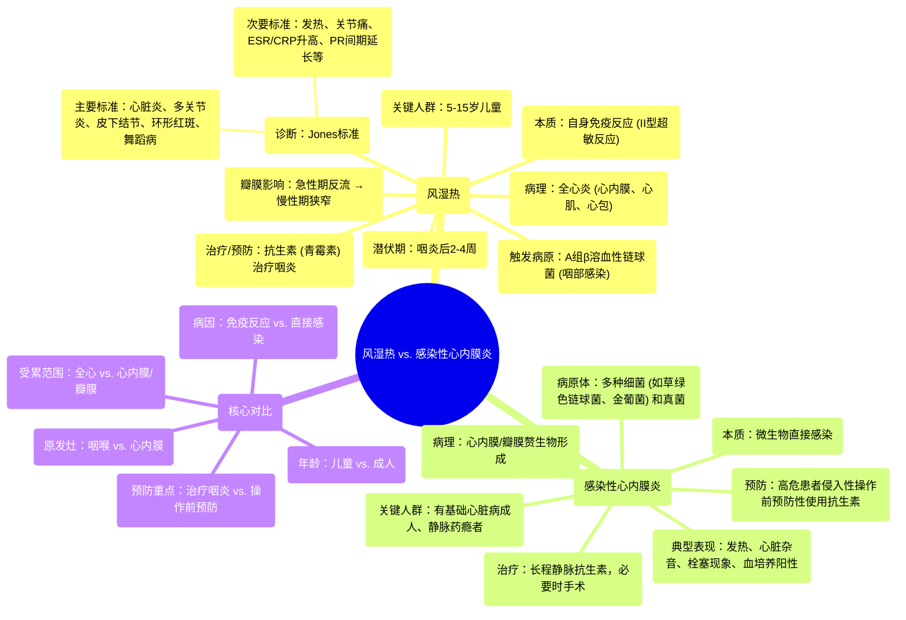

# 34 Rheumatic Fever vs. Infective Endocarditis - Comparison - Cardiology Series

  <video controls preload="metadata" playsinline>
    <source src="https://helly.s3.bitiful.net/心血管学科/%E4%B8%93%E8%BE%91%2018%EF%BC%9A%E5%BF%83%E5%86%85%E7%A7%91%E7%BB%88%E6%9E%81%E7%99%BE%E7%A7%91%E8%BE%9E%E5%85%B8%20%28The%20Cardiology%20Encyclopedia%29/34%20Rheumatic%20Fever%20vs.%20Infective%20Endocarditis%20-%20Comparison%20-%20Cardiology%20Series.mp4" type="video/mp4">
    
您的浏览器不支持播放，请升级。

  </video>

::: tip ⚡️ 核心考点 (30s速读)
*   **核心考点**：风湿热是A组链球菌感染后触发的自身免疫反应，主要影响儿童，可导致全心炎；感染性心内膜炎是心内膜（尤其是瓣膜）的直接微生物感染，多见于有基础心脏病的成人。
*   **临床意义**：两者均可导致瓣膜损伤和心脏杂音，但病因、发病机制、高危人群、临床表现和预防治疗策略截然不同，是考试和临床鉴别的重点。
:::

## 🧠 深度精讲

*   **概念1：风湿热**
    *   **本质**：一种由A组β溶血性链球菌（化脓性链球菌）咽部感染后触发的**自身免疫性疾病**（II型超敏反应，分子模拟机制）。
    *   **关键特征**：
        *   **人群**：主要影响**5-15岁**的儿童和青少年，尤其在居住拥挤、卫生条件差的环境中。
        *   **时间线**：在咽炎发作后**2-4周**出现症状。
        *   **病理**：可导致**全心炎**，累及心内膜、心肌和心包。急性期主要引起瓣膜**反流**，反复发作转为慢性后导致瓣膜**狭窄**。
        *   **诊断**：主要依据**Jones标准**（主要标准：心脏炎、多关节炎、皮下结节、环形红斑、舞蹈病；次要标准：发热、关节痛、急性期反应物升高等）。
        *   **预防**：关键在于对链球菌性咽炎进行**早期、足疗程的抗生素治疗**（如青霉素）。

*   **概念2：感染性心内膜炎**
    *   **本质**：心内膜（特别是心脏瓣膜）的**微生物感染**。
    *   **关键特征**：
        *   **病原体**：可由多种细菌（如草绿色链球菌、金黄色葡萄球菌）和真菌引起。
        *   **高危人群**：多见于有**基础心脏结构异常**（如瓣膜病、人工瓣膜）的成人，或静脉药瘾者。
        *   **病理**：主要局限于**心内膜和瓣膜**，形成含有微生物的**赘生物**。
        *   **临床表现**：典型表现为**发热、心脏杂音、栓塞现象**（如皮肤瘀点、Osler结节、Janeway损害、脾梗死）和**血培养阳性**。
        *   **治疗**：核心是**长期、大剂量、静脉使用敏感抗生素**，有时需手术干预。

*   **概念3：风湿热与感染性心内膜炎的对比**
    *   **病因**：风湿热是**免疫反应**（单一病原体触发）；感染性心内膜炎是**直接感染**（多种病原体）。
    *   **受累范围**：风湿热为**全心炎**；感染性心内膜炎主要累及**心内膜/瓣膜**。
    *   **发病年龄**：风湿热多见于**儿童**；感染性心内膜炎多见于**成人**。
    *   **原发感染部位**：风湿热原发感染在**咽喉**；感染性心内膜炎原发感染在**心内膜**。
    *   **杂音演变**：风湿热急性期致**反流性杂音**，慢性期致**狭窄性杂音**；感染性心内膜炎杂音性质多变，常为新出现的或变化的杂音。
    *   **预防**：风湿热预防在于治疗**咽炎**；感染性心内膜炎预防在于对有高危因素者进行**侵入性操作前的抗生素预防**。

## 📚 双语术语表 (Terminology)
| 英文术语 | 中文翻译 | 定义/解释 |
| :--- | :--- | :--- |
| Rheumatic Fever | 风湿热 | 由A组链球菌感染后触发的自身免疫性疾病，主要影响心脏、关节、皮肤和神经系统。 |
| Infective Endocarditis | 感染性心内膜炎 | 心内膜（尤其是心脏瓣膜）的微生物感染。 |
| Group A Beta-hemolytic Streptococcus | A组β溶血性链球菌 | 引起链球菌性咽炎和触发风湿热的细菌。 |
| Molecular Mimicry | 分子模拟 | 病原体抗原与宿主自身抗原相似，导致免疫系统攻击自身组织的机制。 |
| Jones Criteria | Jones标准 | 诊断风湿热的临床标准，包括主要和次要表现。 |
| Pancarditis | 全心炎 | 心脏所有三层（心内膜、心肌、心包）均发生炎症。 |
| Vegetation | 赘生物 | 感染性心内膜炎时，在心瓣膜上形成的由血小板、纤维蛋白、微生物和炎症细胞组成的团块。 |
| ASO (Anti-streptolysin O) | 抗链球菌溶血素O | 针对链球菌溶血素O的抗体，提示近期A组链球菌感染。 |
| Fibrinoid Necrosis | 纤维素样坏死 | 风湿热心肌病理改变中可见的一种坏死类型，见于Aschoff小体。 |

## 🗺️ 知识图谱

