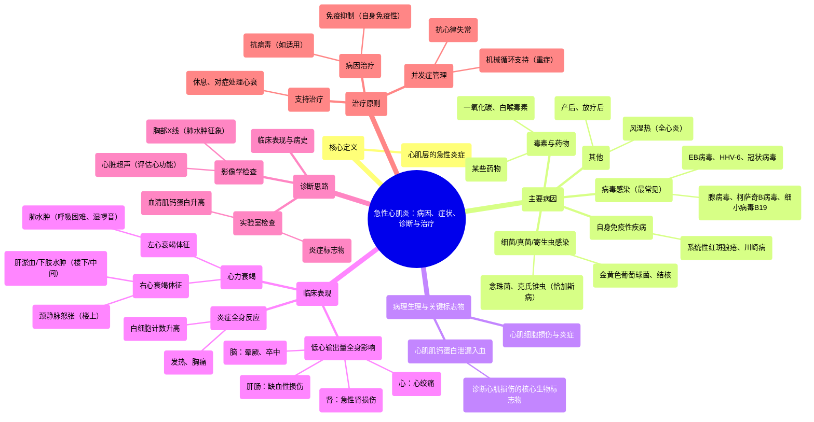

# 35 Acute Myocarditis — Causes, Symptoms, Diagnosis & Treatment — Cardiology

  <video controls preload="metadata" playsinline>
    <source src="https://helly.s3.bitiful.net/心血管学科/%E4%B8%93%E8%BE%91%2018%EF%BC%9A%E5%BF%83%E5%86%85%E7%A7%91%E7%BB%88%E6%9E%81%E7%99%BE%E7%A7%91%E8%BE%9E%E5%85%B8%20%28The%20Cardiology%20Encyclopedia%29/35%20Acute%20Myocarditis%20%E2%80%94%20Causes%2C%20Symptoms%2C%20Diagnosis%20%26%20Treatment%20%E2%80%94%20Cardiology.mp4" type="video/mp4">
    
您的浏览器不支持播放，请升级。

  </video>

::: tip ⚡️ 核心考点 (30s速读)
*   **核心考点**：急性心肌炎是心肌的急性炎症，最常见病因为病毒感染。其核心病理生理是心肌细胞损伤导致收缩功能障碍，进而引发全心衰竭（右心衰与左心衰）及低心输出量的一系列全身表现。
*   **临床意义**：诊断需结合临床表现（心衰症状、发热、胸痛）、实验室检查（肌钙蛋白升高、白细胞计数升高）及影像学。治疗以支持治疗为主，针对病因（如抗病毒、免疫抑制）及处理并发症（如心力衰竭、心律失常）。
:::

## 🧠 深度精讲

*   **概念1：定义与解剖基础**
    急性心肌炎是心肌（心脏的肌肉中层）的急性炎症。心脏壁由内向外分为三层：心内膜、心肌层和心包。心肌炎特指心肌层的病变，需与心内膜疾病（如心内膜炎）和心包疾病（如心包炎）相鉴别。

*   **概念2：病因学**
    病因多样，最常见为**病毒感染**（如腺病毒、柯萨奇B病毒、细小病毒B19、EB病毒、人类疱疹病毒6型、冠状病毒等）。其他原因包括细菌、真菌、寄生虫感染（如恰加斯病）、自身免疫性疾病（如狼疮、川崎病）、毒素（如一氧化碳、白喉毒素）、药物以及产后、放疗后等状态。

*   **概念3：病理生理与临床表现**
    心肌炎症损伤心肌细胞，导致两个主要后果：
    1.  **心肌收缩功能障碍**：引发心力衰竭。
        *   **右心衰竭**：血液淤积在体循环，表现为“楼上”（颈静脉怒张）、“楼下”（下肢水肿）和“中间”（肝淤血、心源性肝硬化）。
        *   **左心衰竭**：血液淤积在肺循环，导致肺水肿，表现为呼吸困难、端坐呼吸、湿性啰音、咳嗽、咯血等。
    2.  **心肌细胞膜完整性破坏**：细胞内物质（如**心肌肌钙蛋白I和T**）泄漏入血，导致血清肌钙蛋白显著升高，这是诊断心肌损伤的关键生物标志物。
    此外，炎症本身可引起发热、胸痛，并激活免疫系统导致白细胞计数升高。

*   **概念4：全身影响（低心输出量状态）**
    严重的心肌炎导致心输出量严重下降，全身器官灌注不足：
    *   **心脏**：心绞痛。
    *   **大脑**：头晕、晕厥前兆、晕厥、意识模糊，甚至缺血性卒中。
    *   **肾脏**：急性肾损伤（肾前性氮质血症）。
    *   **肝脏/肠道**：缺血性肝炎、肠系膜缺血、缺血性结肠炎。
    *   **四肢**：雷诺现象。

## 📚 双语术语表 (Terminology)
| 英文术语 | 中文翻译 | 定义/解释 |
| :--- | :--- | :--- |
| Acute Myocarditis | 急性心肌炎 | 心肌的急性炎症。 |
| Myocardium | 心肌层 | 构成心脏壁中层的肌肉组织，负责心脏收缩。 |
| Endocardium | 心内膜 | 心脏壁的内层。 |
| Pericardium | 心包 | 包裹心脏的外层囊膜。 |
| Cardiomyopathy | 心肌病 | 一组以心肌机械或电功能障碍为特征的心肌疾病。 |
| Troponin (I/T) | 肌钙蛋白 (I/T) | 存在于心肌细胞内的蛋白质，心肌损伤时释放入血，是诊断心肌损伤（如心肌炎、心肌梗死）的特异性标志物。 |
| Systolic Dysfunction | 收缩功能障碍 | 心脏收缩泵血能力下降。 |
| Heart Failure | 心力衰竭 | 心脏泵血功能无法满足机体代谢需要的综合征。 |
| Pulmonary Edema | 肺水肿 | 液体在肺间质和肺泡内异常积聚，常由左心衰竭引起。 |
| Viral Etiology | 病毒病因学 | 指疾病由病毒感染引起。 |
| Coxsackie B Virus | 柯萨奇B病毒 | 一种常见的可引起病毒性心肌炎的肠道病毒。 |
| Chagas Disease | 恰加斯病 | 由克氏锥虫引起的寄生虫感染，是拉丁美洲地区心肌炎的常见原因。 |
| Autoimmune Disease | 自身免疫性疾病 | 机体免疫系统错误攻击自身组织的疾病，如系统性红斑狼疮。 |

## 🗺️ 知识图谱

