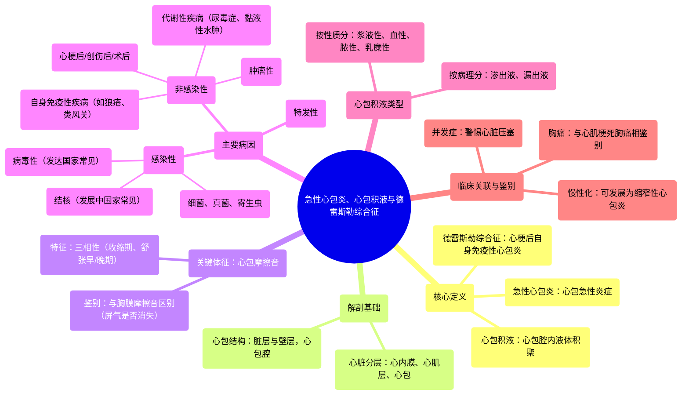

# 36 Acute Pericarditis, Pericardial Effusions, Dressler Syndrome — Cardiology Series

  <video controls preload="metadata" playsinline>
    <source src="https://helly.s3.bitiful.net/心血管学科/%E4%B8%93%E8%BE%91%2018%EF%BC%9A%E5%BF%83%E5%86%85%E7%A7%91%E7%BB%88%E6%9E%81%E7%99%BE%E7%A7%91%E8%BE%9E%E5%85%B8%20%28The%20Cardiology%20Encyclopedia%29/36%20Acute%20Pericarditis%2C%20Pericardial%20Effusions%2C%20Dressler%20Syndrome%20%E2%80%94%20Cardiology%20Series.mp4" type="video/mp4">
    
您的浏览器不支持播放，请升级。

  </video>

::: tip ⚡️ 核心考点 (30s速读)
*   **核心考点**：急性心包炎是心包壁层和脏层的急性炎症，典型表现为胸痛、心包摩擦音和特征性心电图改变。需与心肌梗死、胸膜炎等鉴别。
*   **临床意义**：最常见病因为病毒感染（发达国家）和结核（发展中国家）。识别心包摩擦音（三相性、呼吸不消失）是床旁诊断的关键。需警惕心包积液进展为心脏压塞。
:::

## 🧠 深度精讲

*   **概念1：心包解剖与疾病谱系**
    心脏壁由内向外分为心内膜、心肌层和心包。心包是包裹心脏的双层囊（脏层和壁层），其间的潜在腔隙即心包腔。疾病可累及任一层：心内膜疾病（如感染性心内膜炎）、心肌疾病（如心肌梗死、心肌炎、心肌病）以及心包疾病（如心包炎、心包积液）。

*   **概念2：急性心包炎的病理与体征**
    心包发炎时，两层心包相互摩擦产生“心包摩擦音”。其特点是：1) **三相性**：出现在心室收缩期、舒张早期（心室快速充盈期）和舒张晚期（心房收缩期）；2) **与呼吸无关**：患者屏气时，因心脏仍在跳动，摩擦音仍存在。这与**胸膜摩擦音**（双相性，吸气与呼气时出现，屏气时消失）形成关键鉴别。

*   **概念3：病因分类**
    急性心包炎病因多样：
    *   **感染性**：病毒（如柯萨奇病毒、EB病毒、HIV，在发达国家最常见）、细菌（包括结核，在发展中国家最常见）、真菌、寄生虫（如查加斯病）。
    *   **非感染性**：
        *   **自身免疫性**：系统性红斑狼疮、类风湿关节炎、药物性狼疮等。
        *   **代谢性**：尿毒症、甲状腺功能减退（黏液性水肿）。
        *   **肿瘤性**：恶性肿瘤心包转移。
        *   **创伤性/术后**：心肌梗死后（如Dressler综合征）、心脏手术或创伤后。
    *   **特发性**：病因不明，临床也常见。

*   **概念4：心包积液类型**
    炎症可导致心包腔内液体增多，即心包积液。根据积液性质可分为：
    *   **浆液性**：清亮液体。
    *   **血性**：心包积血。
    *   **脓性**：心包积脓。
    *   **乳糜性**：乳糜心包。

## 📚 双语术语表 (Terminology)
| 英文术语 | 中文翻译 | 定义/解释 |
| :--- | :--- | :--- |
| Acute Pericarditis | 急性心包炎 | 心包（心脏最外层）的急性炎症。 |
| Pericardial Effusion | 心包积液 | 心包腔内异常液体积聚。 |
| Dressler Syndrome | 德雷斯勒综合征 | 心肌梗死后数周出现的自身免疫性心包炎。 |
| Pericardial Friction Rub | 心包摩擦音 | 因发炎的心包层相互摩擦产生的刮擦样听诊音，是心包炎的特征性体征。 |
| Pleural Friction Rub | 胸膜摩擦音 | 因发炎的胸膜层相互摩擦产生的听诊音，与呼吸相关。 |
| Myocarditis | 心肌炎 | 心肌层的炎症。 |
| Cardiomyopathy | 心肌病 | 一组以心肌本身病变导致心脏功能障碍的疾病。 |
| Constrictive Pericarditis | 缩窄性心包炎 | 慢性心包炎导致心包增厚、钙化，限制心脏舒张。 |
| Endocarditis | 心内膜炎 | 心内膜（包括心脏瓣膜）的炎症，常为感染性。 |
| Hemopericardium | 心包积血 | 心包腔内积血。 |
| Chylopericardium | 乳糜心包 | 心包腔内积聚乳糜液（淋巴液）。 |
| Idiopathic | 特发性 | 病因不明。 |
| Uremia | 尿毒症 | 肾衰竭导致代谢废物在血液中积聚的状态，可引发心包炎。 |
| Myxedema | 黏液性水肿 | 严重甲状腺功能减退症引起的皮肤和组织非凹陷性水肿，可累及心脏。 |

## 🗺️ 知识图谱

