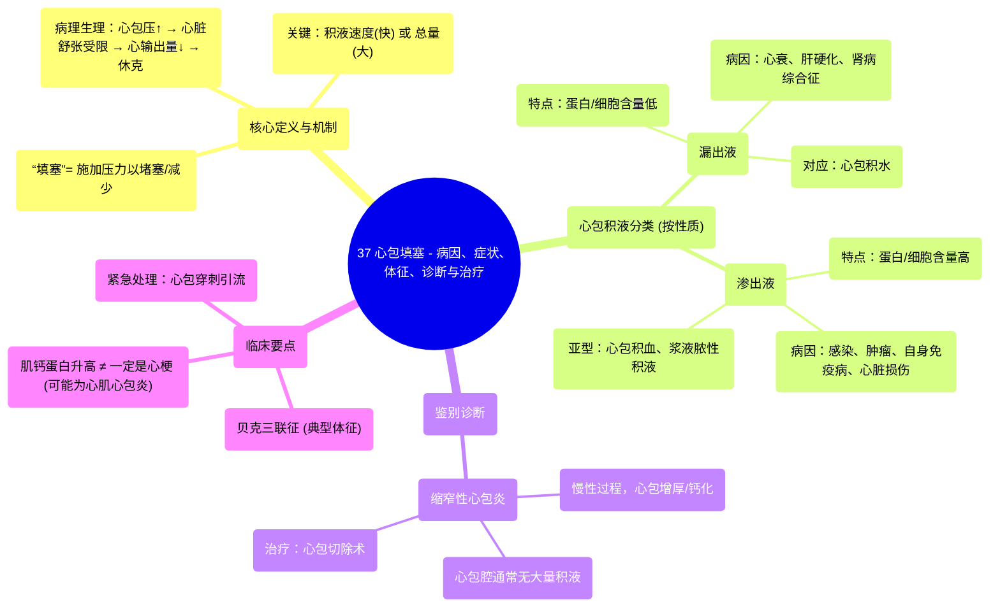

# 37 Cardiac Tamponade - Causes, Symptoms, Signs, Diagnosis & Treatment - Cardiology Series

  <video controls preload="metadata" playsinline>
    <source src="https://helly.s3.bitiful.net/心血管学科/%E4%B8%93%E8%BE%91%2018%EF%BC%9A%E5%BF%83%E5%86%85%E7%A7%91%E7%BB%88%E6%9E%81%E7%99%BE%E7%A7%91%E8%BE%9E%E5%85%B8%20%28The%20Cardiology%20Encyclopedia%29/37%20Cardiac%20Tamponade%20-%20Causes%2C%20Symptoms%2C%20Signs%2C%20Diagnosis%20%26%20Treatment%20-%20Cardiology%20Series.mp4" type="video/mp4">
    
您的浏览器不支持播放，请升级。

  </video>

::: tip ⚡️ 核心考点 (30s速读)
*   **核心考点**：心包填塞是心包腔内液体快速或大量积聚，导致心包内压力急剧升高，压迫心脏并严重影响其充盈和泵血功能的一种急危重症。
*   **临床意义**：其关键在于“速度”和“量”。缓慢、少量的积液，因心包有代偿能力，可能不引起填塞；而快速或大量的积液，即使总量不大，也可能迅速导致致命性休克（Beck三联征：低血压、心音遥远、颈静脉怒张）。
:::

## 🧠 深度精讲

*   **“填塞”一词的医学含义**：视频通过一个生动的比喻（颅脑刀刺伤）解释了“填塞”的核心概念。它指的是通过施加压力来“堵塞”、“封堵”或“减少”出血或渗出的过程。在心包填塞中，积聚的液体就像那个“塞子”，对心脏施加压力，限制其舒张。
*   **心包填塞的病理生理学**：
    *   **关键因素**：不是所有心包积液都会导致填塞。关键在于积液积累的**速度**和**总量**。正常心包有弹性，可缓慢适应少量积液；但当积液过快（如心脏破裂、创伤）或量过大时，心包内压力骤升。
    *   **后果**：升高的心包内压力压迫心脏，尤其是舒张期，导致：
        1.  **心室充盈受限**：心脏无法有效舒张以接纳回心血液。
        2.  **每搏输出量下降**：心脏泵出的血量减少。
        3.  **心输出量下降 & 低血压**：最终导致全身供血不足，引发休克。
*   **心包积液的性质与病因**：积液的性质（漏出液 vs. 渗出液）能提示病因。
    *   **漏出液**（蛋白质和细胞含量低）：见于全身性疾病导致静水压升高或胶体渗透压降低，如**充血性心力衰竭、肝硬化、肾病综合征**。对应“心包积水”。
    *   **渗出液**（蛋白质和细胞含量高）：见于局部炎症或损伤，如：
        *   **感染**（细菌如结核、病毒、真菌）：常为“浆液脓性”积液。
        *   **恶性肿瘤**：转移或直接侵犯。
        *   **自身免疫性疾病**：如系统性红斑狼疮。
        *   **心脏损伤**：心肌梗死后的心脏破裂、创伤、医源性损伤，导致“心包积血”。
    *   **其他**：胸导管损伤导致“乳糜性心包积液”。
*   **与缩窄性心包炎的鉴别**：视频开头提到，心包填塞与缩窄性心包炎有相似之处（都限制心脏舒张），但并非同一疾病。
    *   **心包填塞**：通常是**急性**过程，由心包腔内液体压力引起，**心包本身可能正常**。解除积液（如心包穿刺）可立即缓解症状。
    *   **缩窄性心包炎**：是**慢性**过程，由于心包**增厚、钙化、失去弹性**而限制心脏舒张，**心包腔内通常无大量积液**。治疗需手术切除增厚的心包。

## 📚 双语术语表 (Terminology)
| 英文术语 | 中文翻译 | 定义/解释 |
| :--- | :--- | :--- |
| Cardiac Tamponade | 心包填塞 | 心包腔内液体快速或大量积聚，导致心脏受压、充盈受限的急危状态。 |
| Pericardium | 心包 | 包裹心脏和心包大血管根部的纤维浆膜囊，分为脏层和壁层。 |
| Pericardial Effusion | 心包积液 | 心包腔内液体积聚。 |
| Hemopericardium | 心包积血 | 心包腔内积聚血液。 |
| Constrictive Pericarditis | 缩窄性心包炎 | 心包因慢性炎症增厚、钙化，失去弹性，导致心脏舒张受限的疾病。 |
| Beck‘s Triad | 贝克三联征 | 心包填塞的典型体征：低血压、心音遥远、颈静脉怒张。 |
| Exudate | 渗出液 | 因炎症导致血管通透性增加而形成的液体，富含蛋白质和细胞（如中性粒细胞）。 |
| Transudate | 漏出液 | 因静水压增高或胶体渗透压降低而形成的液体，蛋白质和细胞含量低。 |
| Myocardium | 心肌（层） | 心脏的中层，由心肌细胞构成，负责心脏的收缩功能。 |
| Endocardium | 心内膜 | 心脏的内层，覆盖心腔内表面，心脏瓣膜由此构成。 |
| Epicardium | 心外膜 | 心包脏层，紧贴于心肌表面。 |
| Tamponade Effect | 填塞效应 | 通过外部压力来阻止出血或渗出的物理效应。 |

## 🗺️ 知识图谱

