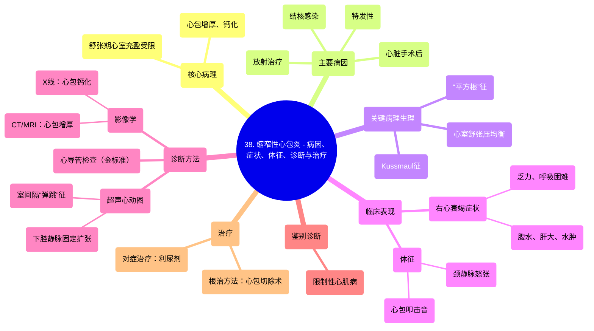

# 38 Constrictive Pericarditis - Causes, Symptoms, Signs, Diagnosis & Management - Cardiology

  <video controls preload="metadata" playsinline>
    <source src="https://helly.s3.bitiful.net/心血管学科/%E4%B8%93%E8%BE%91%2018%EF%BC%9A%E5%BF%83%E5%86%85%E7%A7%91%E7%BB%88%E6%9E%81%E7%99%BE%E7%A7%91%E8%BE%9E%E5%85%B8%20%28The%20Cardiology%20Encyclopedia%29/38%20Constrictive%20Pericarditis%20-%20Causes%2C%20Symptoms%2C%20Signs%2C%20Diagnosis%20%26%20Management%20-%20Cardiology.mp4" type="video/mp4">
    
您的浏览器不支持播放，请升级。

  </video>

::: tip ⚡️ 核心考点 (30s速读)
*   **核心考点**：缩窄性心包炎是心脏被增厚、钙化的心包膜紧紧包裹，导致心室在舒张期充盈受限的一种疾病。其血流动力学特征与限制性心肌病相似，但病因和治疗方法不同。
*   **临床意义**：常见病因包括结核病、心脏手术后、放射治疗等。典型体征为Kussmaul征（吸气时颈静脉怒张更明显）和心包叩击音。治疗关键在于通过心包切除术解除心脏的机械性束缚。
:::

## 🧠 深度精讲

*   **概念1：心包的结构与功能**
    心包是包裹心脏和出入心脏大血管根部的纤维浆膜囊，分为内外两层。内层为浆膜心包（脏层和壁层），外层为纤维心包。其主要功能是固定心脏、减少摩擦、防止心脏过度扩张以及作为感染扩散的屏障。

*   **概念2：心包炎的分类**
    心包炎可根据病程、病理生理和病因进行分类。
    *   **按病程**：急性心包炎（如特发性、感染性）和慢性心包炎（如粘连性、**缩窄性**）。
    *   **按病理生理**：干性心包炎（无积液）和湿性心包炎（有心包积液）。
    *   **按积液性质**：可分为漏出液（如心力衰竭、肾病综合征所致）、渗出液（如感染、肿瘤转移所致）、血性（如创伤、主动脉夹层）和乳糜性（胸导管损伤）。

*   **概念3：缩窄性心包炎的病理生理**
    这是本课的核心。当心包因慢性炎症（如结核、放射、手术后）而增厚、纤维化甚至钙化时，会失去弹性，变成一个坚硬的“外壳”。这个外壳在舒张期限制了心室的扩张，导致：
    1.  **心室充盈受阻**：血液回流到心脏困难。
    2.  **舒张期压力均衡**：左右心室的舒张末压趋于相等（差值通常<5 mmHg）。
    3.  **“平方根”征**：心室压力曲线在舒张早期快速下降后出现一个平台期，形如平方根符号“√”。
    4.  **Kussmaul征**：由于右心房在吸气时不能正常舒张，导致颈静脉压力在吸气时不降反升。

*   **概念4：诊断与鉴别诊断**
    *   **症状**：与右心衰竭相似，如乏力、呼吸困难、腹胀（腹水）、下肢水肿。
    *   **体征**：颈静脉怒张、肝大、腹水、下肢水肿、心包叩击音（舒张早期额外心音）。
    *   **检查**：
        *   **影像学**：胸部X线可见心包钙化；心脏CT/MRI可清晰显示心包增厚。
        *   **超声心动图**：可见心包增厚、室间隔在吸气时向左室摆动（室间隔“弹跳”征）、下腔静脉扩张且呼吸变异度消失。
        *   **心导管检查**：是诊断“金标准”，可证实舒张期压力均衡和“平方根”征。
    *   **主要鉴别诊断**：**限制性心肌病**。两者临床表现极为相似，但限制性心肌病是心肌本身僵硬，心包正常。鉴别至关重要，因为限制性心肌病**不能**用心包切除术治疗。

*   **概念5：治疗与管理**
    **心包切除术**是唯一可能治愈缩窄性心包炎的方法，即手术剥离增厚的心包，解除对心脏的压迫。手术风险较高，需在心力衰竭症状明显但心肌尚未发生不可逆萎缩前进行。对于无法手术或术前准备的患者，可使用利尿剂缓解水肿症状，但效果有限。

## 📚 双语术语表 (Terminology)
| 英文术语 | 中文翻译 | 定义/解释 |
| :--- | :--- | :--- |
| Constrictive Pericarditis | 缩窄性心包炎 | 心脏被增厚、僵硬的心包包裹，导致舒张期充盈受限的疾病。 |
| Pericardium | 心包 | 包裹心脏的纤维浆膜囊。 |
| Pericardial Effusion | 心包积液 | 心包腔内液体积聚。 |
| Transudate | 漏出液 | 低蛋白、低细胞含量的积液，通常因流体静压升高或渗透压降低所致（如心衰、肝硬化）。 |
| Exudate | 渗出液 | 高蛋白、高细胞含量的积液，通常因炎症导致血管通透性增加所致（如感染、肿瘤）。 |
| Kussmaul‘s Sign | 库斯莫尔征 | 吸气时颈静脉压力不降反升，见于缩窄性心包炎和限制性心肌病。 |
| Pericardiectomy | 心包切除术 | 外科切除部分或全部心包的手术，是治疗缩窄性心包炎的主要方法。 |
| Restrictive Cardiomyopathy | 限制性心肌病 | 一种心肌僵硬、舒张功能受限的心肌病，临床表现与缩窄性心包炎相似。 |
| “Square Root” Sign | “平方根”征 | 心导管检查中，心室舒张期压力曲线呈早期快速下降后平台期的形态，是缩窄性心包炎的特征性表现。 |

## 🗺️ 知识图谱

