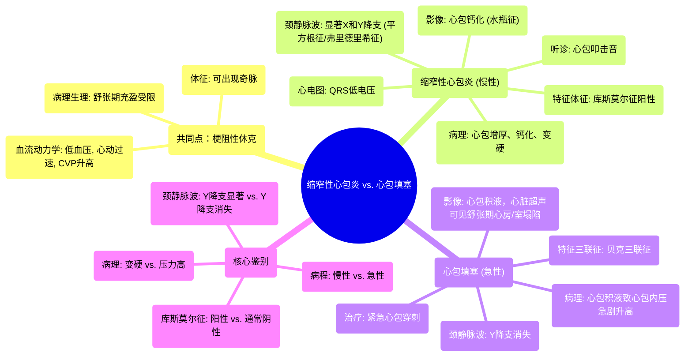

# 39 Constrictive Pericarditis vs. Cardiac Tamponade - Cardiology Series

  <video controls preload="metadata" playsinline>
    <source src="https://helly.s3.bitiful.net/心血管学科/%E4%B8%93%E8%BE%91%2018%EF%BC%9A%E5%BF%83%E5%86%85%E7%A7%91%E7%BB%88%E6%9E%81%E7%99%BE%E7%A7%91%E8%BE%9E%E5%85%B8%20%28The%20Cardiology%20Encyclopedia%29/39%20Constrictive%20Pericarditis%20vs.%20Cardiac%20Tamponade%20-%20Cardiology%20Series.mp4" type="video/mp4">
    
您的浏览器不支持播放，请升级。

  </video>

::: tip ⚡️ 核心考点 (30s速读)
*   **核心考点**：缩窄性心包炎与心包填塞均可导致**梗阻性休克**，表现为低血压、心动过速等血流动力学不稳定。两者核心区别在于**病理生理机制**：缩窄是心包**慢性增厚钙化**限制了心脏舒张期充盈；填塞是心包腔内**急性液体快速积聚**压迫心脏。
*   **临床意义**：两者均可出现**奇脉**，但**库斯莫尔征**（吸气时颈静脉怒张）是缩窄性心包炎的特征性表现，而心包填塞时**Y降支消失**。影像学上，缩窄可见心包**钙化**（水瓶征），而填塞可见**心包积液**。
:::

## 🧠 深度精讲

*   **缩窄性心包炎**
    *   **病理基础**：心包因慢性炎症（如结核、心脏术后远期）发生**纤维化、增厚、钙化**，变得坚硬，限制了心脏在舒张期的扩张。
    *   **血流动力学影响**：
        1.  **舒张期充盈受限**：厚硬的心包阻碍血液流入心室，导致**前负荷（输入）减少**。
        2.  **心输出量下降**：前负荷减少直接导致心输出量降低。
        3.  **低血压**：心输出量下降引起血压降低（血压=心输出量×外周阻力）。
        4.  **压力升高**：血液回流受阻，导致**中心静脉压（CVP）和肺毛细血管楔压（PCWP）均升高**。
        5.  **代偿机制**：低血压触发压力感受器反射，引起**交感神经兴奋**（心动过速、血管收缩），试图维持血压。
    *   **特征性体征与检查**：
        *   **体征**：**库斯莫尔征阳性**（吸气时颈静脉怒张）、**奇脉**（吸气时收缩压下降>10 mmHg）。
        *   **听诊**：可闻及**心包叩击音**（舒张早期额外心音）。
        *   **影像**：X线/CT可见**心包钙化**（“水瓶征”）。
        *   **心电图**：**QRS波低电压**（钙化心包阻碍电传导）。
        *   **心导管/超声**：各心腔**舒张期压力均等化**；颈静脉波可见**显著的X降支和Y降支**（“平方根征”，其中显著的Y降支称为**弗里德里希征**）。

*   **心包填塞**
    *   **病理基础**：心包腔内**液体快速积聚**（如出血、积液），导致心包内压力急剧升高，压迫心脏。
    *   **血流动力学影响**：与缩窄类似，也导致**舒张期充盈受限、前负荷减少、心输出量下降、低血压及CVP升高**（**贝克三联征**：低血压、颈静脉怒张、心音遥远）。关键区别在于其发生**更急骤**。
    *   **特征性体征与检查**：
        *   **体征**：**奇脉**常见。
        *   **关键鉴别点**：**颈静脉波Y降支消失或减弱**（因为舒张早期血液无法快速流入被压迫的心室）。库斯莫尔征通常**不出现**。
        *   **影像**：超声心动图是金标准，可见**心包积液**及舒张期右心房、右心室塌陷。

*   **核心对比总结**
    *   **病程**：缩窄为**慢性**；填塞为**急性/亚急性**。
    *   **病理**：缩窄是心包**变厚变硬**；填塞是心包内**压力增高**。
    *   **颈静脉波**：缩窄有**显著Y降支**（弗里德里希征）；填塞**Y降支消失**。
    *   **库斯莫尔征**：缩窄**阳性**；填塞通常阴性。
    *   **影像学**：缩窄见**钙化**；填塞见**积液**。

## 📚 双语术语表 (Terminology)
| 英文术语 | 中文翻译 | 定义/解释 |
| :--- | :--- | :--- |
| Constrictive Pericarditis | 缩窄性心包炎 | 心包慢性增厚、钙化，限制心脏舒张期充盈的疾病。 |
| Cardiac Tamponade | 心包填塞 | 心包腔内液体快速积聚，导致心包内压急剧升高，压迫心脏的急症。 |
| Obstructive Shock | 梗阻性休克 | 由于血液回流心脏的物理性梗阻（如心包疾病、肺栓塞）导致的休克类型。 |
| Kussmaul's Sign | 库斯莫尔征 | 吸气时颈静脉压力不降反升（怒张），是缩窄性心包炎的特征性体征。 |
| Pulsus Paradoxus | 奇脉 | 吸气时收缩压下降超过10 mmHg，可见于缩窄性心包炎、心包填塞等。 |
| Friedrich's Sign | 弗里德里希征 | 颈静脉波中显著的Y降支，见于缩窄性心包炎。 |
| Square Root Sign | 平方根征 | 心导管压力波形中，心室舒张早期压力快速下降后平台期的形态，形似平方根符号“√”，见于缩窄性心包炎。 |
| Water Bottle Sign | 水瓶征 | 胸部影像上，因心包增厚或积液，心脏轮廓呈类似水瓶的清晰、致密边界。 |
| Beck's Triad | 贝克三联征 | 心包填塞的典型三联征：低血压、颈静脉怒张、心音遥远。 |
| Equalization of Pressures | 压力均等化 | 心脏各腔室（右心房、右心室、左心房、左心室）在舒张末期的压力趋于相等，见于缩窄性心包炎和心包填塞。 |

## 🗺️ 知识图谱

