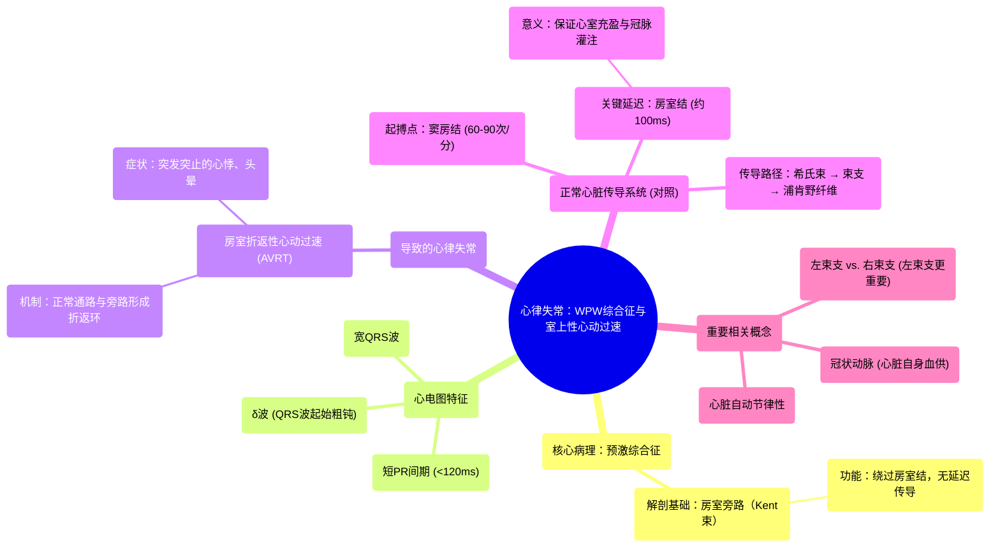

# 40 Heart Arrhythmia - Wolff-Parkinson White (WPW) Syndrome - AVRT - Supraventricular Tachycardia - ECG

  <video controls preload="metadata" playsinline>
    <source src="https://helly.s3.bitiful.net/心血管学科/%E4%B8%93%E8%BE%91%2018%EF%BC%9A%E5%BF%83%E5%86%85%E7%A7%91%E7%BB%88%E6%9E%81%E7%99%BE%E7%A7%91%E8%BE%9E%E5%85%B8%20%28The%20Cardiology%20Encyclopedia%29/40%20Heart%20Arrhythmia%20-%20Wolff-Parkinson%20White%20%28WPW%29%20Syndrome%20-%20AVRT%20-%20Supraventricular%20Tachycardia%20-%20ECG.mp4" type="video/mp4">
    
您的浏览器不支持播放，请升级。

  </video>

::: tip ⚡️ 核心考点 (30s速读)
*   **核心考点**：预激综合征（Wolff-Parkinson-White， WPW）是由于心脏存在一条异常的“旁路”（Kent束），导致电信号绕过房室结延迟，提前激动心室，在心电图上表现为特征性的“δ波”和短PR间期。
*   **临床意义**：WPW患者易发生房室折返性心动过速（AVRT），导致突发突止的心悸、头晕，甚至晕厥。识别其心电图特征对诊断和预防潜在风险至关重要。
:::

## 🧠 深度精讲

*   **正常心脏电传导系统**：心脏的“电路”始于“窦房结”（天然起搏器，心率60-90次/分），电信号依次传导至心房、房室结（在此处有约100毫秒的关键延迟）、希氏束、左右束支，最后通过浦肯野纤维激动心室肌。这个延迟保证了心室有足够时间在收缩前充盈血液（舒张期），并让冠状动脉（供应心脏自身的动脉）得到灌注。
*   **WPW综合征的病理基础**：在WPW患者中，除了正常的传导通路外，心房和心室之间还存在一条先天性的异常肌束，称为“Kent束”。这条旁路没有房室结的生理性延迟，因此电信号可以更快地“抄近道”提前激动一部分心室肌。
*   **心电图特征**：由于部分心室肌被提前激动，心电图会表现出：
    1.  **短PR间期**（<120ms）：因为信号绕过房室结，从心房到心室的传导时间缩短。
    2.  **δ波**：QRS波起始部出现一个缓慢、粗钝的上升支，代表心室肌被异常旁路提前、缓慢地除极。
    3.  **宽QRS波**：由于心室除极顺序异常，整个QRS波时间可能延长。
*   **心律失常机制**：这条旁路的存在为折返性心动过速创造了条件。最常见的是**顺向型房室折返性心动过速（AVRT）**：电信号沿正常通路（房室结）下传心室，再经旁路逆传回心房，形成一个环形运动，导致心率突然增快（常>150次/分）。患者会感到突发突止的心悸、胸闷、头晕。
*   **重要概念辨析**：
    *   **左束支 vs. 右束支**：左束支负责激动更重要的左心室（为全身供血），因此左束支传导阻滞的临床意义通常比右束支传导阻滞更严重。
    *   **心脏的自动节律性**：心脏具有内在的起搏能力，即使脱离神经支配（如移植心脏）也能自主跳动，这源于其特化的传导系统（如窦房结、浦肯野纤维）和富含线粒体的心肌细胞对疲劳的强抵抗力。

## 📚 双语术语表 (Terminology)
| 英文术语 | 中文翻译 | 定义/解释 |
| :--- | :--- | :--- |
| Wolff-Parkinson-White (WPW) Syndrome | 沃尔夫-帕金森-怀特综合征（预激综合征） | 一种因存在房室旁路（Kent束）导致心室预激的先天性心脏病。 |
| Pre-excitation Syndrome | 预激综合征 | 心脏电冲动通过异常旁路提前激动心室肌的一类疾病总称，WPW是其中最常见类型。 |
| Accessory Pathway (Kent Bundle) | 旁路（肯特束） | 连接心房和心室的异常肌纤维束，是WPW综合征的解剖基础。 |
| Atrioventricular Reentrant Tachycardia (AVRT) | 房室折返性心动过速 | WPW综合征最常见的心律失常，电信号在正常房室传导系统和旁路之间形成折返环。 |
| Delta Wave (δ wave) | δ波（德尔塔波） | WPW综合征心电图特征，表现为QRS波起始部粗钝的上升支，代表心室肌被旁路提前除极。 |
| Short PR Interval | 短PR间期 | WPW心电图特征之一，指心房除极开始到心室除极开始的时间短于120毫秒。 |
| Sinoatrial (SA) Node | 窦房结 | 心脏的正常起搏点，位于右心房，自发产生60-90次/分的电冲动。 |
| Atrioventricular (AV) Node | 房室结 | 位于心房与心室交界处，电信号在此产生生理性延迟（约100ms），保证心室充盈。 |
| Bundle of His | 希氏束 | 房室结的延续，将电信号传导至心室。 |
| Bundle Branches (Left/Right) | 束支（左/右） | 希氏束的分支，分别激动左心室和右心室。左束支阻滞通常比右束支阻滞更严重。 |
| Purkinje Fibers | 浦肯野纤维 | 传导系统的终末分支，深入心室肌，确保电信号快速、同步地激动整个心室。 |
| Automaticity | 自动节律性 | 心脏传导系统细胞在无外界刺激下自发产生动作电位的能力。 |
| Coronary Arteries | 冠状动脉 | 起源于主动脉根部，环绕心脏并为其心肌供血的动脉，因其形似王冠而得名。 |

## 🗺️ 知识图谱

