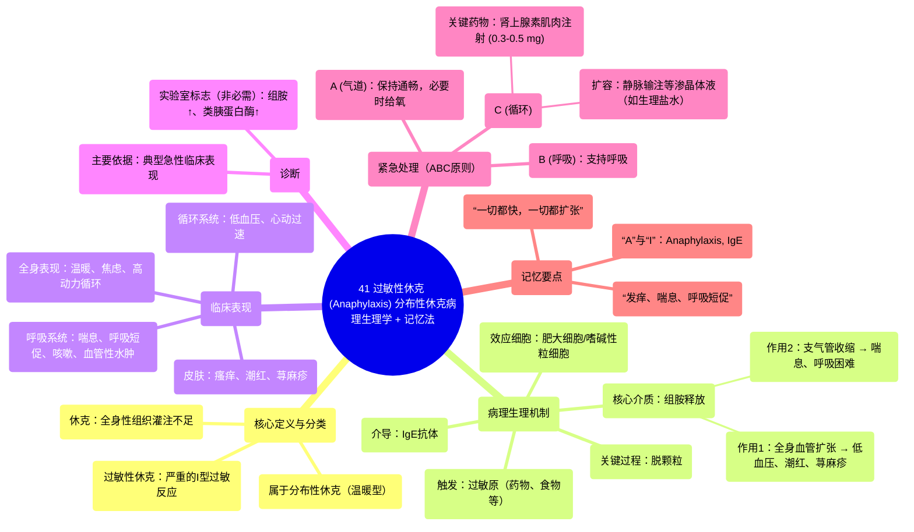

# 41 Anaphylactic Shock (Anaphylaxis) Distributive Shock Pathophysiology + Mnemonic

  <video controls preload="metadata" playsinline>
    <source src="https://helly.s3.bitiful.net/心血管学科/%E4%B8%93%E8%BE%91%2018%EF%BC%9A%E5%BF%83%E5%86%85%E7%A7%91%E7%BB%88%E6%9E%81%E7%99%BE%E7%A7%91%E8%BE%9E%E5%85%B8%20%28The%20Cardiology%20Encyclopedia%29/41%20Anaphylactic%20Shock%20%28Anaphylaxis%29%20Distributive%20Shock%20Pathophysiology%20%2B%20Mnemonic.mp4" type="video/mp4">
    
您的浏览器不支持播放，请升级。

  </video>

::: tip ⚡️ 核心考点 (30s速读)
*   **核心考点**：过敏性休克是一种由IgE介导的、危及生命的严重过敏反应，属于分布性休克。其核心病理生理是肥大细胞/嗜碱性粒细胞脱颗粒释放组胺，导致全身血管扩张（引起低血压、皮肤潮红）和支气管收缩（引起喘息、呼吸困难）。
*   **临床意义**：患者表现为“温暖且焦虑”，属于高动力循环（高输出量性心衰）。紧急处理遵循ABC原则，**肾上腺素肌肉注射是抢救的基石**。
:::

## 🧠 深度精讲

*   **概念1：休克与过敏性休克的定位**
    休克被定义为全身性的组织灌注不足，导致细胞缺氧、代谢紊乱，最终引起器官损伤甚至死亡。根据血流动力学特点，休克可分为“湿冷型”（如低血容量性、心源性、梗阻性休克）和“温暖型”。**过敏性休克属于“分布性休克”**，是“温暖型”休克的代表之一（其他包括脓毒性休克、神经源性休克）。其特点是全身血管异常扩张，血液淤积在外周血管，导致有效循环血量锐减，但心脏代偿性加快泵血，因此表现为“**一切都快，一切都扩张**”：心率快、心输出量高（高输出量性心衰/高动力循环）、血管扩张，患者因此皮肤温暖、焦虑不安。

*   **概念2：病理生理机制——“A”与“I”的线索**
    过敏性休克（Anaphylaxis）的命名提示了其过程：“Ana-”意为“向上、过度”，“-phylaxis”意为“保护”，即身体“过度保护”的反应。其核心是**IgE介导的I型超敏反应**。当过敏原（如药物、食物、昆虫毒液）进入已致敏的个体，会与结合在肥大细胞和嗜碱性粒细胞表面的IgE抗体交联，触发细胞**脱颗粒**，释放大量预合成的**组胺**等介质。
    *   **组胺的作用**：作为“组织中的胺”，它产生两种关键效应：1) **全身血管扩张**，导致血压骤降、循环衰竭、皮肤出现潮红、荨麻疹和瘙痒；2) **支气管平滑肌收缩**，导致喘息、呼吸急促、咳嗽，严重时出现血管性水肿可阻塞气道。

*   **概念3：临床表现与诊断**
    诊断主要基于典型的急性临床表现，属于临床急症，**不依赖实验室检查**。典型表现可概括为 **“发痒、喘息、呼吸短促”** 。如果进行检测，可发现血液中**组胺**和**类胰蛋白酶**水平升高。需要与快速耐受性（Tachyphylaxis，反复用药后反应迅速减弱）相鉴别。

*   **概念4：紧急处理——牢记ABC与肾上腺素**
    处理必须争分夺秒，遵循急救**ABC原则**（气道、呼吸、循环）：
    1.  **气道与呼吸**：确保气道通畅，给予吸氧。
    2.  **循环**：立即建立静脉通道，快速输注**等渗晶体液（如0.9%生理盐水）** 以扩充血容量。
    3.  **关键药物**：**肾上腺素（Adrenaline/Epinephrine）** 是首选和核心治疗药物。标准剂量为**0.3-0.5 mg**，通过**肌肉注射**给药。它能迅速逆转血管扩张和支气管收缩，是抢救生命的决定性步骤。

## 📚 双语术语表 (Terminology)
| 英文术语 | 中文翻译 | 定义/解释 |
| :--- | :--- | :--- |
| Anaphylactic Shock | 过敏性休克 | 一种严重的、速发型的全身性过敏反应，可导致危及生命的循环和呼吸衰竭。 |
| Distributive Shock | 分布性休克 | 一类由于全身血管阻力异常降低，血液分布异常导致的休克。特征为高动力循环。 |
| Hypoperfusion | 灌注不足 | 流向组织或器官的血液减少，导致氧气和营养物质供应不足。 |
| High Output Cardiac Failure | 高输出量性心力衰竭 | 一种心输出量正常或增高，但仍无法满足机体需求的心衰状态，常见于分布性休克。 |
| IgE | 免疫球蛋白E | 参与I型超敏反应（过敏反应）的主要抗体类型。 |
| Mast Cell / Basophil | 肥大细胞 / 嗜碱性粒细胞 | 储存有组胺等炎症介质的免疫细胞，是过敏反应的核心效应细胞。 |
| Degranulation | 脱颗粒 | 肥大细胞/嗜碱性粒细胞受刺激后，将胞内颗粒内容物（如组胺）释放到细胞外的过程。 |
| Histamine | 组胺 | 过敏反应中释放的关键介质，引起血管扩张、支气管收缩和血管通透性增加。 |
| Tryptase | 类胰蛋白酶 | 主要存在于肥大细胞颗粒中的酶，其血液水平升高是肥大细胞激活的标志。 |
| Epinephrine / Adrenaline | 肾上腺素 | 过敏性休克抢救的一线药物，通过激动α和β受体，收缩血管、扩张支气管、提升血压。 |
| Isotonic Fluid | 等渗液体 | 渗透压与血浆相近的液体（如0.9%生理盐水），用于快速扩容而不引起细胞显著水肿或脱水。 |

## 🗺️ 知识图谱

