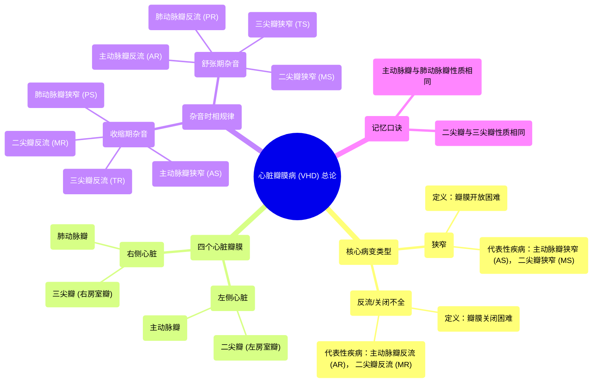

# 42 Valvular Heart Diseases (VHD) - An Introduction - Cardiology

  <video controls preload="metadata" playsinline>
    <source src="https://helly.s3.bitiful.net/心血管学科/%E4%B8%93%E8%BE%91%2018%EF%BC%9A%E5%BF%83%E5%86%85%E7%A7%91%E7%BB%88%E6%9E%81%E7%99%BE%E7%A7%91%E8%BE%9E%E5%85%B8%20%28The%20Cardiology%20Encyclopedia%29/42%20Valvular%20Heart%20Diseases%20%28VHD%29%20-%20An%20Introduction%20-%20Cardiology.mp4" type="video/mp4">
    
您的浏览器不支持播放，请升级。

  </video>

::: tip ⚡️ 核心考点 (30s速读)
*   **核心考点**：心脏瓣膜病分为**狭窄**（瓣膜开放困难）和**反流/关闭不全**（瓣膜关闭困难）。根据瓣膜位置和病变类型，杂音出现在**收缩期**或**舒张期**。
*   **临床意义**：主动脉瓣与肺动脉瓣杂音性质相同（狭窄为收缩期，反流为舒张期）；二尖瓣与三尖瓣杂音性质相同（狭窄为舒张期，反流为收缩期）。
:::

## 🧠 深度精讲

*   **概念1：心脏瓣膜的功能与分类**
    心脏共有四个瓣膜：**二尖瓣**（左心房与左心室之间）、**三尖瓣**（右心房与右心室之间）、**主动脉瓣**（左心室与主动脉之间）和**肺动脉瓣**（右心室与肺动脉干之间）。它们的作用是保证血液单向流动。病变主要分为两类：**狭窄**（瓣膜不能充分打开，血流通过受阻）和**反流/关闭不全**（瓣膜不能完全关闭，血液发生逆向反流）。

*   **概念2：杂音时相的判断逻辑**
    判断杂音时相的关键在于理解瓣膜正常的开闭时机。
    1.  **主动脉瓣与肺动脉瓣**：在**心室收缩期**打开，让血液射入大动脉；在**心室舒张期**关闭，防止血液倒流回心室。因此：
        *   **狭窄**（打开困难）→ 发生在收缩期 → **收缩期杂音**。
        *   **反流**（关闭困难）→ 发生在舒张期 → **舒张期杂音**。
    2.  **二尖瓣与三尖瓣**：在**心室舒张期**打开，让血液从心房流入心室；在**心室收缩期**关闭，防止血液从心室反流回心房。因此：
        *   **狭窄**（打开困难）→ 发生在舒张期 → **舒张期杂音**。
        *   **反流**（关闭困难）→ 发生在收缩期 → **收缩期杂音**。

*   **概念3：血液循环复习**
    含氧血自肺经**肺静脉**→**左心房**→（经**二尖瓣**）→**左心室**→（经**主动脉瓣**）→**主动脉**→全身。全身脱氧血经体静脉→**右心房**→（经**三尖瓣**）→**右心室**→（经**肺动脉瓣**）→**肺动脉干**→肺。此循环是理解各瓣膜作用的基础。

## 📚 双语术语表 (Terminology)
| 英文术语 | 中文翻译 | 定义/解释 |
| :--- | :--- | :--- |
| Valvular Heart Disease (VHD) | 心脏瓣膜病 | 心脏瓣膜结构或功能异常的一类疾病。 |
| Stenosis | 狭窄 | 瓣膜开放受限，导致血流通过受阻。 |
| Regurgitation / Insufficiency | 反流 / 关闭不全 | 瓣膜关闭不全，导致血液发生逆向流动。 |
| Systolic murmur | 收缩期杂音 | 发生在心脏收缩期（心室射血期）的杂音。 |
| Diastolic murmur | 舒张期杂音 | 发生在心脏舒张期（心室充盈期）的杂音。 |
| Mitral Valve | 二尖瓣 | 位于左心房和左心室之间，有两个瓣叶。 |
| Aortic Valve | 主动脉瓣 | 位于左心室和主动脉之间。 |
| Tricuspid Valve | 三尖瓣 | 位于右心房和右心室之间。 |
| Pulmonic Valve | 肺动脉瓣 | 位于右心室和肺动脉干之间。 |
| Cardiac cycle | 心动周期 | 心脏一次收缩和舒张的机械活动周期。 |

## 🗺️ 知识图谱

