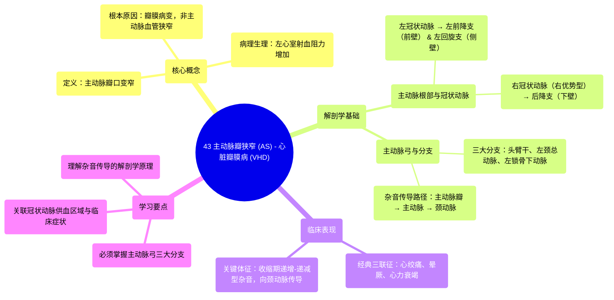

# 43 Aortic Stenosis (AS) - Valvular Heart Disease (VHD) - Causes, Symptoms, Diagnosis, Treatment -Cardio

  <video controls preload="metadata" playsinline>
    <source src="https://helly.s3.bitiful.net/心血管学科/%E4%B8%93%E8%BE%91%2018%EF%BC%9A%E5%BF%83%E5%86%85%E7%A7%91%E7%BB%88%E6%9E%81%E7%99%BE%E7%A7%91%E8%BE%9E%E5%85%B8%20%28The%20Cardiology%20Encyclopedia%29/43%20Aortic%20Stenosis%20%28AS%29%20-%20Valvular%20Heart%20Disease%20%28VHD%29%20-%20Causes%2C%20Symptoms%2C%20Diagnosis%2C%20Treatment%20-Cardio.mp4" type="video/mp4">
    
您的浏览器不支持播放，请升级。

  </video>

::: tip ⚡️ 核心考点 (30s速读)
*   **核心考点**：主动脉瓣狭窄是主动脉瓣口变窄，导致左心室射血受阻。典型三联征为心绞痛、晕厥和心力衰竭。听诊可闻及收缩期递增-递减型杂音，向颈动脉传导。
*   **临床意义**：是常见的瓣膜病，可导致左心室肥厚、心力衰竭甚至猝死。治疗取决于狭窄程度和症状，重度有症状者需行主动脉瓣置换术。
:::

## 🧠 深度精讲
*   **主动脉瓣狭窄 (AS) 的定义**：视频明确指出，主动脉瓣狭窄是指主动脉瓣本身的瓣口变窄，而非主动脉血管狭窄。更准确的描述应为“主动脉瓣狭窄”。这导致左心室在收缩期向主动脉射血时阻力增加。
*   **解剖学关联与杂音传导**：视频通过详细回顾心脏和主动脉的解剖结构，解释了主动脉瓣狭窄杂音（收缩期杂音）向颈动脉传导的机制。因为左心室连接主动脉，而主动脉弓发出头臂干和颈总动脉，所以瓣膜处的湍流产生的杂音可以沿血流方向传导至颈部血管。
*   **冠状动脉解剖回顾**：视频复习了冠状动脉的分布，这对于理解主动脉瓣狭窄的并发症（如心绞痛）至关重要。左前降支（“寡妇制造者”）供应前壁，右冠状动脉（在右优势型循环中）供应下壁，左回旋支供应侧壁。
*   **主动脉弓分支的重要性**：视频以幽默但严肃的方式强调了主动脉弓三大分支（头臂干、左颈总动脉、左锁骨下动脉）是必须掌握的解剖知识，并梳理了其后续分支，如上肢和头颈部的动脉来源。

## 📚 双语术语表 (Terminology)
| 英文术语 | 中文翻译 | 定义/解释 |
| :--- | :--- | :--- |
| Aortic Stenosis (AS) | 主动脉瓣狭窄 | 主动脉瓣口变窄，导致左心室射血受阻的心脏瓣膜疾病。 |
| Valvular Heart Disease (VHD) | 心脏瓣膜病 | 影响心脏一个或多个瓣膜（主动脉瓣、二尖瓣、肺动脉瓣、三尖瓣）功能的一类疾病。 |
| Left Anterior Descending (LAD) artery | 左前降支动脉 | 左冠状动脉的主要分支之一，供应心脏前壁，因其闭塞常导致大面积心梗而被称为“寡妇制造者”。 |
| Brachiocephalic artery | 头臂干动脉 | 主动脉弓的第一个分支，随后分为右锁骨下动脉和右颈总动脉。 |
| Aortic arch | 主动脉弓 | 升主动脉的延续，呈弓形弯曲，发出供应头颈和上肢的主要动脉分支。 |
| Murmur | 杂音 | 血液湍流通过狭窄瓣膜或异常通道时产生的心音以外的异常声音。 |
| Radiate to carotids | 向颈动脉传导 | 主动脉瓣狭窄的收缩期杂音可沿血流方向传播至颈部，在颈动脉处听诊增强。 |

## 🗺️ 知识图谱

