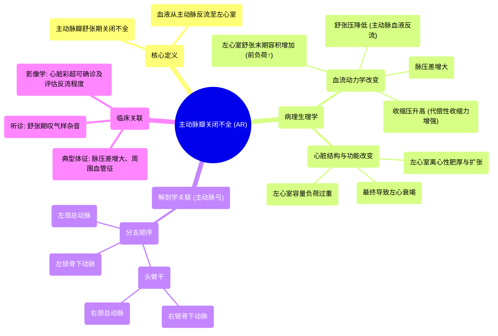

# 44 Aortic Regurgitation (AR) - Aortic Insufficiency - Valvular Heart Disease (VHD) - Cardiology

  <video controls preload="metadata" playsinline>
    <source src="https://helly.s3.bitiful.net/心血管学科/%E4%B8%93%E8%BE%91%2018%EF%BC%9A%E5%BF%83%E5%86%85%E7%A7%91%E7%BB%88%E6%9E%81%E7%99%BE%E7%A7%91%E8%BE%9E%E5%85%B8%20%28The%20Cardiology%20Encyclopedia%29/44%20Aortic%20Regurgitation%20%28AR%29%20-%20Aortic%20Insufficiency%20-%20Valvular%20Heart%20Disease%20%28VHD%29%20-%20Cardiology.mp4" type="video/mp4">
    
您的浏览器不支持播放，请升级。

  </video>

::: tip ⚡️ 核心考点 (30s速读)
*   **核心考点**：主动脉瓣关闭不全（AR）指主动脉瓣在舒张期无法完全闭合，导致血液从主动脉反流回左心室。
*   **临床意义**：这导致左心室容量负荷过重（前负荷增加），引起左心室扩张和肥厚，最终可能导致心力衰竭。典型体征包括脉压差增大（收缩压升高、舒张压降低）和周围血管征。
:::

## 🧠 深度精讲
*   **概念1：病理生理与血流动力学改变**
    *   **核心问题**：主动脉瓣在舒张期关闭不全。
    *   **直接后果**：血液从主动脉反流回左心室。
    *   **左心室影响**：左心室在舒张期同时接收来自左心房（正常）和主动脉（异常反流）的血液，导致**左心室舒张末期容积（前负荷）增加**。
    *   **心脏代偿**：根据**Frank-Starling定律**，前负荷增加使左心室收缩力增强，导致**收缩压升高**。
    *   **主动脉影响**：舒张期血液反流入左心室，使主动脉内血容量减少，导致**舒张压降低**。
    *   **最终结果**：**脉压差（收缩压与舒张压之差）显著增大**。长期容量负荷过重导致左心室离心性肥厚和扩张，最终失代偿，发生左心衰竭。

*   **概念2：相关解剖复习（主动脉弓分支）**
    *   视频中强调了主动脉弓三大分支的临床重要性，顺序为：
        1.  **头臂干（无名动脉）**：向右分出**右锁骨下动脉**和**右颈总动脉**。
        2.  **左颈总动脉**。
        3.  **左锁骨下动脉**。
    *   **记忆口诀**：“头臂干、左颈总、左锁骨下”。头臂干（Brachiocephalic）名称来源于其供应区域：Brachium（臂）和Cephalic（头）。

## 📚 双语术语表 (Terminology)
| 英文术语 | 中文翻译 | 定义/解释 |
| :--- | :--- | :--- |
| Aortic Regurgitation (AR) / Aortic Insufficiency | 主动脉瓣反流 / 主动脉瓣关闭不全 | 主动脉瓣在舒张期关闭不全，导致血液从主动脉反流回左心室。 |
| Valvular Heart Disease (VHD) | 心脏瓣膜病 | 心脏一个或多个瓣膜结构或功能异常的一类疾病。 |
| Diastole | 舒张期 | 心脏舒张、心室充盈血液的阶段。 |
| Systole | 收缩期 | 心脏收缩、心室射血的阶段。 |
| Preload | 前负荷 | 心脏舒张末期心室内的血容量（压力），决定心肌纤维的初长度。 |
| Frank-Starling Law | 弗兰克-斯塔林定律 | 在一定范围内，心肌收缩力随前负荷（初长度）的增加而增强。 |
| Pulse Pressure | 脉压 | 收缩压与舒张压之间的差值。在AR中通常增大。 |
| Brachiocephalic Artery | 头臂干（无名动脉） | 主动脉弓的第一大分支，供应右臂和右头颈部。 |
| Left Common Carotid Artery | 左颈总动脉 | 主动脉弓的第二大分支，供应左头颈部。 |
| Left Subclavian Artery | 左锁骨下动脉 | 主动脉弓的第三大分支，供应左上肢。 |

## 🗺️ 知识图谱

