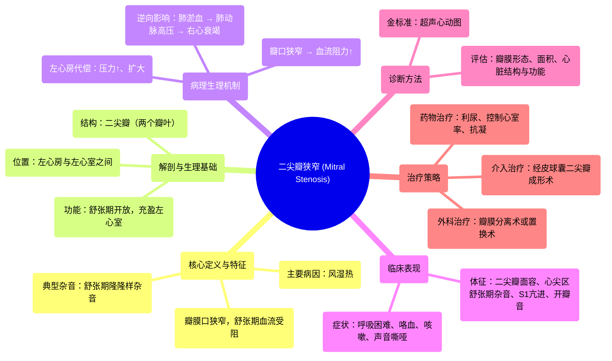

# 45 Mitral Stenosis (MS) - Valvular Heart Disease (VHD) - Mitral Valve Stenosis - Cardiology Series

  <video controls preload="metadata" playsinline>
    <source src="https://helly.s3.bitiful.net/心血管学科/%E4%B8%93%E8%BE%91%2018%EF%BC%9A%E5%BF%83%E5%86%85%E7%A7%91%E7%BB%88%E6%9E%81%E7%99%BE%E7%A7%91%E8%BE%9E%E5%85%B8%20%28The%20Cardiology%20Encyclopedia%29/45%20Mitral%20Stenosis%20%28MS%29%20-%20Valvular%20Heart%20Disease%20%28VHD%29%20-%20Mitral%20Valve%20Stenosis%20-%20Cardiology%20Series.mp4" type="video/mp4">
    
您的浏览器不支持播放，请升级。

  </video>

::: tip ⚡️ 核心考点 (30s速读)
*   **核心考点**：二尖瓣狭窄是一种瓣膜性心脏病，指二尖瓣口面积减小，导致舒张期血液从左心房流入左心室受阻。其典型杂音为**舒张期隆隆样杂音**。
*   **临床意义**：主要病因是**风湿热**。长期狭窄导致左心房压力增高、扩大，最终可引起**肺淤血、肺动脉高压、右心衰竭**。典型体征包括“二尖瓣面容”（双颧绀红）。
:::

## 🧠 深度精讲

*   **概念1：二尖瓣的解剖与功能**
    *   二尖瓣位于**左心房与左心室之间**，属于**房室瓣**。
    *   因其由**两个瓣叶**构成，故又称**二尖瓣**或**二尖瓣**（Bicuspid Valve）。心脏中其他瓣膜（主动脉瓣、肺动脉瓣、三尖瓣）通常有三个瓣叶。
    *   其正常功能是在**心室舒张期**开放，允许氧合血液从左心房顺畅流入左心室。

*   **概念2：二尖瓣狭窄的病理生理**
    *   **根本问题**：瓣膜口狭窄（面积减小）。
    *   **血流动力学影响**：根据流体力学原理（如泊肃叶定律），管道半径减小会导致阻力急剧增加。因此，左心房需要**更用力地收缩**以将血液泵过狭窄的瓣膜。
    *   **代偿与失代偿**：
        1.  **左心房代偿性肥厚与扩大**：长期对抗高阻力，导致左心房压力升高、心房扩大。
        2.  **肺循环淤血**：左心房压力逆向传导至肺静脉和肺毛细血管，引起**肺淤血**，临床表现为呼吸困难（如劳力性呼吸困难、夜间阵发性呼吸困难）。
        3.  **肺动脉高压与右心受累**：长期的肺静脉高压可导致**反应性肺动脉高压**，增加右心室后负荷，最终可能导致**右心室肥厚、扩大乃至右心衰竭**。

*   **概念3：病因、症状与诊断**
    *   **主要病因**：**风湿热**是导致二尖瓣狭窄的最常见原因，其引起的瓣膜交界处融合、增厚、钙化是典型病理改变。
    *   **关键症状**：
        *   **呼吸困难**：肺淤血的首发和主要症状。
        *   **咯血**：可由支气管静脉破裂或肺梗死引起。
        *   **咳嗽**：常与肺淤血有关。
        *   **声音嘶哑**：扩大的左心房可能压迫**左侧喉返神经**（绕主动脉弓走行）所致。
    *   **典型体征**：
        *   **听诊**：心尖区**舒张中晚期隆隆样杂音**，常伴有**第一心音亢进**和**开瓣音**（如果瓣膜弹性尚可）。
        *   **视诊**：“二尖瓣面容”——双颧部呈紫红色（与心输出量减低、外周血管收缩及肺淤血有关）。
    *   **诊断金标准**：**超声心动图**。可直接观察瓣膜形态、测量瓣口面积、评估狭窄程度及心脏结构改变。

*   **概念4：治疗原则**
    *   **药物治疗**：主要用于控制症状（如利尿剂减轻肺淤血）和并发症（如房颤时控制心室率、抗凝）。
    *   **介入治疗**：**经皮球囊二尖瓣成形术**是治疗单纯性中重度二尖瓣狭窄的有效方法，适用于瓣膜弹性尚好、无严重钙化或关闭不全的患者。
    *   **外科治疗**：包括**二尖瓣直视分离术**或**二尖瓣置换术**，适用于不适合介入治疗或合并其他瓣膜病变的患者。

## 📚 双语术语表 (Terminology)
| 英文术语 | 中文翻译 | 定义/解释 |
| :--- | :--- | :--- |
| Mitral Stenosis (MS) | 二尖瓣狭窄 | 二尖瓣口开放受限，舒张期血流从左心房流入左心室受阻。 |
| Valvular Heart Disease (VHD) | 瓣膜性心脏病 | 心脏瓣膜（包括结构或功能）发生病变的一类疾病。 |
| Atrioventricular Valve | 房室瓣 | 位于心房与心室之间的瓣膜，包括二尖瓣和三尖瓣。 |
| Bicuspid Valve | 二尖瓣 | 指具有两个瓣叶的瓣膜，特指二尖瓣。 |
| Diastolic Murmur | 舒张期杂音 | 发生在心脏舒张期的异常心音，二尖瓣狭窄的杂音属于此类。 |
| Rheumatic Fever | 风湿热 | A组乙型溶血性链球菌感染后引起的自身免疫性疾病，是导致二尖瓣狭窄的主要病因。 |
| Left Atrial Enlargement | 左心房扩大 | 二尖瓣狭窄时，左心房为克服血流阻力而发生的代偿性扩大。 |
| Pulmonary Congestion | 肺淤血 | 左心房压力增高导致肺静脉和肺毛细血管压力升高，液体渗入肺组织。 |
| Pulmonary Hypertension | 肺动脉高压 | 由肺循环压力持续升高所定义的病理生理状态，二尖瓣狭窄是其主要原因之一。 |
| Poiseuille‘s Law | 泊肃叶定律 | 描述流体在管道中流动时，流量与管道半径四次方成正比的物理定律，用于解释狭窄导致阻力剧增。 |

## 🗺️ 知识图谱

