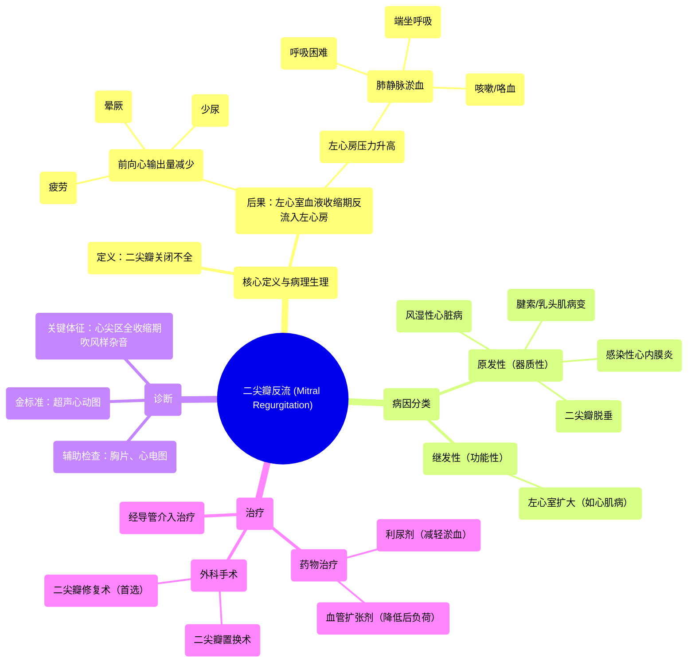

# 46 Mitral Regurgitaion (MR) - Valvular Heart Disease (VHD) - Mitral valve Insufficiency - Cardiology

  <video controls preload="metadata" playsinline>
    <source src="https://helly.s3.bitiful.net/心血管学科/%E4%B8%93%E8%BE%91%2018%EF%BC%9A%E5%BF%83%E5%86%85%E7%A7%91%E7%BB%88%E6%9E%81%E7%99%BE%E7%A7%91%E8%BE%9E%E5%85%B8%20%28The%20Cardiology%20Encyclopedia%29/46%20Mitral%20Regurgitaion%20%28MR%29%20-%20Valvular%20Heart%20Disease%20%28VHD%29%20-%20Mitral%20valve%20Insufficiency%20-%20Cardiology.mp4" type="video/mp4">
    
您的浏览器不支持播放，请升级。

  </video>

::: tip ⚡️ 核心考点 (30s速读)
*   **核心考点**：二尖瓣反流是二尖瓣关闭不全，导致心室收缩期血液从左心室反流回左心房，引起左心房和肺静脉压力增高，最终导致肺淤血和心输出量减少。
*   **临床意义**：典型症状为肺淤血相关（呼吸困难、咳嗽、端坐呼吸）和心输出量降低相关（疲劳、晕厥）。听诊可闻及心尖区全收缩期吹风样杂音。
:::

## 🧠 深度精讲

*   **概念1：二尖瓣反流的病理生理**
    二尖瓣位于左心房和左心室之间。正常情况下，心室收缩期（射血期）二尖瓣应紧密关闭，防止血液倒流。当二尖瓣因各种原因（如瓣叶脱垂、风湿性病变、腱索断裂等）无法完全关闭时，即发生二尖瓣反流。此时，左心室收缩射出的血液一部分进入主动脉，另一部分则反流回左心房。这导致两个主要后果：1) **左心房容量和压力负荷增加**，压力逆向传导至肺静脉和肺毛细血管，引起**肺淤血**，表现为呼吸困难、咳嗽、端坐呼吸等症状；2) **有效心输出量减少**，因为部分血液无效地往返于左心室和左心房，导致全身器官灌注不足，引起疲劳、乏力、少尿等。

*   **概念2：病因与分类**
    二尖瓣反流的病因多样，主要可分为**原发性（器质性）**和**继发性（功能性）**。**原发性**指瓣膜本身结构异常，如：风湿性心脏病（瓣叶增厚、挛缩）、二尖瓣脱垂（瓣叶黏液样变性）、感染性心内膜炎（瓣叶穿孔、赘生物）、腱索断裂或乳头肌功能不全（如心肌梗死累及乳头肌）。**继发性**指瓣膜结构基本正常，但由于左心室扩大（如扩张型心肌病）或几何形状改变，导致瓣环扩张，使瓣叶对合不良。

*   **概念3：临床表现与诊断**
    **症状**：早期可无症状。典型症状包括：**肺淤血症状**（劳力性呼吸困难、阵发性夜间呼吸困难、端坐呼吸、咳嗽、咯血）和**低心输出量症状**（疲劳、活动耐力下降、头晕、严重时可晕厥）。**体征**：听诊最具特征性的发现是**心尖区全收缩期吹风样杂音**，向腋下传导。严重反流时，心尖搏动可呈抬举样，第二心音可亢进（肺动脉高压时）。**诊断**：**超声心动图**是确诊和评估反流严重程度的金标准，可直观显示反流束、评估左心房和左心室大小及功能、并帮助确定病因。胸部X线可见左心房、左心室增大和肺淤血征象。心电图可能显示左心房肥大（P波增宽双峰）和左心室肥厚。

*   **概念4：治疗原则**
    治疗取决于反流的严重程度、病因、症状以及左心室功能。**药物治疗**主要用于控制症状和并发症，如使用利尿剂减轻肺淤血，使用血管紧张素转换酶抑制剂或血管紧张素II受体拮抗剂降低后负荷、减少反流量。对于**重度、有症状的二尖瓣反流**，或无症状但伴有左心室功能下降（射血分数≤60%）或左心室显著扩大（收缩末期内径≥40mm）的患者，应考虑**外科手术干预**。手术方式包括**二尖瓣修复术**（首选，尤其适用于退行性病变）和**二尖瓣置换术**。经导管二尖瓣修复术（如MitraClip）为高危手术患者提供了新的选择。

## 📚 双语术语表 (Terminology)
| 英文术语 | 中文翻译 | 定义/解释 |
| :--- | :--- | :--- |
| Mitral Regurgitation (MR) | 二尖瓣反流 | 二尖瓣关闭不全，导致左心室收缩时血液反流入左心房。 |
| Valvular Heart Disease (VHD) | 心脏瓣膜病 | 心脏一个或多个瓣膜结构或功能异常的一类疾病。 |
| Stenosis | 狭窄 | 瓣膜开放受限，血流通过受阻。 |
| Regurgitation / Insufficiency | 反流 / 关闭不全 | 瓣膜关闭不全，导致血液逆流。 |
| Left Atrium (LA) | 左心房 | 接收来自肺静脉的含氧血，并将其泵入左心室。 |
| Left Ventricle (LV) | 左心室 | 心脏的主要泵血腔室，将含氧血泵入主动脉供应全身。 |
| Systole | 收缩期 | 心室收缩、射血的时期。 |
| Diastole | 舒张期 | 心室舒张、充盈的时期。 |
| Dyspnea | 呼吸困难 | 主观感觉呼吸费力或不适。 |
| Orthopnea | 端坐呼吸 | 平卧时呼吸困难加重，需坐起或抬高床头方能缓解。 |
| Paroxysmal Nocturnal Dyspnea (PND) | 阵发性夜间呼吸困难 | 夜间睡眠中突然因憋气而惊醒，需坐起喘息。 |
| Hemoptysis | 咯血 | 咳出血液或血性痰。 |
| Presyncope / Syncope | 晕厥前兆 / 晕厥 | 短暂性脑血流灌注不足导致的近乎或完全意识丧失。 |
| Echocardiography | 超声心动图 | 利用超声波检查心脏结构和功能的影像学方法，是诊断瓣膜病的首选。 |
| Mitral Valve Repair / Replacement | 二尖瓣修复术 / 置换术 | 治疗重度二尖瓣反流的外科手术方式。 |

## 🗺️ 知识图谱

