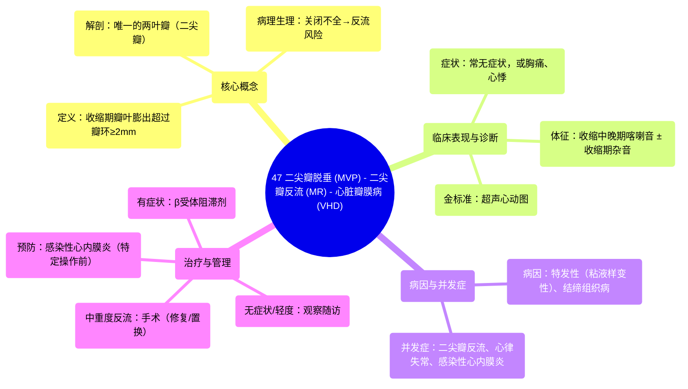

# 47 Mitral Valve Prolapse (MVP) - Mitral Regurgitation (MR) - Valvular Heart Disease (VHD) - Cardiology

  <video controls preload="metadata" playsinline>
    <source src="https://helly.s3.bitiful.net/心血管学科/%E4%B8%93%E8%BE%91%2018%EF%BC%9A%E5%BF%83%E5%86%85%E7%A7%91%E7%BB%88%E6%9E%81%E7%99%BE%E7%A7%91%E8%BE%9E%E5%85%B8%20%28The%20Cardiology%20Encyclopedia%29/47%20Mitral%20Valve%20Prolapse%20%28MVP%29%20-%20Mitral%20Regurgitation%20%28MR%29%20-%20Valvular%20Heart%20Disease%20%28VHD%29%20-%20Cardiology.mp4" type="video/mp4">
    
您的浏览器不支持播放，请升级。

  </video>

::: tip ⚡️ 核心考点 (30s速读)
*   **核心考点**：二尖瓣脱垂是指二尖瓣的一个或两个瓣叶在心室收缩期向上膨出，超过瓣环平面≥2mm。它本身可能无症状，但可并发二尖瓣关闭不全（反流），导致肺水肿风险增加。
*   **临床意义**：多数患者预后良好，无需特殊治疗。但需通过超声心动图明确诊断，并定期随访，监测是否出现二尖瓣反流、心律失常（如室性早搏）或感染性心内膜炎等并发症。
:::

## 🧠 深度精讲

*   **概念1：二尖瓣脱垂的定义与解剖基础**
    二尖瓣是位于左心房和左心室之间的瓣膜，是心脏四个瓣膜中唯一一个只有两个瓣叶（二叶瓣）的瓣膜。在心室收缩期，二尖瓣应紧密关闭，防止血液从左心室反流回左心房。二尖瓣脱垂是指一个或两个瓣叶在收缩期向上（向左心房方向）异常膨出或呈“降落伞”样改变，其定义为瓣叶体部超过二尖瓣瓣环平面≥2毫米。这种结构异常使得瓣膜关闭对合不良，是导致二尖瓣关闭不全（反流）的重要原因之一。

*   **概念2：病因、症状与诊断**
    **病因**：多数为特发性（原发性），可能与瓣膜粘液样变性、腱索过长有关。也可继发于某些结缔组织病（如马凡综合征）。
    **症状**：许多患者无症状，为体检时偶然发现。有症状者可出现：非典型性胸痛（与劳累关系不明确）、心悸（常因伴随的室性早搏引起）、呼吸困难、疲乏、焦虑等。听诊特征为心尖区收缩中晚期喀喇音，若伴有反流，可闻及收缩期吹风样杂音。
    **诊断**：**超声心动图**是确诊和评估的金标准。它可以直观显示瓣叶脱垂的程度、测量反流量、评估左心房和左心室大小及功能。

*   **概念3：治疗与并发症**
    **治疗**：对于无症状、无反流或仅有轻度反流的患者，通常无需治疗，建议定期随访和超声心动图检查。治疗主要针对并发症：① 对于有症状（如心悸）的患者，可使用β受体阻滞剂。② 对于中重度二尖瓣反流，出现左心室扩大或心功能下降时，需考虑**二尖瓣修复或置换术**。③ 所有患者在进行可能导致菌血症的操作（如牙科手术）前，需预防性使用抗生素，以预防**感染性心内膜炎**（但最新指南对此有更严格的限定）。
    **并发症**：主要包括：① 二尖瓣关闭不全（反流）及其导致的左心房扩大、心房颤动、肺动脉高压和心力衰竭。② 心律失常，特别是室性早搏。③ 感染性心内膜炎风险略有增加。④ 脑栓塞（罕见，可能与瓣膜上血栓形成有关）。

## 📚 双语术语表 (Terminology)
| 英文术语 | 中文翻译 | 定义/解释 |
| :--- | :--- | :--- |
| Mitral Valve Prolapse (MVP) | 二尖瓣脱垂 | 二尖瓣瓣叶在心室收缩期向左心房方向膨出，超过瓣环平面≥2mm。 |
| Mitral Regurgitation (MR) / Mitral Insufficiency | 二尖瓣反流 / 二尖瓣关闭不全 | 二尖瓣关闭不全，导致左心室血液在收缩期反流回左心房。 |
| Valvular Heart Disease (VHD) | 心脏瓣膜病 | 心脏瓣膜（二尖瓣、主动脉瓣、三尖瓣、肺动脉瓣）发生结构或功能异常的一类疾病。 |
| Stenosis | 狭窄 | 瓣膜开口变窄，阻碍血液前向流动。 |
| Regurgitation / Insufficiency | 反流 / 关闭不全 | 瓣膜关闭不全，导致血液反向流动。 |
| Bicuspid Valve | 二叶瓣 | 特指二尖瓣，因其具有两个瓣叶。 |
| Echocardiography | 超声心动图 | 利用超声波检查心脏结构和功能的影像学方法，是诊断瓣膜病的金标准。 |
| Barlow‘s Syndrome | 巴洛综合征 | 二尖瓣脱垂的别称。 |
| Annulus | 瓣环 | 心脏瓣膜附着处的纤维环状结构。 |

## 🗺️ 知识图谱

